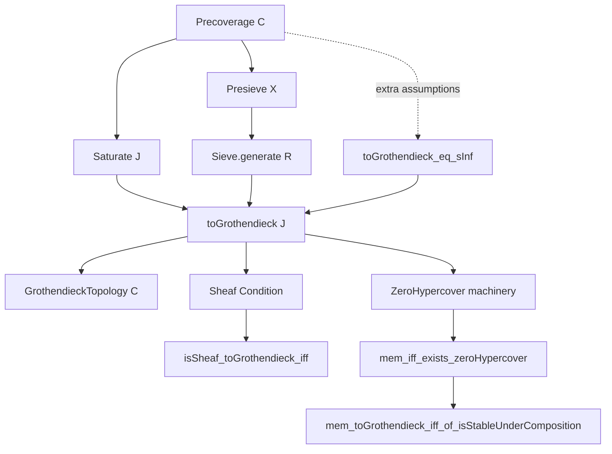
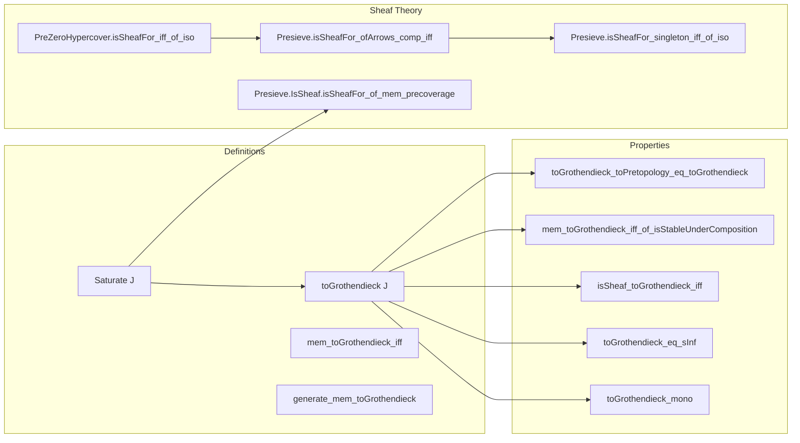

### Technical Brief: `PrecoverageToGrothendieck.lean`

---

#### **1. Key Definitions & Theorems**

| Name | Type / Signature | Purpose |
|------|------------------|---------|
| `Saturate J X S` | `inductive Prop` | Auxiliary inductive predicate defining covering sieves for the Grothendieck topology generated by precoverage `J`. Captures closure under top, pullbacks, and transitivity. |
| `toGrothendieck J` | `GrothendieckTopology C` | The Grothendieck topology generated by `J`, defined inductively via `Saturate J`. |
| `mem_toGrothendieck_iff` | `S ∈ J.toGrothendieck X ↔ J.Saturate X S` | Characterizes membership in the generated topology. |
| `generate_mem_toGrothendieck` | `R ∈ J X ⇒ Sieve.generate R ∈ J.toGrothendieck X` | Ensures covering presieves of `J` generate covering sieves in the topology. |
| `toGrothendieck_mono` | `J ≤ K ⇒ J.toGrothendieck ≤ K.toGrothendieck` | Monotonicity of the construction w.r.t. precoverage inclusion. |
| `toGrothendieck_eq_sInf` | `J.toGrothendieck = sInf { K | ... }` | Alternative characterization: the *smallest* Grothendieck topology containing all `Sieve.generate S` for `S ∈ J`. |
| `isSheaf_toGrothendieck_iff` | `Presieve.IsSheaf J.toGrothendieck P ↔ ...` | Main theorem: `P` is a sheaf for `J.toGrothendieck` iff it is a sheaf for *all pullbacks* of covering presieves of `J`. |
| `mem_toGrothendieck_iff_of_isStableUnderComposition` | Under extra assumptions (`IsStableUnderComposition`, etc.), simplifies membership to existence of a covering presieve inside `S`. |
| `toGrothendieck_toPretopology_eq_toGrothendieck` | Equality of constructions when `J` is a pretopology. |
| `Presieve.IsSheaf.isSheafFor_of_mem_precoverage` | If `P` is a sheaf for `J.toGrothendieck`, then it is sheaf for each `R ∈ J`. |
| `PreZeroHypercover.isSheafFor_iff_of_iso` | Sheaf condition is invariant under isomorphism of zero hypercovers. |
| `Presieve.isSheafFor_ofArrows_comp_iff` | Sheaf condition invariant under isomorphisms of indexing arrows. |
| `Presieve.isSheafFor_singleton_iff_of_iso` | Sheaf condition for singleton presieves invariant under isomorphism of covering maps. |

---

#### **2. Naming Conventions**

- **Prefixes**:
  - `toGrothendieck`: Construction from precoverage to Grothendieck topology.
  - `Saturate`: Inductive closure operation.
  - `isSheaf_...`: Sheaf condition relative to a topology/presieve.
  - `mem_...`: Membership criteria.
  - `generate_...`: Sieve generation from presieves.

- **Suffixes**:
  - `_iff`: Logical equivalence characterizations.
  - `_mono`: Monotonicity lemmas.
  - `_eq_...`: Equality lemmas.
  - `_of_...`: Derived properties from assumptions (e.g., `of_mem_precoverage`).
  - `_comp_iff`, `_iff_of_iso`: Invariance under composition or isomorphism.

- **Notable patterns**:
  - `Presieve.IsSheafFor P S` — $P$ satisfies sheaf condition for presieve $S$.
  - `Sieve.generate R` — smallest sieve containing presieve $R$.
  - `S.pullback f` — pullback of sieve $S$ along $f$.

---

#### **3. Tactic Stack**

- **Core tactics**:
  - `induction hS with ...` — structural induction on `Saturate`.
  - `refine ⟨?, ?_⟩` — constructing pairs/dependent pairs.
  - `choose ... using ...` — using choice to extract witnesses.
  - `simp only [...] at *` — targeted simplification.
  - `rw [...]` — rewriting using equivalences/definitions.
  - `congr 1` — congruence for function extensionality.
  - `ext` — extensionality for functions/families.
  - `grind .` — custom automation (likely for routine Grothendieck topology proofs).
  - `sInf_le`, `le_sInf_iff` — lattice reasoning in Grothendieck topology lattice.

- **Domain-specific automation**:
  - `reassoc_of% h` — likely reassociates compositions using a hint `h`.
  - `types_comp_apply`, `op_comp`, `P.map_comp` — algebraic simplifications in presheaf category.

---

#### **4. Proof Logic**

- **Inductive structure** dominates proofs:
  - Proofs about `Saturate` use induction on its constructors (`of`, `top`, `pullback`, `transitive`).
  - Proofs about `toGrothendieck` inherit this via `mem_toGrothendieck_iff`.

- **Sheaf condition proofs**:
  - Use equivalence `Presieve.isSheafFor_iff_generate` to reduce to sieves.
  - For `isSheaf_toGrothendieck_iff`, the key step is generalizing over pullbacks and using induction on `Saturate` to reduce to covering presieves.
  - The `transitive` case requires careful handling of amalgamation and compatibility — uses `IsSeparatedFor_and_exists_isAmalgamation_iff_isSheafFor`.

- **Equality proofs**:
  - `toGrothendieck_eq_sInf`: Proves double inequality via `le_sInf_iff` and `sInf_le`, using induction on `Saturate`.
  - `mem_toGrothendieck_iff_of_isStableUnderComposition`: Uses induction on `Saturate` + zero hypercover machinery (`mem_iff_exists_zeroHypercover`) to simplify membership.

- **Iso/invariance lemmas**:
  - Reduce to isomorphism invariance of sheaf condition via `PreZeroHypercover.isoMk` and `isSheafFor_iff_of_iso`.

---

#### **5. Imports & Dependencies**

- **Core imports**:
  ```lean
  Mathlib.CategoryTheory.Sites.Hypercover.Zero
  Mathlib.CategoryTheory.Sites.SheafOfTypes
  ```

- **Implicit dependencies** (via `CategoryTheory` namespace and usage):
  - `Mathlib.CategoryTheory.Sites.GrothendieckTopology`
  - `Mathlib.CategoryTheory.Sites.Presieve`
  - `Mathlib.CategoryTheory.Sites.Sheaf`
  - `Mathlib.CategoryTheory.Limits.Pullbacks`
  - `Mathlib.CategoryTheory.EssentialImage` (via `HasPullbacks`, `IsStableUnder...`)
  - `Mathlib.CategoryTheory.PrezeroHypercover` (via `ZeroHypercover`)

- **Key typeclasses used**:
  - `[Category C]`
  - `[IsStableUnderComposition J]`
  - `[IsStableUnderBaseChange J]`
  - `[J.HasPullbacks]`
  - `[HasIsos J]`
  - `[Limits.HasPullbacks C]`

---

#### **6. Mermaid Diagrams**

##### **Dependency Graph of Core Concepts**



##### **Overview of File Structure**



---

#### **7. Theory Context**

This file formalizes the foundational link between **precoverages** (a lax, possibly non-saturated notion of covering families) and **Grothendieck topologies** (saturated, stable, transitive sieves). It shows:

- Every precoverage generates a *minimal* Grothendieck topology.
- Sheaf condition for the generated topology reduces to checking sheaves for *pullbacks* of original covering presieves — crucial for descent theory.
- When the precoverage satisfies stability conditions (composition, base change, pullbacks, isos), the generated topology coincides with the one from the associated *pretopology*.

This is foundational for:
- Constructing Grothendieck topologies from geometric data (e.g., open covers, fpqc covers).
- Proving descent theorems in sheaf theory.
- Formalizing sites from geometric morphisms or fibered categories.

--- 

Let me know if you'd like a formalized summary in LaTeX or a Lean `doc` string template.
