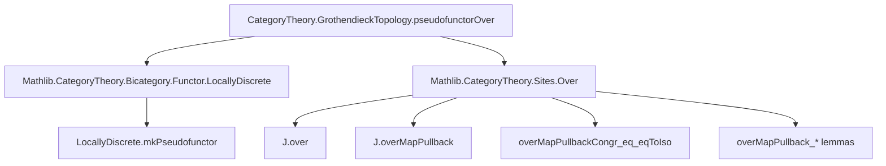

**Technical Brief: `PseudofunctorSheafOver.lean`**

---

### 1. **Key Definitions & Theorems**

| Name | Type / Signature | Purpose |
|------|------------------|---------|
| `pseudofunctorOver` | `J : GrothendieckTopology C → A : Category → Pseudofunctor (LocallyDiscrete Cᵒᵖ) Cat` | Constructs a pseudofunctor from the opposite of the locally discrete bicategory on `C` to `Cat`, sending each object `X : C` to the category of `A`-valued sheaves on the over category `Over X`. |
| `J.over X.unop` | `Site` | The over category `C / X` equipped with the induced Grothendieck topology via `J`. |
| `Sheaf (J.over X.unop) A` | `Category` | Category of sheaves on the site `J.over X.unop` with values in `A`. |
| `J.overMapPullback A f.unop` | `CatHom (Sheaf (J.over Y.unop) A) (Sheaf (J.over X.unop) A)` | Pullback functor along a morphism `f : X → Y` in `C`, induced by pullback of diagrams in over categories. |
| `J.overMapPullbackId`, `J.overMapPullbackComp`, `J.overMapPullback_assoc`, `J.overMapPullback_comp_id`, `J.overMapPullback_id_comp` | `Iso` terms | Coherence isomorphisms ensuring pseudofunctor laws hold up to coherent isomorphism (identity, composition, associativity, unit laws). |

---

### 2. **Naming Conventions**

- **Prefixes**:
  - `overMapPullback`: Indicates pullback along maps in over categories.
  - `overMapPullback_*`: Specific coherence laws (e.g., `assoc`, `comp_id`, `id_comp`).
- **Suffixes**:
  - `unop`: Used to convert morphisms in `C` to morphisms in `Cᵒᵖ` for compatibility with `LocallyDiscrete Cᵒᵖ`.
  - `.symm`: Used to invert isomorphisms when needed (e.g., for composition coherence).
- **`mkPseudofunctor`**: Standard pattern for defining pseudofunctors from locally discrete bicategories.

---

### 3. **Tactic Stack**

- `ext1`: Used to extend over 1-morphisms (e.g., natural transformations or functors).
- `simpa [overMapPullbackCongr_eq_eqToIso] using …`: Simplifies goals using congruence lemmas that identify isomorphisms induced by universal properties.
- `by ext1; simpa …`: Recurring pattern for verifying pseudofunctor coherence laws.

---

### 4. **Proof Logic**

- **Structure**: The definition is *constructive* and *explicit*.
- **Strategy**:
  1. Define the object mapping: `X ↦ Sheaf(J.over X.unop, A)`.
  2. Define the 1-morphism mapping: `f ↦ pullback along f`.
  3. Define 2-morphism data (identity and composition isomorphisms).
  4. Prove pseudofunctor axioms using:
     - Universal properties of pullbacks (via `overMapPullback_*` lemmas).
     - The `overMapPullbackCongr_eq_eqToIso` lemma to identify canonical isomorphisms.
- **Induction / Cases**: Not used — the proof is purely categorical and relies on coherence of pullbacks in a Grothendieck topology.

---

### 5. **Imports**

| Import | Role |
|--------|------|
| `Mathlib.CategoryTheory.Bicategory.Functor.LocallyDiscrete` | Provides `LocallyDiscrete.mkPseudofunctor`, used to define pseudofunctors from locally discrete bicategories. |
| `Mathlib.CategoryTheory.Sites.Over` | Provides `J.over`, `J.overMapPullback`, and coherence lemmas for pullbacks in over categories. |

---

### 8. **Mermaid Diagrams**

#### **Dependency Graph**



#### **Overview of File Structure**

```mermaid
flowchart LR
  subgraph "File: PseudofunctorSheafOver.lean"
    A[Universe declarations] --> B[CategoryTheory namespace]
    B --> C[GrothendieckTopology namespace]
    C --> D[pseudofunctorOver definition]
    D --> E[Object mapping: X ↦ Sheaf(J.over X, A)]
    D --> F[1-morphism mapping: f ↦ pullback(f)]
    D --> G[2-morphism data: id, comp, assoc, unit laws]
    G --> H[Proofs via simpa + ext1]
  end
```

#### **Theoretical Context**

```mermaid
graph LR
  subgraph "Higher Categorical Context"
    A[LocallyDiscrete Cᵒᵖ] -->|Objects| B[C]
    A -->|1-morphisms| C[Cᵒᵖ]
    D[Cat] -->|Objects| E[Categories]
    D -->|1-morphisms| F[Functors]
    D -->|2-morphisms| G[Natural Transformations]
    style A fill:#f9f,stroke:#333
    style D fill:#bbf,stroke:#333
  end

  subgraph "Sheaf Theory"
    B -->|Over categories| H[Over X]
    H -->|Grothendieck topology| I[Site]
    I -->|Sheaves| J[Sheaf(I, A)]
  end

  D <-->|pseudofunctorOver| J
```

--- 

This file formalizes a foundational construction in *stack theory* and *descent theory*, where sheaves on over categories vary pseudofunctorially over the base category. It sets up the machinery needed to define stacks and descent data in the language of bicategories.
