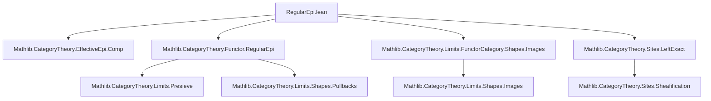

### Technical Brief: `RegularEpi.lean`

---

#### **1. Key Definitions & Theorems**

| Name | Type / Signature | Purpose |
|------|------------------|---------|
| `isRegularEpiCategory_sheaf` | `∀ {J : GrothendieckTopology C}, [HasPullbacks D] → [HasPushouts D] → [IsRegularEpiCategory D] → (∀ {F G : Sheaf J D} (f : F ⟶ G) [Epi f], ∃ I, p, i, Epi p ∧ Mono i ∧ p ≫ i = f.val) → [Balanced (Sheaf J D)] → IsRegularEpiCategory (Sheaf J D)` | Main theorem: under factorization and balance assumptions, the sheaf category `Sheaf J D` is a regular epi category. |
| `instance sheaf_isRegularEpiCategory_Type` | `IsRegularEpiCategory (Sheaf J (Type u))` | Instance for sheaves of types (`D := Type u`), using image factorization in `Type`. |
| `example` | `IsRegularEpiCategory (Sheaf J (Type (max u v)))` | Immediate corollary via `inferInstance`. |

**Auxiliary lemmas used in proof:**
- `isRegularEpi_iff_effectiveEpi`: Characterization of regular epis via effective epimorphisms.
- `Balanced.isIso_of_mono_of_epi`: In balanced categories, bimorphisms are isomorphisms.
- `presheafToSheaf.map_comp`, `sheafificationAdjunction.counit_naturality`: Naturality of sheafification counit.
- `Epi.comp_left_cancel`, `epi_of_epi`: Standard epi properties.
- `isColimitCoforkMapOfIsColimit`, `isColimitCoforkOfEffectiveEpi`: Colimit preservation under left exact functors (sheafification is left exact).

---

#### **2. Naming Conventions**

- **Prefixes:**
  - `isRegularEpi_`: Properties of regular epimorphisms.
  - `presheafToSheaf`, `sheafToPresheaf`: Functors between presheaf and sheaf categories.
  - `sheafificationAdjunction`: Sheafification adjunction.
  - `effectiveEpi`, `regularEpiOfEpi`: Standard terminology for factorization properties.
- **Suffixes:**
  - `_val`: Underlying presheaf of a sheaf (e.g., `f.val`, `F.val`).
  - `_map`: Application of a functor to a morphism (e.g., `presheafToSheaf.map f`).
  - `_app`: Component of a natural transformation at an object (e.g., `counit.app F`).
  - `_of_`: Construction from data (e.g., `epi_of_epi`, `isIso_of_mono_of_epi`).

---

#### **3. Tactic Stack**

| Tactic | Frequency | Role |
|--------|-----------|------|
| `rw` | High | Rewriting using naturality, factorization, and adjunction laws. |
| `simp` | High | Simplifying using adjunctions, functoriality, and sheaf properties. |
| `infer_instance` | Medium | Solving class constraints (e.g., `Epi`, `Mono`, `Balanced`). |
| `exact` / `exact?` | Medium | Completing subgoals after reductions. |
| `congr` | Low | Congruence reasoning (e.g., equality of composites). |
| `have` / `suffices` | High | Introducing intermediate claims and reducing goals. |
| `cases` | Low | Rarely needed; structure is categorical, not inductive. |

No heavy automation like `aesop` or `ring`; relies on manual manipulation of categorical structure.

---

#### **4. Proof Logic**

The proof follows a **factorization → sheafification → balance → colimit preservation** strategy:

1. **Factorization in presheaves**: Given epi `f : F ⟶ G` in `Sheaf J D`, use assumption `h` to factor `f.val` as `p ≫ i` with `p` epi, `i` mono.
2. **Sheafify**: Apply `presheafToSheaf` (left exact, preserves colimits) to get `presheafToSheaf.map f.val`.
3. **Show sheafified `i` is iso**: Since `presheafToSheaf.map f.val` is epi (as `f` is epi and sheafification is conservative), and `presheafToSheaf.map i` is mono (functor preserves monos), balance implies it’s an iso.
4. **Reduce to `p`**: Since `f` is iso-conjugate to `presheafToSheaf.map f.val = presheafToSheaf.map p ∘ presheafToSheaf.map i`, and `presheafToSheaf.map i` is iso, `f` is regular epi iff `presheafToSheaf.map p` is.
5. **Show `p` is regular epi**: Use that `p` is effective epi in presheaves (by assumption on `D`), and sheafification preserves colimits → coequalizer of kernel pair of `p` maps to coequalizer of kernel pair of `f`, hence `f` is regular epi.

The instance for `D = Type u` uses the standard image factorization in `Type`, where every morphism factors as epi followed by mono.

---

#### **5. Imports**

| Module | Purpose |
|--------|---------|
| `Mathlib.CategoryTheory.EffectiveEpi.Comp` | Composition properties of effective epimorphisms. |
| `Mathlib.CategoryTheory.Functor.RegularEpi` | Proof that presheaf categories `Cᵒᵖ ⥤ D` are regular epi when `D` is. |
| `Mathlib.CategoryTheory.Limits.FunctorCategory.Shapes.Images` | Image factorization in functor categories (used for `Type`-valued case). |
| `Mathlib.CategoryTheory.Sites.LeftExact` | Sheafification is left exact; preserves finite limits. |

---

#### **6. Mermaid Diagrams**

##### **Dependency Graph (Top-Level)**



##### **Proof Outline Flowchart**

```mermaid
flowchart LR
  Start[Given: f : F ⟶ G, Epi f] --> Factor[Factor f.val = p ≫ i, Epi p, Mono i]
  Factor --> Sheafify[Apply presheafToSheaf]
  Sheafify --> EpiSheafified[Show presheafToSheaf.map f.val is Epi]
  EpiSheafified --> EpiOfI[Show presheafToSheaf.map i is Epi]
  EpiOfI --> MonoIso[presheafToSheaf.map i is Mono + Epi ⇒ Iso (Balanced)]
  MonoIso --> ReduceToP[Reduce to showing presheafToSheaf.map p is RegEpi]
  ReduceToP --> EffectiveP[p is EffectiveEpi in presheaves]
  EffectiveP --> SheafColimit[Sheafification preserves colimits ⇒ f is EffectiveEpi]
  SheafColimit --> Final[⇒ f is RegularEpi]
```

##### **Theory Context Overview**

```mermaid
graph LR
  subgraph "Base Category"
    C[Category C]
    D[Category D]
  end

  subgraph "Sheaf Theory"
    J[Grothendieck Topology J on C]
    P[Presheaf C D]
    S[Sheaf J D]
  end

  subgraph "Functors"
    presheafToSheaf[Presheaf ⥡ Sheaf]
    sheafToPresheaf[Sheaf ⥯ Presheaf]
    sheafification[Sheafification Adjunction]
  end

  subgraph "Assumptions"
    HPull[HasPullbacks D]
    HPush[HasPushouts D]
    RegD[IsRegularEpiCategory D]
    Fact[Factorization of epis in Sheaf]
    Bal[Balanced Sheaf J D]
  end

  C --> P
  D --> P
  J --> S
  P --> presheafToSheaf
  S --> sheafToPresheaf
  presheafToSheaf --> sheafification
  sheafToPresheaf --> sheafification
  RegD & HPull & HPush & Fact & Bal --> MainResult[IsRegularEpiCategory (Sheaf J D)]
```

--- 

This file formalizes a foundational result in sheaf theory: under mild conditions, sheaf categories inherit the regular epi structure from their target category, crucial for developing cohomology and descent theory in categorical logic and geometry.
