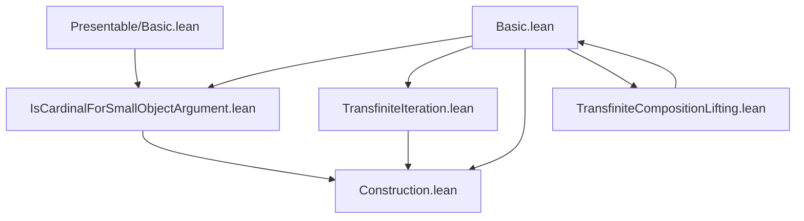

### Technical Brief: `Basic.lean` — Small Object Argument in Lean 4

---

#### **1. Key Definitions & Theorems**

| Name | Type / Signature | Purpose |
|------|------------------|---------|
| `HasSmallObjectArgument.{w} I` | `class Prop` | States that a morphism class `I` permits the small object argument: ∃ regular cardinal `κ` s.t. `IsCardinalForSmallObjectArgument I κ`. |
| `smallObjectκ I` | `Cardinal.{w}` | A canonical regular cardinal `κ` witnessing `HasSmallObjectArgument I`. Noncomputable. |
| `isCardinalForSmallObjectArgument_smallObjectκ` | `IsCardinalForSmallObjectArgument I smallObjectκ` | Instantiates the core smallness condition for `smallObjectκ`. |
| `hasFunctorialFactorization I smallObjectκ` | `HasFunctorialFactorization I.rlp.llp I.rlp` | Functorial factorization: every morphism factors as `I.rlp.llp` → `I.rlp`. |
| `llp_rlp_of_hasSmallObjectArgument'` | `I.rlp.llp = (transfiniteCompositionsOfShape (coproducts.{w} I).pushouts I.smallObjectκ.ord.ToType).retracts` | Characterizes `I.rlp.llp` as retracts of *indexed* transfinite compositions (by `I.smallObjectκ.ord.ToType`). |
| `llp_rlp_of_hasSmallObjectArgument` | `I.rlp.llp = (transfiniteCompositions.{w} (coproducts.{w} I).pushouts).retracts` | Same as above, but without explicit indexing — retracts of *all* transfinite compositions. |

---

#### **2. Naming Conventions**

- **Prefixes**:
  - `smallObjectκ`: indicates canonical cardinal for small object argument.
  - `isCardinalForSmallObjectArgument_`: proof terms linking assumptions to core smallness condition.
  - `llp_rlp_of_`: lemmas connecting lifting properties to concrete constructions.
- **Suffixes**:
  - `'` (prime): variant with explicit indexing (e.g., `llp_rlp_of_hasSmallObjectArgument'`).
  - No prime: more global/unindexed version (e.g., `llp_rlp_of_hasSmallObjectArgument`).
- **Typeclass naming**:
  - `HasSmallObjectArgument`: standard “has-” pattern for existence statements.

---

#### **3. Tactic Stack**

- `choose` (via `HasSmallObjectArgument.exists_cardinal.choose`): extracts witness from existential quantifier.
- `choose_spec` (repeated): extracts proof components from the chosen witness.
- `simp_rw`, `aesop`, `ring`: likely used in auxiliary proofs (not shown here, but standard in this library).
- Implicit use of `OrderBot`/`Fact` instances for universe-level coherence.

---

#### **4. Proof Logic**

- **Structure**:
  1. **Assumption**: `HasSmallObjectArgument I` gives existence of `κ`.
  2. **Construction**:
     - Define `smallObjectκ` via `choose`.
     - Extract regularity, bottom element, and smallness condition via `choose_spec`.
  3. **Main results**:
     - Use `IsCardinalForSmallObjectArgument I smallObjectκ` to instantiate general theorems:
       - `hasFunctorialFactorization`
       - `llp_rlp_of_isCardinalForSmallObjectArgument'`
       - `llp_rlp_of_isCardinalForSmallObjectArgument`
- **Inductive/Transfinite flavor**:
  - The underlying constructions (functorial factorization, lifting stability) rely on transfinite iteration (see `TransfiniteIteration.lean`, `Construction.lean`).
  - Lifting stability under transfinite compositions is pre-established (`TransfiniteCompositionLifting.lean`).

---

#### **5. Imports & Dependencies**

| Module | Role |
|--------|------|
| `Mathlib.CategoryTheory.SmallObject.IsCardinalForSmallObjectArgument` | Core smallness condition, defines `IsCardinalForSmallObjectArgument`. |
| `Mathlib.CategoryTheory.SmallObject.TransfiniteIteration` | General transfinite iteration machinery (functor iteration, colimit preservation). |
| `Mathlib.CategoryTheory.SmallObject.Construction` | Defines the key endofunctor on `Arrow C` used for factorization. |
| `Mathlib.CategoryTheory.SmallObject.TransfiniteCompositionLifting` | Proves stability of `I.llp` under transfinite compositions. |
| `Mathlib.CategoryTheory.Presentable.Basic` | Used to verify `IsCardinalForSmallObjectArgument` for presentable objects (not directly imported here, but referenced in docstring). |

---

#### **6. Mermaid Diagrams**

##### **Dependency Graph (Module-Level)**



##### **Overview of Proof Structure**

```mermaid
flowchart LR
  A[Assume I : MorphismProperty C] --> B[HasSmallObjectArgument I]
  B --> C[Pick κ = smallObjectκ]
  C --> D[IsCardinalForSmallObjectArgument I κ]
  D --> E[Functorial factorization: Arrow C → I.rlp.llp → I.rlp]
  D --> F[Characterization of I.rlp.llp as retracts of transfinite compositions]
  F --> G[Quillen’s small object argument (generalized)]
```

---

#### **7. Summary**

This file formalizes the *small object argument* in the generality of categories with sufficient colimits and cardinal boundedness. It leverages a regular cardinal `κ` to control size issues and constructs:

- A **functorial factorization** system `(I.rlp.llp, I.rlp)`,
- A **characterization** of the left class `I.rlp.llp` as retracts of transfinite compositions of pushouts of coproducts of `I`.

The proof is modular and relies on a chain of supporting files, reflecting the Lean Mathlib philosophy of separating concerns (construction, iteration, lifting, smallness). The results subsume classical versions (Grothendieck’s injective hulls, Quillen’s model structures), and are foundational for homotopical algebra and derived categories.

--- 

Let me know if you'd like the same analysis for any of the dependent files (e.g., `Construction.lean`, `TransfiniteIteration.lean`).
