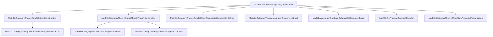
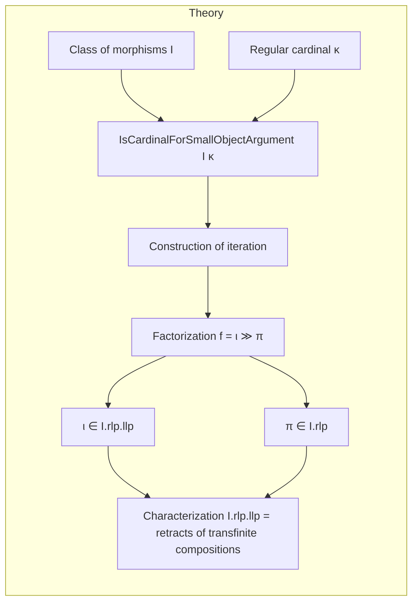

Here is the **technical metadata** extracted from `IsCardinalForSmallObjectArgument.lean`, formatted as requested:

---

### 1. KEY DEFINITIONS & THEOREMS

| Name | Type / Signature | Purpose |
|------|------------------|---------|
| `IsCardinalForSmallObjectArgument` | `class (κ : Cardinal.{w}) [Fact κ.IsRegular] [OrderBot κ.ord.ToType] : Prop` | Encodes technical conditions (smallness, colimits, preservation of colimits by `Hom(A, -)`) required to carry out the small object argument via transfinite iteration up to `κ.ord.ToType`. |
| `succStruct` | `SuccStruct (Arrow C ⥤ Arrow C)` | Successor structure on the functor category `Arrow C ⥤ Arrow C`, induced by the natural transformation `ε : 1 ⇒ SmallObject.functor I.homFamily`. |
| `iterationFunctor` | `κ.ord.ToType ⥤ Arrow C ⥤ Arrow C` | Transfinite iteration of `succStruct`, indexing steps of the construction. |
| `iteration` | `Arrow C ⥤ Arrow C` | Colimit of `iterationFunctor`, i.e., the transfinite composition of the successor steps. |
| `ιIteration` | `𝟭 _ ⟶ iteration` | Natural inclusion from identity to the transfinite iteration. |
| `ιObj`, `πObj` | `X ⟶ obj I κ f`, `obj I κ f ⟶ Y` | Intermediate object and factorization morphisms in the small object argument. |
| `relativeCellComplexιObj` | `RelativeCellComplex I.homFamily (ιObj I κ f)` | Shows `ιObj` is a relative `I`-cell complex. |
| `rlp_πObj` | `I.rlp (πObj I κ f)` | Shows `πObj` has the right lifting property w.r.t. `I`. |
| `llp_rlp_of_isCardinalForSmallObjectArgument` | `I.rlp.llp = (transfiniteCompositions (coproducts I).pushouts).retracts` | Characterizes the class `I.rlp.llp` as retracts of transfinite compositions of pushouts of coproducts of maps in `I`. |
| `functorialFactorizationData` | `FunctorialFactorizationData I.rlp.llp I.rlp` | Constructs a *functorial* factorization system with left class `I.rlp.llp` and right class `I.rlp`. |
| `hasFunctorialFactorization` | `HasFunctorialFactorization I.rlp.llp I.rlp` | Concludes existence of a functorial factorization system. |

---

### 2. NAMING CONVENTIONS

- **Prefixes**:
  - `ι` (iota): inclusion / transfinite inclusion morphism (e.g., `ιObj`, `ιIteration`, `ιFunctorObj`)
  - `π` (pi): projection / transfinite projection morphism (e.g., `πObj`)
  - `obj`: intermediate object in factorization (e.g., `obj`, `objMap`)
  - `iteration`: transfinite iteration-related constructions (e.g., `iterationFunctor`, `iteration`, `iterationObjRightIso`)
  - `succStruct`: successor structure (e.g., `succStruct`, `succStruct_prop_le_propArrow`)
  - `propArrow`, `prop_iterationFunctor_map_succ`: properties of morphisms in the successor structure.

- **Suffixes**:
  - `Iso`: isomorphism (e.g., `iterationFunctorObjObjRightIso`)
  - `App`: application at an object (e.g., `ιIteration_app_right`)
  - `Naturality`: naturality squares (e.g., `ιObj_naturality`, `πObj_naturality`)
  - `LE`, `Succ`: order-theoretic morphisms (e.g., `homOfLE`, `Order.succ`, `Order.le_succ`)

---

### 3. TACTIC STACK

Frequently used tactics in proofs:
- `simp` / `simp only` / `simp_rw`: simplification with definitional equalities and lemmas.
- `rw`: rewriting using equalities and isomorphisms.
- `dsimp`: definitional simplification (especially for unfolding definitions).
- `infer_instance`: filling typeclass arguments.
- `apply`, `exact`, `intro`: basic proof scripting.
- `have`, `obtain`: intermediate lemma introduction.
- `convert`, `congr`: congruence-based equality proofs.
- `cancel_mono`, `cancel_epi`: cancellation lemmas for monos/epis.
- `reassoc`: for rewriting associativity in simp lemmas.
- `asIso`, `isoMk`: constructing isomorphisms.

---

### 4. PROOF LOGIC

The logical flow of proofs follows a **structured transfinite induction** pattern:

1. **Setup**: Assume `IsCardinalForSmallObjectArgument I κ`, giving access to:
   - Smallness (`isSmall`, `locallySmall`)
   - Colimit existence (`hasPushouts`, `hasCoproducts`, `hasIterationOfShape`)
   - Preservation of colimits by `Hom(A, -)` for `A → B ∈ I`.

2. **Construction of successor structure**:
   - Build `succStruct` using `ε` and colimits.
   - Show `(succStruct).prop ≤ propArrow`, i.e., successor steps are pushouts of coproducts of `I` on the left and isomorphisms on the right.

3. **Transfinite iteration**:
   - Define `iterationFunctor`, `iteration`, and `ιIteration`.
   - Prove that `ιIteration` is a transfinite composition of `(succStruct).prop`-morphisms.

4. **Factorization**:
   - Define `obj`, `ιObj`, `πObj` as components of the factorization.
   - Prove `ιObj_πObj : ιObj ≫ πObj = f`.
   - Show `ιObj` is a relative `I`-cell complex via `relativeCellComplexιObj`.
   - Show `πObj ∈ I.rlp` via lifting property.

5. **Characterization of `I.rlp.llp`**:
   - Use the factorization to show any `f ∈ I.rlp.llp` is a retract of a transfinite composition of pushouts of coproducts of `I`.
   - Conclude equality of classes via `le_antisymm`.

---

### 5. IMPORTS (PRIMARY DEPENDENCIES)

| Module | Purpose |
|--------|---------|
| `Mathlib.CategoryTheory.SmallObject.Construction` | Defines `ε`, `functorObj`, `ιFunctorObj`, `πFunctorObj`, and the basic successor step. |
| `Mathlib.CategoryTheory.SmallObject.TransfiniteIteration` | Provides iteration theory for `SuccStruct`, including `iterationFunctor`, `ιIteration`, and transfinite composition. |
| `Mathlib.CategoryTheory.SmallObject.TransfiniteCompositionLifting` | Lifting properties for transfinite compositions. |
| `Mathlib.CategoryTheory.MorphismProperty.IsSmall` | `IsSmall`, `LocallySmall`, `HasCoproducts`, etc. |
| `Mathlib.AlgebraicTopology.RelativeCellComplex.Basic` | `RelativeCellComplex`, `AttachCells`, `transfiniteCompositionsOfShape`. |
| `Mathlib.SetTheory.Cardinal.Regular` | Regular cardinals, `κ.ord`, `ToType`, `noMaxOrder`, etc. |
| `Mathlib.CategoryTheory.MorphismProperty.Factorization` | `FunctorialFactorizationData`, `HasFunctorialFactorization`. |

---

### 6. MERMAID DIAGRAMS

#### Dependency Graph (Top-Level Modules)

#### Overview of the File’s Role in the Theory

---

Let me know if you'd like a formalized dependency graph (e.g., for `leanproject`), or a visualization of the `iterationFunctor` indexing diagram.
