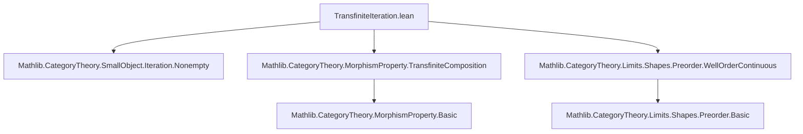
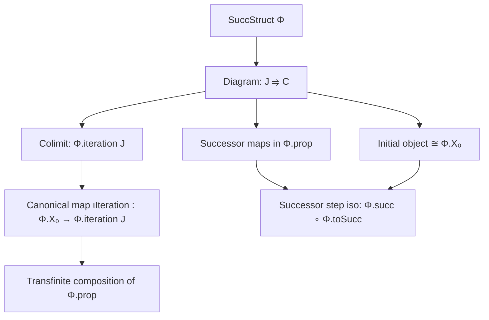

### Technical Brief: `TransfiniteIteration.lean`

---

#### **1. Key Definitions & Theorems**

| Name | Type | Purpose |
|------|------|---------|
| `iter (j : J)` | `Φ.Iteration j` | Chooses a canonical element in the $j$-th iteration (using `Classical.arbitrary`). |
| `iterationFunctor (J)` | `J ⥤ C` | Functor indexing transfinite iterations of `Φ` over a well-ordered type `J`. |
| `iteration (J)` | `C` | The colimit of `iterationFunctor J`, i.e., the $J$-th transfinite iteration of `Φ`. |
| `iterationCocone (J)` | `Cocone (Φ.iterationFunctor J)` | The canonical colimit cocone. |
| `isColimitIterationCocone (J)` | `IsColimit (Φ.iterationCocone J)` | Asserts that `iterationCocone J` is a colimit. |
| `iterationFunctorObjBotIso (J)` | `(Φ.iterationFunctor J).obj ⊥ ≅ Φ.X₀` | Isomorphism between the initial object in the diagram and the start of the successor structure. |
| `ιIterationFunctor (J)` | `const Φ.X₀ ⟶ Φ.iterationFunctor J` | Natural transformation from constant `Φ.X₀` to the diagram. |
| `ιIteration (J)` | `Φ.X₀ ⟶ Φ.iteration J` | Canonical map from start object to transfinite iteration (the $J$-th transfinite composition). |
| `transfiniteCompositionOfShapeιIteration (J)` | `Φ.prop.TransfiniteCompositionOfShape J (Φ.ιIteration J)` | Shows `ιIteration J` is a transfinite composition of morphisms in `Φ.prop`. |
| `prop_iterationFunctor_map_succ (j, hj)` | `Φ.prop ((Φ.iterationFunctor J).map (homOfLE (Order.le_succ j)))` | Maps successor steps in the diagram are in `Φ.prop`. |
| `iterationFunctorObjSuccIso (j, hj)` | `(Φ.iterationFunctor J).obj (Order.succ j) ≅ Φ.succ ((Φ.iterationFunctor J).obj j)` | Successor step in diagram is isomorphic to applying `Φ.succ`. |
| `iterationFunctor_map_succ (j, hj)` | `(Φ.iterationFunctor J).map (homOfLE (Order.le_succ j)) = Φ.toSucc _ ≫ (Φ.iterationFunctorObjSuccIso j hj).inv` | Factorization of successor maps via `Φ.toSucc`. |

---

#### **2. Naming Conventions**

- **Prefixes**:
  - `iterationFunctor_`: relates to the diagram functor.
  - `ιIteration`: canonical morphism from start object to colimit.
  - `prop_`: properties of morphisms in the successor structure (e.g., `prop_iterationFunctor_map_succ`).
  - `isColimit_`: asserts colimit universal property.
- **Suffixes**:
  - `_iso`: indicates an isomorphism.
  - `_cocone`: refers to cocones.
  - `_functor`: refers to functors.
  - `_obj`: object part of a functor or structure.
  - `_map`: morphism part of a functor or structure.

---

#### **3. Tactic Stack**

- `simp` / `simp only`: heavily used for simplifying hom-sets and functors.
- `rw`: rewriting using lemmas like `iterationFunctor_obj`, `arrowMk_iterationFunctor_map`.
- `apply Arrow.mk_injective`: to prove equality of arrows in arrow category.
- `exact`, `refine`, `intro`: standard proof construction.
- `dsimp`: for definitional simplification (e.g., unfolding `iterationFunctor`).
- `eqToIso`: converting equalities to isomorphisms.
- `NatIso.ofComponents`: constructing natural isomorphisms componentwise.
- `Cocones.ext`: extensionality for cocones.
- `IsColimit.ofIsoColimit`, `IsColimit.precomposeInvEquiv`: colimit manipulation.

---

#### **4. Proof Logic**

- **Inductive/structural reasoning** on the well-ordered type `J`:
  - Use of `WellFoundedLT J` and `SuccOrder J` to reason about successors and limits.
- **Colimit universal property** is central:
  - Prove that certain cones are colimits via `IsColimit` lemmas.
  - Use isomorphisms to transfer known colimits (e.g., from `Φ.iter i`) to the global diagram.
- **Diagram analysis**:
  - Successor steps: relate `(Φ.iterationFunctor J).map (homOfLE (le_succ j))` to `Φ.toSucc`.
  - Initial step: relate `⊥` to `X₀` via `iterationFunctorObjBotIso`.
- **Morphism property preservation**:
  - Show successor maps lie in `Φ.prop`, then use `succ_eq` and `fac` from `TransfiniteCompositionOfShape`.

---

#### **5. Imports**

| Module | Purpose |
|--------|---------|
| `Mathlib.CategoryTheory.SmallObject.Iteration.Nonempty` | Nonemptiness and basic iteration properties. |
| `Mathlib.CategoryTheory.MorphismProperty.TransfiniteComposition` | Theory of transfinite compositions of morphisms. |
| `Mathlib.CategoryTheory.Limits.Shapes.Preorder.WellOrderContinuous` | Continuity of limits over well-ordered diagrams. |

---

#### **6. Mermaid Diagrams**

##### **Dependency Graph (Module-Level)**



##### **Overview of Theoretical Flow**



##### **Diagram of Key Isomorphisms & Maps**

```mermaid
graph LR
  X₀["Φ.X₀"] -->|ιIterationFunctor| D[j]
  X₀ -->|ιIteration| COLIM["Φ.iteration J"]
  D[("Φ.iterationFunctor J").obj ⊥] -- iso -->|iterationFunctorObjBotIso| X₀
  D[j] -->|colimit.ι j| COLIM
  D[j] -->|map (le_succ j)| D[succ j]
  D[succ j] -- iso -->|iterationFunctorObjSuccIso| Φ.succ(D[j])
  Φ.succ(D[j]) -->|Φ.toSucc| D[succ j]
```

---

#### **7. Summary**

This file formalizes the **transfinite iteration of a successor structure** over a well-ordered index type `J`. It constructs a diagram `iterationFunctor J : J ⥤ C`, shows it admits a colimit (`iteration J`), and proves that the canonical map `ιIteration : Φ.X₀ → Φ.iteration J` is a **transfinite composition** of morphisms in `Φ.prop`. Key technical tools include:
- Isomorphisms between diagram objects and iterates (`Φ.iter j`),
- Factorization of successor maps via `Φ.toSucc`,
- Verification that the diagram is *well-order continuous*, enabling colimit arguments.

This is foundational for the small object argument and localization in category theory.
