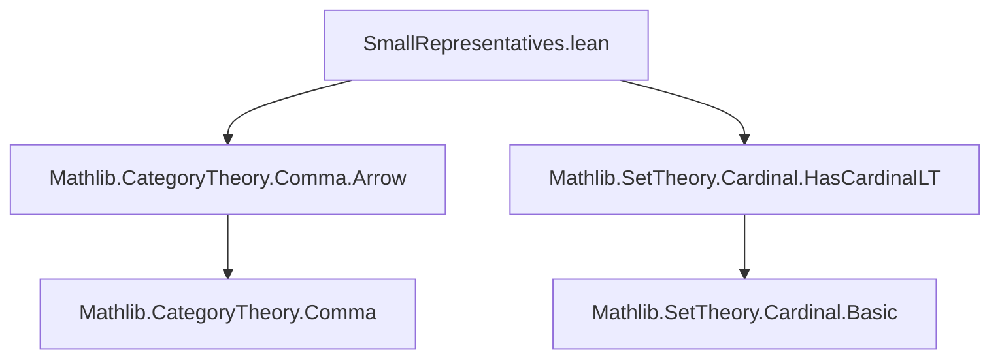
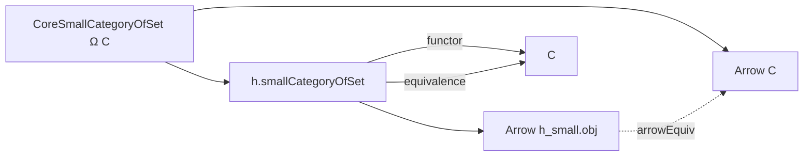

### Technical Brief: `SmallRepresentatives.lean`

---

#### **1. Key Definitions & Theorems**

| Name | Type / Signature | Purpose |
|------|------------------|---------|
| `SmallCategoryOfSet Ω` | `Type w → Type w` | Structure encoding a category whose objects and morphisms are subtypes of a fixed type `Ω`. Encodes identity, composition, and axioms. |
| `SmallCategoryOfSet.categoryFamily` | `SmallCategoryOfSet Ω → Type w` | Family of categories indexed by `SmallCategoryOfSet Ω`; each term yields the object type of a small category. |
| `CoreSmallCategoryOfSet Ω C` | `Type w → Type u → Type w` | Helper structure for constructing `SmallCategoryOfSet Ω` from a category `C`, using bijections between `C`’s objects/morphisms and subtypes of `Ω`. |
| `CoreSmallCategoryOfSet.smallCategoryOfSet` | `CoreSmallCategoryOfSet Ω C → SmallCategoryOfSet Ω` | Converts a `CoreSmallCategoryOfSet` into a `SmallCategoryOfSet`. |
| `CoreSmallCategoryOfSet.functor` | `h.smallCategoryOfSet.obj ⥤ C` | Canonical functor from the constructed small category to `C`. |
| `CoreSmallCategoryOfSet.equivalence` | `h.smallCategoryOfSet.obj ≌ C` | Equivalence of categories induced by `h`. |
| `CoreSmallCategoryOfSet.arrowEquiv` | `Arrow h.smallCategoryOfSet.obj ≃ Arrow C` | Bijection on arrows induced by the equivalence. |
| `SmallCategoryOfSet.exists_equivalence` | `∀ C, [Category C], Cardinal bounds ⇒ ∃ S, Nonempty (categoryFamily Ω S ≌ C)` | Main representation theorem: any category with object/morphism cardinals ≤ `Ω` is equivalent to some `categoryFamily Ω S`. |
| `SmallCategoryCardinalLT κ` | `Cardinal.{w} → Type w` | Index type for a representative family of categories whose arrow types have cardinality `< κ`. |
| `SmallCategoryCardinalLT.categoryFamily` | `SmallCategoryCardinalLT κ → Type w` | Family of categories indexed by `SmallCategoryCardinalLT κ`. |
| `SmallCategoryCardinalLT.exists_equivalence` | `HasCardinalLT (Arrow C) κ ⇒ ∃ S, Nonempty (categoryFamily κ S ≌ C)` | Representation theorem for categories bounded by a cardinal `κ`. |

---

#### **2. Naming Conventions**

- **Prefixes**:
  - `SmallCategoryOfSet.*`: Core data structures for representing small categories via subtypes.
  - `CoreSmallCategoryOfSet.*`: Intermediate helper structures for constructing representatives.
  - `categoryFamily`: Standard suffix for families of categories indexed by a parameter.
- **Suffixes**:
  - `Equiv`: Denotes bijections (e.g., `objEquiv`, `homEquiv`).
  - `functor`, `equivalence`: Standard categorical constructions.
  - `smallCategoryOfSet`: Conversion from helper to main structure.
- **Logical suffixes**:
  - `exists_equivalence`: Existence of equivalence under cardinal bounds.
  - `hasCardinalLT`: Property of a category (its arrows are `< κ`).

---

#### **3. Tactic Stack**

Frequent tactics used in proofs:

- `by cat_disch`: Custom tactic for category-theoretic discharge (likely defined in Mathlib’s `CategoryTheory.Init`).
- `simp`, `simp_rw`: Simplification using `@[simp]` lemmas (`id_comp`, `comp_id`, `assoc`, `@simps`).
- `rw`: Rewriting using definitions and equivalences.
- `obtain ⟨x, rfl⟩ := ...`: Case analysis on equivalences/embeddings.
- `congr_arg`: To extract equality of components from equality of structured terms.
- `rwa [hasCardinalLT_iff_of_equiv ...]`: Rewriting using equivalence-induced cardinal bounds.
- `constructor`: For proving biconditionals or isomorphisms.

---

#### **4. Proof Logic**

The logical flow follows a standard pattern for *smallness representatives*:

1. **Helper structure (`CoreSmallCategoryOfSet`)**:
   - Given a category `C`, choose embeddings of objects and morphisms into `Ω`.
   - Use these to define a `SmallCategoryOfSet` structure on subtypes of `Ω`.

2. **Construct canonical functor**:
   - From the constructed small category to `C`, using the chosen bijections.
   - Prove it is fully faithful and essentially surjective ⇒ equivalence.

3. **Cardinal bounds**:
   - Use `Cardinal.lift_mk_le'` to extract embeddings from cardinal inequalities.
   - Construct `CoreSmallCategoryOfSet` using these embeddings.

4. **Cardinal-indexed family**:
   - Define `SmallCategoryCardinalLT κ` as pairs `(S, h)` where `S : SmallCategoryOfSet κ.ord.ToType` and `h : HasCardinalLT (Arrow S.obj) κ`.
   - Show any `C` with `HasCardinalLT (Arrow C) κ` is equivalent to some `categoryFamily κ S`.

---

#### **5. Imports**

- `Mathlib.CategoryTheory.Comma.Arrow`: For `Arrow C` (category of arrows in `C`).
- `Mathlib.SetTheory.Cardinal.HasCardinalLT`: For `HasCardinalLT` and cardinal boundedness.

These imports define the ambient categorical and set-theoretic context.

---

#### **6. Mermaid Diagrams**

##### **Dependency Graph (Module Level)**



##### **Overview of Theory Flow**

```mermaid
graph LR
  A[Type Ω] --> B[SmallCategoryOfSet Ω]
  B --> C[categoryFamily Ω : SmallCategoryOfSet Ω → Type w]
  
  D[Category C] --> E[CoreSmallCategoryOfSet Ω C]
  E --> F[smallCategoryOfSet : SmallCategoryOfSet Ω]
  E --> G[functor : smallCategoryOfSet.obj ⥤ C]
  G --> H[equivalence : smallCategoryOfSet.obj ≌ C]
  
  I[Cardinal κ] --> J[SmallCategoryCardinalLT κ]
  J --> K[categoryFamily κ : SmallCategoryCardinalLT κ → Type w]
  K --> L[exists_equivalence : HasCardinalLT (Arrow C) κ ⇒ ∃ S, C ≌ categoryFamily κ S]
```

##### **Arrow Equivalence Chain**



---

#### **7. Summary**

This module formalizes a *small family of small categories* that *represent all small categories up to equivalence*, bounded by a universe-level type `Ω` or a cardinal `κ`. It leverages:
- **Bijections** to embed categories into a fixed universe,
- **Cardinal arithmetic** to control size,
- **Category-theoretic constructions** (functors, equivalences) to relate constructed and target categories.

It is foundational for formalizing *local smallness*, *accessibility*, and *presentability* in dependent type theory.
