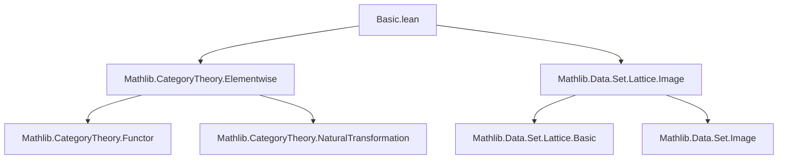
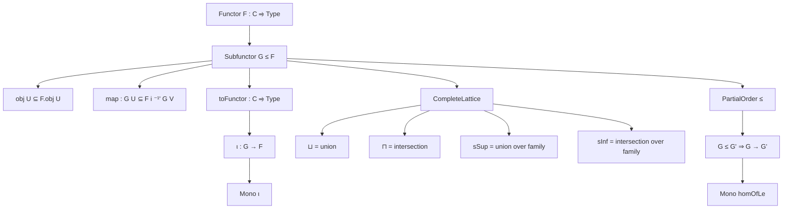
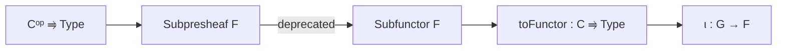

### Technical Brief: `Basic.lean` — Subfunctors of Type-Valued Functors

---

#### **1. Key Definitions & Theorems**

| Name | Type / Signature | Purpose |
|------|------------------|---------|
| `Subfunctor F` | `Structure` | A subfunctor of a functor $F : C \to \mathbf{Type}_w$ consists of a subset `obj U ⊆ F.obj U` for each object $U$, stable under restriction maps `F.map i`. |
| `obj` | `∀ U, Set (F.obj U)` | Sections of the subfunctor over each object. |
| `map` | `∀ {U V i : U ⟶ V}, obj U ⊆ F.map i ⁻¹' obj V` | Compatibility with morphisms: if $x \in G(U)$, then $F(i)(x) \in G(V)$. |
| `PartialOrder (Subfunctor F)` | `Instance` | Lifts pointwise subset inclusion to a partial order on subfunctors. |
| `CompleteLattice (Subfunctor F)` | `Instance` | Subfunctors form a complete lattice: sup/inf/sup/inf over arbitrary families defined pointwise via set-theoretic operations. |
| `toFunctor G` | `G.toFunctor : C ⥤ Type w` | The subfunctor $G$ viewed as a functor (via subtype coercion). |
| `ι G` | `G.ι : G.toFunctor ⟶ F` | Natural inclusion of the subfunctor into the ambient functor. |
| `homOfLe h` | `G ≤ G' ⇒ G.toFunctor ⟶ G'.toFunctor` | Natural transformation induced by inclusion of subfunctors. |
| `eq_top_iff_isIso` | `G = ⊤ ↔ IsIso G.ι` | Characterizes the top subfunctor as those whose inclusion is an isomorphism (i.e., surjective on all components). |
| `nat_trans_naturality` | `f : F' ⟶ G.toFunctor ⇒ F'.map i x` maps compatibly under `f` and `F.map i` | Ensures naturality of maps into a subfunctor, modulo coercion. |

---

#### **2. Naming Conventions**

- **Prefixes**:
  - `obj`, `map`: structural components of `Subfunctor`.
  - `toFunctor`, `ι`, `homOfLe`: constructions from subfunctor data.
  - `le_def`, `top_obj`, `bot_obj`, `max_obj`, `min_obj`: properties of lattice operations.
  - `iSup_obj`, `iInf_obj`, `sSup_obj`, `sInf_obj`: behavior of (indexed) sup/inf with respect to `obj`.

- **Suffixes**:
  - `_obj`: behavior of a construction on `obj U`.
  - `_map`: behavior on morphisms (less frequent here; mostly implicit via `map` field).
  - `_ι`: inclusion morphism (e.g., `homOfLe_ι`).

- **Aliases**:
  - `Subpresheaf` is deprecated in favor of `Subfunctor` (since 2025-12-11), indicating a shift toward functor-theoretic language over presheaf-specific terminology.

---

#### **3. Tactic Stack**

Frequent tactics used in proofs:

| Tactic | Usage |
|--------|-------|
| `aesop` | Automated reasoning for lattice identities (`max_min`, `iSup_min`, `bot_le`, etc.). |
| `simp` / `simp only` | Simplification using `@[simp]` lemmas (`top_obj`, `bot_obj`, `iSup_obj`, `min_obj`, etc.). |
| `ext` | Extensionality for functions/natural transformations/subtypes. |
| `rintro` / `intro` | Introducing hypotheses and destructuring conjunctions/disjunctions. |
| `dsimp`, `simp only [FunctorToTypes.*]` | Simplifying type-theoretic coercions and functor actions. |
| `exact`, `apply`, `refine` | Direct proof steps, especially for lattice properties. |
| `rw [← ...]` | Rewriting using inverse identities (e.g., `eq_top_iff_isIso`). |

---

#### **4. Proof Logic**

- **Structure**: Proofs are largely *pointwise* — properties of subfunctors are reduced to set-theoretic properties of their `obj U` components.
- **Induction**: Not used; instead, proofs rely on:
  - **Extensionality principles** (`ext`, `funext`, `Subtype.ext`) to compare natural transformations/subtypes.
  - **Lattice-theoretic reasoning** (e.g., `sup_le`, `le_sup`, `inf_le`, `le_inf`) lifted pointwise.
  - **Element chasing** via `intro x hx`, `exact F.map _ h'`, etc., to verify compatibility conditions.
- **Dependence on `Set` theory**: Many proofs reduce to standard set operations (`union`, `intersection`, `sUnion`, `sInter`) and their monotonicity.

---

#### **5. Imports**

| Module | Role |
|--------|------|
| `Mathlib.CategoryTheory.Elementwise` | Provides `elementwise` style reasoning and `FunctorToTypes` infrastructure (e.g., `map_id_apply`, `map_comp_apply`). |
| `Mathlib.Data.Set.Lattice.Image` | Supplies lattice operations on sets (`sSup`, `sInf`, `image`, `iUnion`, `iInter`), crucial for defining sup/inf of subfunctors. |

---

#### **6. Mermaid Diagrams**

##### **Dependency Graph (Module-Level)**

##### **Overview of Theory (Subfunctor Lattice)**

##### **Relationship to Presheaves**

> **Note**: The module uses `C ⥤ Type` (covariant functors), whereas presheaves are typically contravariant (`Cᵒᵖ ⥤ Type`). The shift to `Subfunctor` reflects a move toward generality beyond presheaves.

---

#### **7. Summary**

This module formalizes **subfunctors of type-valued functors**, generalizing subpresheaves. It equips the collection of subfunctors with a **complete lattice structure**, where joins/meets are defined pointwise. Key constructions include the embedded functor `toFunctor`, the inclusion `ι`, and morphisms between subfunctors induced by inclusion (`homOfLe`). The proofs rely heavily on set-theoretic reasoning and Lean’s `ext` principles, with automation via `aesop` and `simp`. The deprecation of `Subpresheaf` signals a broader categorical perspective, aligning with modern Mathlib’s emphasis on functorial generality over sheaf-theoretic specialization.
