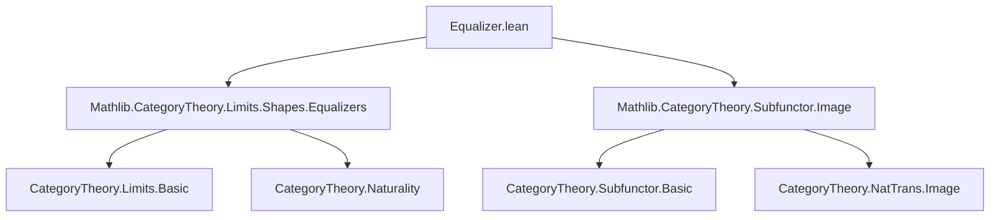
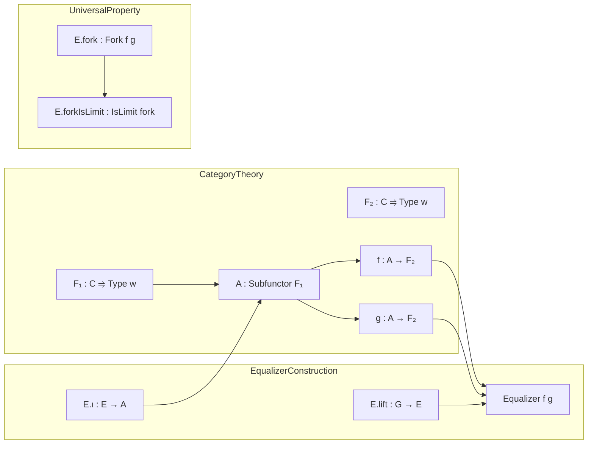
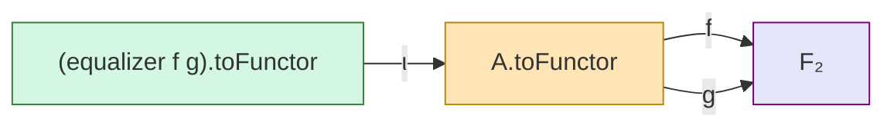

### Technical Brief: Equalizer of Morphisms of Functors as a Subfunctor

---

#### **1. Key Definitions & Theorems**

| Name | Type / Signature | Purpose |
|------|------------------|---------|
| `equalizer` | `Subfunctor F₁` | Constructs the subfunctor of `F₁` where `f` and `g` agree, i.e., points in `A` on which `f` and `g` coincide. |
| `equalizer_le` | `equalizer f g ≤ A` | Inclusion of the equalizer into `A`. |
| `equalizer_self` | `equalizer f f = A` | Trivial case: equalizer of identical morphisms is the whole subfunctor. |
| `mem_equalizer_iff` | `x.1 ∈ equalizer.obj i ↔ f.app i x = g.app i x` | Membership characterization: an element lies in the equalizer iff `f` and `g` agree on it. |
| `range_le_equalizer_iff` | `range (φ ≫ A.ι) ≤ equalizer f g ↔ φ ≫ f = φ ≫ g` | Universal property in terms of factorization through the equalizer. |
| `equalizer_eq_iff` | `equalizer f g = A ↔ f = g` | Equality of equalizer and `A` iff `f = g`. |
| `equalizer.ι` | `(equalizer f g).toFunctor ⟶ A.toFunctor` | The inclusion monomorphism (as a natural transformation). |
| `equalizer.lift` | `(φ : G ⟶ A.toFunctor) → (φ ≫ f = φ ≫ g) → G ⟶ (equalizer f g).toFunctor` | Mediates the universal property: any `φ` equalizing `f` and `g` factors uniquely through the equalizer. |
| `equalizer.fork` | `Limits.Fork f g` | The fork formed by the equalizer inclusion. |
| `equalizer.forkIsLimit` | `Limits.IsLimit (equalizer.fork f g)` | The fork is a limit: the equalizer is *the* limit of the parallel pair `f, g`. |

---

#### **2. Naming Conventions**

- **Prefixes**:
  - `equalizer_`: for definitions and lemmas about the equalizer construction.
  - `mem_`: for membership characterizations.
  - `range_`: for conditions involving the image/range of a natural transformation.
- **Suffixes**:
  - `_iff`: logical equivalence lemmas.
  - `_le`: inclusion lemmas (subfunctor ordering).
  - `_self`: special case where arguments are identical.
  - `_ι`: inclusion morphism (Greek *iota* for inclusion).
  - `_lift`: universal property factorization.
  - `_fork`: fork construction.
- **`[reassoc (attr := simp)]`**: indicates lemmas useful for rewriting compositions in `simp`-based proofs.

---

#### **3. Tactic Stack**

Frequently used tactics in proofs:
- `aesop`: for automated reasoning (e.g., `equalizer_self`).
- `simp` / `simp only`: for simplification using `@[simp]` lemmas like `equalizer_obj`, `equalizer.lift_ι`, etc.
- `rw`: rewriting using equalities (e.g., naturality, `mem_equalizer_iff`).
- `dsimp`: for definitional simplification (e.g., in `forkIsLimit`).
- `infer_instance`: to infer categorical instances (e.g., `Mono`).
- `exact`, `intro`, `rintro`, `cases`: basic proof scripting.
- `funext`, `ext`: extensionality for natural transformations and sets.

---

#### **4. Proof Logic**

The logical flow follows standard categorical reasoning for equalizers:

1. **Definition**: Define the equalizer object-wise as a subset of `A.obj i` where `f` and `g` agree.
2. **Map definition**: Show it's functorial using naturality of `f` and `g`.
3. **Inclusion**: Prove `equalizer_le` and show it's a monomorphism.
4. **Universal property**:
   - Show that `ι ≫ f = ι ≫ g` (`equalizer.condition`).
   - Show that any `φ` with `φ ≫ f = φ ≫ g` factors uniquely through `ι` (`equalizer.lift`).
5. **Limit property**: Prove the fork is terminal among such cones (`forkIsLimit`).
6. **Equivalences**: Derive logical characterizations (`equalizer_eq_iff`, `mem_equalizer_iff`, etc.) using the universal property and extensionality principles.

Induction is not used; the proofs rely on:
- Extensionality (`funext`, `types_ext`, `ext` for natural transformations),
- Set-theoretic reasoning (`setOf`, `subset_def`),
- Categorical properties (`naturality`, `mono`, `limit`).

---

#### **5. Imports**

- `Mathlib.CategoryTheory.Limits.Shapes.Equalizers`: foundational equalizer theory.
- `Mathlib.CategoryTheory.Subfunctor.Image`: for subfunctor operations and image-related lemmas.

These imports indicate the module sits in the context of:
- Presheaves / type-valued functors,
- Subfunctors (i.e., subobjects in a functor category `[C, Type w]`),
- Limits in functor categories.

---

#### **6. Mermaid Diagrams**

##### **Dependency Graph (Module-Level)**

##### **Conceptual Overview (Theoretical Context)**

##### **Diagram of the Equalizer Fork**

The fork expresses:
$$
\text{equalizer}(f,g) \xrightarrow{\iota} A \rightrightarrows^{f}_{g} F_2
$$
and the universal property says this is the limit of the diagram $A \rightrightarrows^{f}_{g} F_2$ in the functor category $[C, \mathsf{Type}_w]$.

---

#### **7. Additional Notes**

- **Deprecations**: All `Subpresheaf.*` aliases are deprecated as of `2025-12-11`, indicating a shift from `Subpresheaf` to `Subfunctor` terminology (likely due to generalization beyond presheaves).
- **`[simps -isSimp]`**: Suppresses automatic generation of `isSimp` instances for `equalizer`, avoiding unnecessary simp-normalization overhead.
- **`reassoc` attribute**: Ensures lemmas like `lift_ι` and `ι_ι` are used for associativity rewriting in `simp`-based automation.

--- 

This module formalizes the *subfunctorial* equalizer — a key construction in sheaf theory, cohomology, and descent, where one often needs to cut down a subfunctor to the locus where two morphisms agree.
