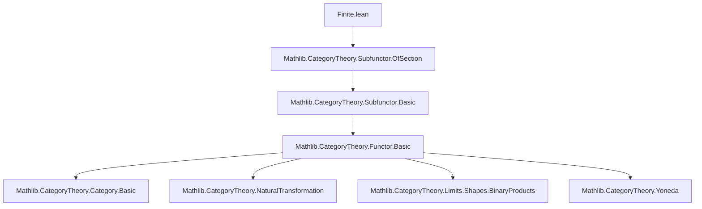
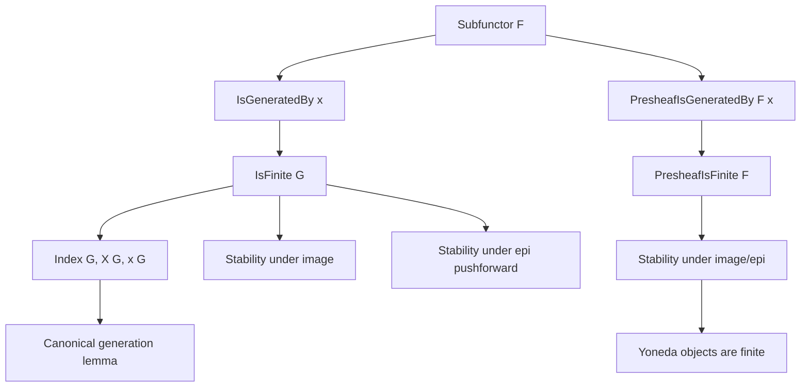

Here is the structured technical brief extracted from `Finite.lean`:

---

### **1. Key Definitions & Theorems**

| Name | Type / Signature | Purpose |
|------|------------------|---------|
| `IsGeneratedBy` | `G.IsGeneratedBy x : Prop` | States that subfunctor `G` is the supremum of sections `x i`, i.e., $ G = \bigsqcup_{i : \iota} \text{ofSection}(x\ i) $. |
| `isGeneratedBy_iff` | `G.IsGeneratedBy x ↔ ⨆ i, ofSection (x i) = G` | Equivalence defining `IsGeneratedBy`. |
| `IsFinite` | `class IsFinite : Prop` | A subfunctor `G` is *finite* if it is generated by sections indexed by a finite type. |
| `Index G` | `Type` | A chosen finite index type for generating sections of `G`. |
| `X G` | `Index G → Cᵒᵖ` | Objects in `Cᵒᵖ` where generating sections live. |
| `x G` | `(i : Index G) → F.obj (X i)` | A family of generating sections. |
| `isGeneratedBy_of_isFinite` | `G.IsGeneratedBy (x G)` | The canonical generating family for a finite subfunctor. |
| `IsGeneratedBy.isFinite` | `{[Finite ι]} → G.IsGeneratedBy x → G.IsFinite` | If `G` is generated by sections over a finite index type, then `G` is finite. |
| `image_isFinite` | `[G.IsFinite] → (G.image f).IsFinite` | Image of a finite subfunctor under a natural transformation is finite. |
| `PresheafIsGeneratedBy` | `PresheafIsGeneratedBy F x : Prop` | `F` is generated by sections `x`, i.e., `⊤ : Subfunctor F` is generated by `x`. |
| `PresheafIsFinite` | `PresheafIsFinite F : Prop` | `F` is finite if `⊤ : Subfunctor F` is finite. |
| `yoneda_obj_isGeneratedBy` | `PresheafIsGeneratedBy (yoneda.obj X) (fun _ ↦ 𝟙 X)` | Yoneda object `yoneda.obj X` is generated by the identity section. |
| `instance yoneda_obj_isFinite` | `PresheafIsFinite (yoneda.obj X)` | Yoneda objects are finite. |

---

### **2. Naming Conventions**

- **Prefixes**:
  - `isGeneratedBy_`: predicates about generation by sections.
  - `isFinite`: predicates about finiteness of subfunctors or presheaves.
  - `PresheafIsGeneratedBy`, `PresheafIsFinite`: presheaf-level analogues.

- **Suffixes**:
  - `_of_isFinite`: constructing data from finiteness assumption.
  - `_image`, `_of_epi`: derived properties under categorical constructions.

- **Structure**:
  - `Index`, `X`, `x`: canonical choices for finite generation data.
  - `ofSection`, `of_equiv`, `of_epi`: morphism-related lemmas.

---

### **3. Tactic Stack**

Frequent tactics used in proofs:
- `simp only [...] using ...`: simplification with custom lemmas.
- `rw [← h.iSup_eq]`, `rw [isGeneratedBy_iff]`: rewriting using definitions.
- `exact le_iSup ...`, `exact h.ofSection_le i`: direct application of lemmas.
- `obtain ⟨n, ⟨e⟩⟩ := Finite.exists_equiv_fin ι`: extracting finite index equivalence.
- `ext U u`: extensionality for functors/subfunctors.
- `simpa only [...] using ...`: simplification + using a hypothesis.
- `exact ⟨u.op, by simp⟩`: constructing witnesses in Yoneda arguments.

---

### **4. Proof Logic**

- **Inductive/Constructive Style**: Finiteness is defined via existence of a finite index type and generating sections.
- **Choice-based Construction**: Use of `choose`, `choose_spec` to extract witnesses from `Finite ι` and `IsFinite`.
- **Categorical Reasoning**:
  - Supremum of subfunctors = join of sections.
  - Use of `ofSection_le_iff`, `image_iSup`, `range_eq_top`, etc.
- **Lifting via Morphisms**:
  - Lemmas like `image_isFinite`, `range_isFinite`, `presheafIsFinite_of_epi` show stability under categorical constructions.
- **Yoneda Lemma Application**:
  - Explicit verification of generation for representables via Yoneda embedding.

---

### **5. Imports**

- `Mathlib.CategoryTheory.Subfunctor.OfSection`: core definitions of `ofSection`, subfunctor lattice.

---

### **6. Mermaid Diagrams**

#### **Dependency Graph (Module Level)**

#### **Conceptual Overview (Theory Flow)**

---

### **7. Theory Scope**

- **Context**: Presheaves of types on a category `C`.
- **Goal**: Formalize a notion of *finite generation* for subfunctors and presheaves, mirroring module theory.
- **Key Tools**:
  - Supremum of subfunctors via sections.
  - Finite types and choice-based extraction.
  - Yoneda lemma for concrete verification.
- **Applications**:
  - Finiteness conditions in cohomology, sheaf theory, or descent.
  - Analogue of "finitely generated submodule" in sheaf theory.

--- 

Let me know if you'd like a formalized summary in Lean or a comparison with `Module.Finite`.
