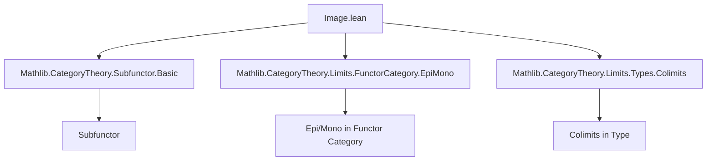

### Technical Brief: Image of Subfunctors in Category Theory (Lean 4)

---

#### **1. Key Definitions & Theorems**

| Name | Type | Purpose |
|------|------|---------|
| `range (p : F' ⟶ F)` | `Subfunctor F` | Defines the *range* of a natural transformation as a subfunctor: at each object `U`, `range p U = Set.range (p.app U)` |
| `lift (f : F' ⟶ F) {G : Subfunctor F} (hf : range f ≤ G)` | `F' ⟶ G.toFunctor` | Factorization of `f` through a subfunctor `G` containing its image |
| `toRange (p : F' ⟶ F)` | `F' ⟶ (range p).toFunctor` | Canonical morphism from domain to range of `p` |
| `image (G : Subfunctor F) (f : F ⟶ F')` | `Subfunctor F'` | Image of subfunctor `G` under `f`: `(f.app i) '' (G.obj i)` |
| `preimage (G : Subfunctor F) (p : F' ⟶ F)` | `Subfunctor F'` | Preimage of subfunctor `G` under `p`: `p.app n ⁻¹' (G.obj n)` |
| `fromPreimage (G : Subfunctor F) (p : F' ⟶ F)` | `(G.preimage p).toFunctor ⟶ G.toFunctor` | Factorization of the inclusion of the preimage into `G` |
| `range_id` | `range (𝟙 F) = ⊤` | Identity morphism has full range |
| `range_ι` | `range G.ι = G` | Range of the inclusion of a subfunctor recovers the subfunctor |
| `toRange_ι` | `toRange p ≫ (range p).ι = p` | Factorization of `p` through its range |
| `epi_iff_range_eq_top` | `Epi p ↔ range p = ⊤` | Characterization of epimorphisms via range |
| `image_le_iff` | `G.image f ≤ G' ↔ G ≤ G'.preimage f` | Adjunction between image and preimage |
| `preimage_image_of_epi` | `(G.preimage p).image p = G` when `p` is epi | Image–preimage cancellation for epimorphisms |

---

#### **2. Naming Conventions**

- **Prefixes**:
  - `range_`: for constructions related to the range of a natural transformation.
  - `image_`: for image of a subfunctor.
  - `preimage_`: for preimage of a subfunctor.
  - `lift_`, `fromPreimage_`: for factorization morphisms.

- **Suffixes**:
  - `_ι`: for morphisms involving the inclusion `ι : G.toFunctor ⟶ F`.
  - `_app_val`: for component-wise value properties (e.g., `toRange_app_val`).
  - `_comp`: for composition-related lemmas (e.g., `image_comp`, `preimage_comp`).
  - `_id`: for identity-related lemmas (e.g., `range_id`, `preimage_id`).

- **`simps` / `reassoc` attributes**: Used to simplify projections or reassociate compositions.

---

#### **3. Tactic Stack**

- **`aesop`**: Dominant tactic for automated reasoning over equalities, inequalities, and set-theoretic properties.
- **`simp` / `simp only`**: For simplification using `@[simp]` lemmas (e.g., `range_ι`, `image_top`).
- **`ext`**: Extensionality for natural transformations or set equality.
- **`rfl`**: Reflexivity for definitional equalities (e.g., `lift_ι`, `toRange_ι`).
- **`obtain ⟨x, hx⟩ := ...`**: Pattern matching on existential quantifiers (e.g., surjectivity).
- **`rw [...]`**: Rewriting using equivalences (e.g., `epi_iff_range_eq_top`).
- **`infer_instance`**: For typeclass resolution (e.g., `Epi`, `Mono`, `IsIso`).

---

#### **4. Proof Logic**

- **Structure**: Most proofs follow a *constructive* and *component-wise* pattern:
  1. **Define** the object-level action (e.g., `obj i := ...`).
  2. **Verify naturality** using `naturality` lemmas (`FunctorToTypes.naturality`).
  3. **Prove equalities/inequalities** by:
     - Extending at the level of components (`ext i x`),
     - Using set-theoretic reasoning (`Set.mem_range`, `Set.mem_preimage`, etc.),
     - Applying `simp` with `Subfunctor.ext_iff` and `funext_iff`.
- **Induction**: Not used directly; instead, *pointwise* reasoning suffices due to type-valued functors.
- **Factorization arguments**: Central to many proofs (e.g., `lift`, `fromPreimage`, `toRange`).
- **Epimorphism/Monomorphism analysis**: Often reduced to surjectivity/injectivity of components via `epi_iff_surjective`, `mono_iff_injective`.

---

#### **5. Imports & Dependencies**

- **Core dependencies**:
  - `Mathlib.CategoryTheory.Subfunctor.Basic`: Defines `Subfunctor` and basic operations.
  - `Mathlib.CategoryTheory.Limits.FunctorCategory.EpiMono`: Characterizations of epis/monos in functor categories.
  - `Mathlib.CategoryTheory.Limits.Types.Colimits`: Used for general limit/colimit reasoning (e.g., `iSup`).

- **Key abstractions**:
  - `Subfunctor F`: Subobjects of a presheaf `F : C ⥤ Type w`.
  - `F ⟶ G`: Natural transformations between type-valued functors.
  - `Set.range`, `Set.image`, `Set.preimage`: Set-theoretic operations lifted pointwise.

---

#### **6. Mermaid Diagrams**

##### **Dependency Graph (Module-Level)**



##### **Conceptual Overview (Image–Preimage Adjunction)**

```mermaid
graph LR
  G[Subfunctor F] -->|image f| G'[Subfunctor F']
  G' -->|preimage f| G
  style G fill:#f9f,stroke:#333
  style G' fill:#9ff,stroke:#333
  classDef adjoint fill:#eee,stroke:#000,stroke-dasharray:5 5;
  class G,G' adjoint;
  link G G' "⊣" "image ⊣ preimage";
```

##### **Factorization Lattice**

```mermaid
graph TD
  F'[F'] -->|p| F[F]
  F'[F'] -->|toRange p| R[(range p).toFunctor]
  R -->|(range p).ι| F
  F'[F'] -->|lift p hf| G[G.toFunctor]
  G -->|G.ι| F
  style R fill:#cfc,stroke:#333
  style G fill:#fcc,stroke:#333
```

---

#### **7. Notes**

- **Deprecation aliases**: All `Subpresheaf.*` names are deprecated in favor of `Subfunctor.*`, indicating a shift in terminology (from presheaves to general type-valued functors).
- **`simps!`**: Used in `lift` to generate simplified projections for dependent types.
- **Set-theoretic foundations**: All constructions are pointwise, leveraging `Type w` as a concrete category (via `FunctorToTypes`).

--- 

This file formalizes the categorical analog of *image factorization* and *preimage pullback* in the context of presheaves/type-valued functors, with a focus on constructive, component-wise reasoning.
