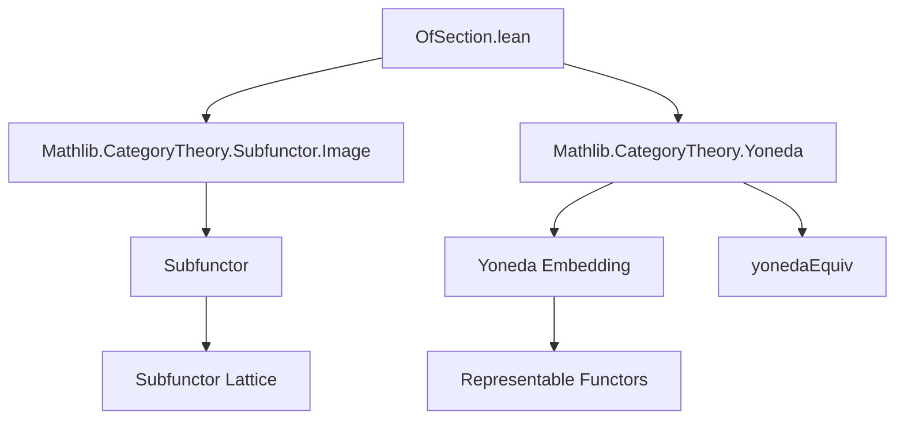
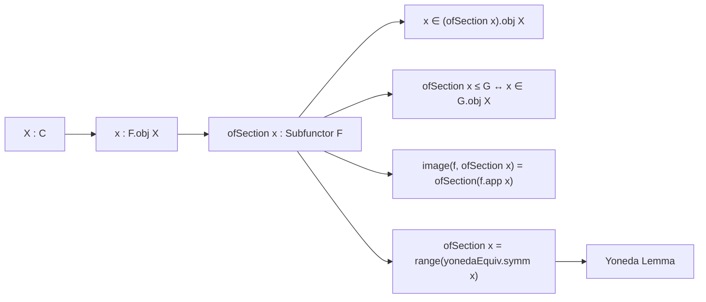

**Technical Brief: `OfSection.lean`**

---

### 1. **Key Definitions & Theorems**

| Name | Type / Signature | Purpose |
|------|------------------|---------|
| `ofSection` | `def ofSection : Subfunctor F` | Constructs the smallest subfunctor of `F` containing a given section `x : F.obj X`. |
| `mem_ofSection_obj` | `x ∈ (ofSection x).obj X` | Shows that `x` is contained in the subfunctor at object `X`. |
| `ofSection_le_iff` | `ofSection x ≤ G ↔ x ∈ G.obj X` | Characterizes the universal property: `ofSection x` is the *least* subfunctor containing `x`. |
| `ofSection_image` | `(ofSection x).image f = ofSection (f.app _ x)` | Compatibility with morphisms of presheaves: image of generated subfunctor equals subfunctor generated by the image section. |
| `ofSection_eq_range` | `ofSection x = range (yonedaEquiv.symm x)` | Identifies `ofSection x` with the range of the natural transformation corresponding to `x` via Yoneda. |
| `range_eq_ofSection` | `range f = ofSection (yonedaEquiv f)` | Converse: range of a natural transformation from representable presheaf equals `ofSection` of the corresponding section. |
| `ofSection_eq_range'` | Same as above but for `uliftYonedaEquiv` (handles universe lifting). | Generalizes the range identification to larger target universes. |
| `range_eq_ofSection'` | `range f = ofSection (uliftYonedaEquiv f)` | Converse for the universe-lifted case. |

---

### 2. **Naming Conventions**

- **Prefixes**:
  - `ofSection`: indicates construction from a section.
  - `range_`: indicates construction from the range of a natural transformation.
- **Suffixes**:
  - `_le_iff`: characterizes ≤ (subfunctor inclusion) via membership.
  - `_image`: describes behavior under image functor.
  - `_eq_range` / `_eq_range'`: equality with range of Yoneda/ulifted Yoneda.
- **`mem_` prefix**: membership lemmas (e.g., `mem_ofSection_obj`).
- **`@[simp]`**: lemmas marked for automatic simplification.

---

### 3. **Tactic Stack**

- `simp` / `simp only`: heavily used for simplification, especially with `@[simps]`, `@[simp]`, and definitional equalities.
- `rw`: rewriting using lemmas like `ofSection_le_iff`, `image_le_iff`, etc.
- `apply le_antisymm`: used in proofs of equality of subfunctors via mutual inclusion.
- `intro` / `rintro`: standard intro-style reasoning for implications and existential quantifiers.
- `exact`: for direct proof steps (e.g., `exact ⟨f, rfl⟩`).
- `dsimp`: used in `ofSection_eq_range'` to unfold universe-lifting definitions.

---

### 4. **Proof Logic**

- **Structure**: Proofs follow a *constructive* and *element-wise* style, leveraging:
  - **Extensionality of subfunctors**: `ext U y` to reduce to pointwise membership.
  - **Yoneda embedding**: via `yonedaEquiv`, `uliftYonedaEquiv`, which identify sections with natural transformations from representables.
  - **Element-wise reasoning**: subfunctors are defined as families of subsets; proofs often reduce to set-theoretic reasoning (e.g., `Set.mem_range`, `Set.mem_image`).
- **Typical flow**:
  1. Prove inclusion `≤` using `ofSection_le_iff` and membership.
  2. Prove reverse inclusion using `image_le_iff` or direct construction.
  3. Use `le_antisymm` to conclude equality.
  4. For `ofSection_image`, combine `image_le_iff` and `Set.mem_image`.

---

### 5. **Imports**

- `Mathlib.CategoryTheory.Subfunctor.Image`: provides `image`, `range`, and related lemmas for subfunctors.
- `Mathlib.CategoryTheory.Yoneda`: provides `yoneda`, `yonedaEquiv`, and related equivalences.

These imports define the ambient categorical and subfunctor machinery.

---

### 6. **Deprecation Aliases**

All definitions/lemmas are re-exported from `Subpresheaf` namespace (now deprecated), with `alias` pointing to `Subfunctor` equivalents.

---

### 7. **Mermaid Diagrams**

#### **Dependency Graph (Module-Level)**



#### **Conceptual Overview (Theory Flow)**



#### **Relationship to Yoneda Lemma**

```mermaid
graph LR
  Hom(C^(op), Type) -->|Yoneda Embedding| F[F : Cᵒᵖ ⥤ Type]
  yoneda.obj X -->|yonedaEquiv| F.obj X
  range(f) -->|range = ofSection| ofSection(x)
```

---

### 8. **Summary**

This module formalizes the construction of the *subfunctor generated by a section* in the context of presheaves of types. It leverages the Yoneda embedding to relate sections to natural transformations from representable presheaves, and shows that the generated subfunctor coincides with the *range* of such a transformation. The development is clean, elementary, and foundational for further work on sheafification, image factorizations, and subobject classifiers in presheaf toposes.
