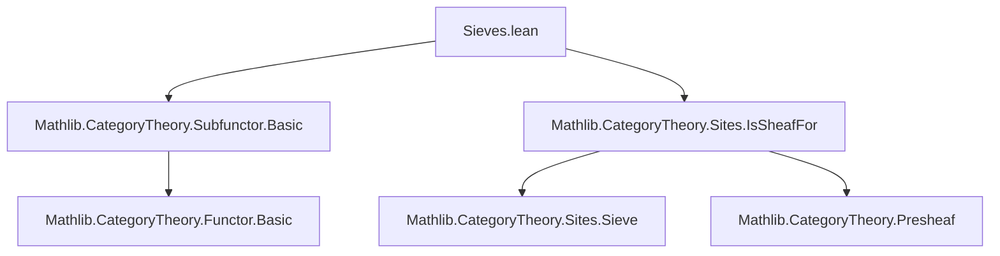
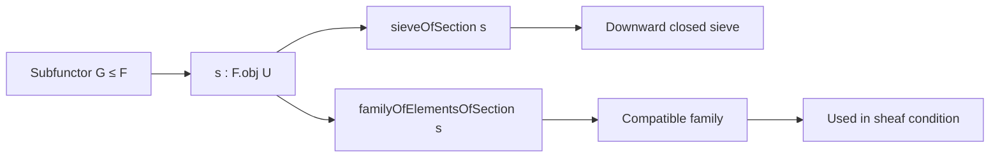

**Technical Brief: Sieves Attached to Subpresheaves (`Sieves.lean`)**

---

### 1. Key Definitions & Theorems

| Name | Type / Signature | Purpose |
|------|------------------|---------|
| `sieveOfSection` | `{U : Cᵒᵖ} → F.obj U → Sieve (unop U)` | Constructs a sieve on `U` consisting of all arrows `f : V ⟶ U` such that the restriction `F.map f.op s` lies in `G.obj (op V)`. |
| `familyOfElementsOfSection` | `{U : Cᵒᵖ} → F.obj U → (G.sieveOfSection s).1.FamilyOfElements G.toFunctor` | Assigns to each `f` in the sieve an element of `G` (namely the restriction of `s` along `f`, packaged as a subtype element). |
| `family_of_elements_compatible` | `{U : Cᵒᵖ} → (s : F.obj U) → (G.familyOfElementsOfSection s).Compatible` | Proves that the family of elements induced by `s` is compatible with respect to the sieve — i.e., respects the gluing condition for sheaves. |

---

### 2. Naming Conventions

- **Prefixes**:
  - `sieveOfSection`, `familyOfElementsOfSection`: follow pattern `XOfY`, where `Y` is the input data (`section`) and `X` is the constructed object (`sieve`, `familyOfElements`).
- **Suffixes**:
  - `OfSection`: indicates construction is parameterized by a section `s : F.obj U`.
- **No explicit `is_`, `mul_`, or `dist_` prefixes/suffixes** — this file focuses on *construction* rather than *property verification* beyond compatibility.

---

### 3. Tactic Stack

- `simp only [...]` — used to simplify homomorphism compositions and `op`/`unop` interactions.
- `rw [...]` — rewrites using functoriality and opposite composition laws.
- `exact ...` — used in `downward_closed` proof to supply witness.
- `refine Subtype.ext ?_` — to prove equality of subtype elements by extending to underlying type.
- `change ...` — to align goal with desired equality before rewriting.

No heavy automation (`aesop`, `tauto`, `linarith`) is used — proofs are mostly direct category-theoretic reasoning.

---

### 4. Proof Logic

- **Structure**: Direct, constructive definitions followed by verification of properties.
- **`sieveOfSection`**:
  - Define arrows in sieve via membership in `G.obj`.
  - Prove downward closure using `G.map` (monotonicity of subfunctor).
- **`familyOfElementsOfSection`**:
  - Define element-wise via `F.map i.op s`, wrapped in subtype using hypothesis `hi`.
- **`family_of_elements_compatible`**:
  - Reduce to equality of two composites in `F`.
  - Use functoriality (`map_comp`) and opposite composition (`op_comp`) to show commutativity of the relevant diagram.

Induction or case analysis is *not* used — all arguments are diagrammatic and rely on universal properties of functors and opposites.

---

### 5. Imports

| Import | Role |
|--------|------|
| `Mathlib.CategoryTheory.Subfunctor.Basic` | Provides `Subfunctor` type and basic operations (e.g., `map`, `obj`, `toFunctor`). |
| `Mathlib.CategoryTheory.Sites.IsSheafFor` | Provides `Compatible`, `FamilyOfElements`, and sieve-related sheaf-theoretic notions. |

These imports define the ambient categorical and sheaf-theoretic context.

---

### 6. Mermaid Diagrams

#### Dependency Graph (Module-Level)



#### Overview of File Content



#### Key Construction Diagram (Sieve)

```mermaid
graph LR
  V -- f --> U
  F U -- s --> s
  F V -- F.map f.op --> F.map f.op s ∈ G V
  style V fill:#f9f,stroke:#333
  style U fill:#bbf,stroke:#333
  style G V fill:#9f9,stroke:#333
```

---

### 7. Summary

This file formalizes the classical construction in sheaf theory where a section of a presheaf `F` induces a sieve on its domain, together with a compatible family of elements in a subpresheaf `G ≤ F`. It serves as a foundational step toward relating subfunctors, sieves, and sheafification — particularly relevant for the sheaf condition and descent theory.

The definitions and proofs are minimal, explicit, and rely on basic functor calculus and subtype reasoning — typical of modern Lean formalizations in category theory.
