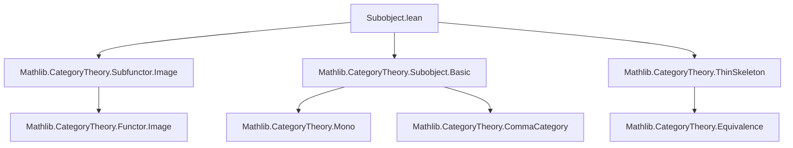
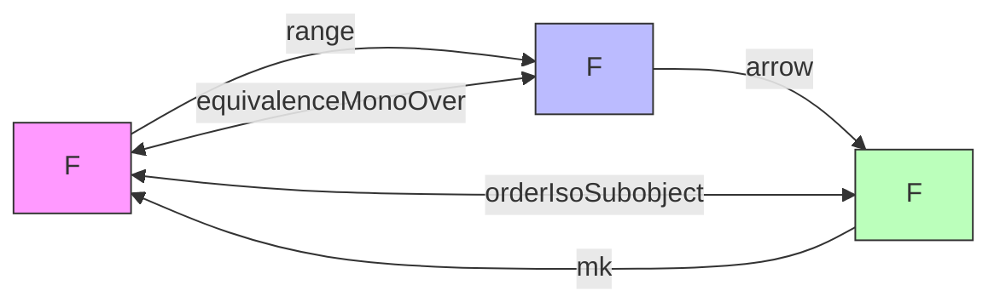

**Technical Brief: `Subobject.lean` (Mathlib Category Theory Module)**  
*Generated for Domain-Specific AI Agent Training*

---

### 1. **Key Definitions & Theorems**

| Name | Type | Purpose |
|------|------|---------|
| `equivalenceMonoOver` | `Subfunctor F ≌ MonoOver F` | Constructs a categorical equivalence between the category of subfunctors of `F` and the category of monomorphisms into `F` (i.e., `MonoOver F`). |
| `range_subobjectMk_ι` | `range (Subobject.mk A.ι).arrow = A` | Shows that applying `Subobject.mk` to the inclusion of a subfunctor and then taking the range recovers the original subfunctor. |
| `subobjectMk_range_arrow` | `Subobject.mk (range X.arrow).ι = X` | Dual to above: taking the range of a mono (representing a subobject) and then embedding it via `Subobject.mk` recovers the original subobject. |
| `orderIsoSubobject` | `Subfunctor F ≃o Subobject F` | Establishes an order isomorphism between the poset of subfunctors and the poset of subobjects (i.e., equivalence classes of monos) of `F`. |

> **Note**: All three main results are *noncomputable* and rely on the thin-skeleton equivalence (`ThinSkeleton.equivalence`) to bridge between concrete and abstract representations.

---

### 2. **Naming Conventions**

- **Prefixes**:
  - `equivalenceMonoOver`: `equivalence` + target category (`MonoOver`)
  - `orderIsoSubobject`: `orderIso` + target structure (`Subobject`)
  - `range_subobjectMk_ι`, `subobjectMk_range_arrow`: `range`/`subobjectMk` + `arrow`/`ι` (indicating component interaction)
- **Suffixes**:
  - `_ι`: refers to the inclusion morphism (e.g., `A.ι : A.obj ⟶ F.obj`)
  - `_arrow`: refers to the arrow part of a mono (e.g., `X.arrow : X.obj ⟶ F.obj`)
- **Pattern**: `X.arrow` and `A.ι` are standard for objects in `MonoOver F` and `Subfunctor F`, respectively.

---

### 3. **Tactic Stack**

| Tactic | Frequency | Role |
|--------|-----------|------|
| `simp` | High | Simplifies identities involving `equivalenceMonoOver`, `unitIso`, `counitIso`, `range`, `Subobject.mk`, etc. |
| `rw` | Medium | Rewrites using lemmas like `← MonoOver.w f`, `← range_comp_le`, etc. |
| `apply` / `exact` | Medium | Used in `homOfLE` constructions and proof of `map_rel_iff'`. |
| `eq_to_iso` / `isoMk` | Low | For constructing isomorphisms in the equivalence. |
| `leOfHom` | Medium | Converts homs to inequalities in the subfunctor poset. |
| `congr'` / `ext` | Implicit | Used implicitly via `simps` attribute and `simp`-based proofs. |

> **Notable absence**: No `induction`, `cases`, or `interval_cases` — proofs are structural and rely on categorical universal properties.

---

### 4. **Proof Logic**

- **High-level strategy**:
  1. Define functors `Subfunctor F → MonoOver F` and `MonoOver F → Subfunctor F` via `range` and `Subobject.mk`.
  2. Use `ThinSkeleton.equivalence` to simplify coherence (since both categories are thin/posetal up to iso).
  3. Prove unit/counit isomorphisms via `eqToIso` and `MonoOver.isoMk`, leveraging `asIso (toRange ...)`.
  4. For `orderIsoSubobject`, reduce to showing monotonicity and bijectivity using the equivalence above.
- **Key logical flow**:
  - `range_subobjectMk_ι` and `subobjectMk_range_arrow` are *consequences* of the unit/counit of the equivalence.
  - `map_rel_iff'` uses the equivalence to translate order relations (`≤`) into homs and back.

---

### 5. **Imports**

| Module | Purpose |
|--------|---------|
| `Mathlib.CategoryTheory.Subfunctor.Image` | Provides `range` for subfunctors and related lemmas. |
| `Mathlib.CategoryTheory.Subobject.Basic` | Defines `Subobject`, `MonoOver`, `Subobject.mk`, and basic properties. |
| `Mathlib.CategoryTheory.ThinSkeleton` | Used implicitly via `ThinSkeleton.equivalence` to reduce to thin categories. |

> **Scope**: This module sits at the intersection of *subobject theory* and *presheaf/subfunctor theory* in category theory.

---

### 8. **Mermaid Diagrams**

#### **Dependency Graph**

#### **Overview of Theory Flow**

> **Interpretation**:  
> - `Subfunctor F` and `MonoOver F` are *categorically equivalent*.  
> - `Subfunctor F` and `Subobject F` are *order-isomorphic* (i.e., isomorphic as posets).  
> - The equivalence `equivalenceMonoOver` is the core bridge; `orderIsoSubobject` is derived via thin-skeleton reduction.

--- 

**End of Technical Brief**
