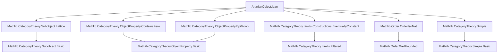

### Technical Brief: `ArtinianObject.lean`

---

#### **1. Key Definitions & Theorems**

| Name | Type / Signature | Purpose |
|------|------------------|---------|
| `isArtinianObject` | `ObjectProperty C := fun X ↦ WellFoundedLT (Subobject X)` | Defines the *property* of being Artinian at the level of object properties (i.e., a predicate on objects). |
| `IsArtinianObject` | `abbrev IsArtinianObject : Prop := isArtinianObject.Is X` | Prop-valued version: “$X$ is Artinian” as a proposition. |
| `isArtinianObject_iff_antitone_chain_condition` | `IsArtinianObject X ↔ ∀ f : ℕ →o (Subobject X)ᵒᵈ, ∃ n, ∀ m ≥ n, f n = f m` | Equivalence between Artinianess and DCC on antitone chains (via dual order). |
| `isArtinianObject_iff_not_strictAnti` | `IsArtinianObject X ↔ ∀ f : ℕ → Subobject X, ¬ StrictAnti f` | Equivalent formulation: no strictly decreasing ω-chain. |
| `isArtinianObject_iff_isEventuallyConstant` | `IsArtinianObject X ↔ ∀ F : ℕ ⥤ (MonoOver X)ᵒᵖ, IsFiltered.IsEventuallyConstant F` | Characterization via eventual constancy of functors from ℕ (viewed as discrete category) into $(\text{MonoOver } X)^{op}$. |
| `isArtinianObject_of_isZero` | `IsZero X → IsArtinianObject X` | Zero object is Artinian. |
| `isArtinianObject_of_mono` | `Mono i : X ⟶ Y → IsArtinianObject Y → IsArtinianObject X` | Subobjects of Artinian objects are Artinian. |
| `exists_simple_subobject` | `¬IsZero X → ∃ Y ≤ X, Simple Y` | Every non-zero Artinian object has a simple subobject. |
| `simpleSubobject`, `simpleSubobjectArrow` | `noncomputable def`s | Choice of a simple subobject and its inclusion monomorphism. |

---

#### **2. Naming Conventions**

- **Prefixes**:
  - `isArtinianObject`: for the *property* (typeclass-compatible predicate).
  - `IsArtinianObject`: for the *propositional* version (used in proofs).
  - `simpleSubobject`, `simpleSubobjectArrow`: naming reflects construction from existence lemma.

- **Suffixes**:
  - `_of_`: e.g., `isArtinianObject_of_mono`, `isArtinianObject_of_isZero` — indicates derivation from a condition.
  - `_iff_`: logical equivalences (↔).
  - `_condition`: used in chain-condition-based characterizations.

- **Dualization**:
  - Use of `ᵒᵈ` (opposite/dual) in `Subobject X)ᵒᵈ`, `(MonoOver X)ᵒᵖ`, and `orderDualEquivalence`.

---

#### **3. Tactic Stack**

Frequently used tactics in this file:

| Tactic | Role |
|--------|------|
| `rw` | Rewriting definitions and equivalences (e.g., `isArtinianObject`, `WellFoundedLT`, `Subobject.map`). |
| `dsimp` | Simplifying definitions (especially when unfolding `isArtinianObject`, `IsArtinianObject`). |
| `exact` / `apply` | Closing goals using known lemmas or instances. |
| `infer_instance` | Inferring typeclass instances (e.g., `WellFoundedLT` from `IsArtinianObject`). |
| `refine` | Partial construction of proofs, especially for `⟨...⟩`-style goals. |
| `simp` / `simpa` | Simplifying goals using `simp` lemmas (e.g., `isIso_iff_of_reflects_iso`, `PartialOrder.isIso_iff_eq`). |
| `cases` / `obtain` | Extracting witnesses from existential quantifiers (e.g., `obtain ⟨n, hn⟩ := ...`). |
| `funext` (implicit via `fun _ ↦ ...`) | Proving extensionality of functions/morphisms. |
| `subsingleton` tools (`Subsingleton.elim`) | Handling uniqueness in subsingleton types (e.g., `Subobject X` when `X` is zero). |

No heavy use of `aesop`, `ring`, or `linarith`; focus is on categorical reasoning and order-theoretic properties.

---

#### **4. Proof Logic**

The logical flow across the file follows this pattern:

1. **Definition & Equivalence Setup**  
   Define `isArtinianObject` via well-foundedness of `Subobject X` (i.e., DCC), then prove multiple equivalent formulations:
   - Antitone chains stabilize (`antitone_chain_condition`)
   - No strictly decreasing ω-chains (`not_strictAnti`)
   - Functors from ℕ into $(\text{MonoOver } X)^{op}$ are eventually constant.

2. **Stability Properties**  
   Prove closure under:
   - Zero object (`isArtinianObject_of_isZero`)
   - Subobjects (`isArtinianObject_of_mono`)
   → These justify that `isArtinianObject` is a *closed under subobjects* object property.

3. **Existence of Simple Subobjects**  
   Using DCC, show that any non-zero Artinian object has an atom (i.e., simple subobject), via:
   - `IsAtomic.eq_bot_or_exists_atom_le` on `⊤ : Subobject X`
   - Nontriviality of `Subobject X` from `¬IsZero X`

4. **Choice & Instances**  
   Define `simpleSubobject` and `simpleSubobjectArrow` using `choose`, and prove:
   - `Mono simpleSubobjectArrow`
   - `Simple (simpleSubobject h)`

All proofs rely heavily on:
- Properties of `Subobject X` as a partial order (lattice, subsingleton when zero).
- Dualization tricks (`orderDualEquivalence`, `wellFoundedGT_dual_iff`).
- Interactions between `MonoOver X`, `Subobject X`, and their opposites.

---

#### **5. Imports**

| Import | Purpose |
|--------|---------|
| `Mathlib.CategoryTheory.Subobject.Lattice` | Structure of `Subobject X` as a lattice, subsingleton properties. |
| `Mathlib.CategoryTheory.ObjectProperty.ContainsZero` | Formalism of `ObjectProperty` and closure properties (e.g., `ContainsZero`). |
| `Mathlib.CategoryTheory.ObjectProperty.EpiMono` | Tools for stability under monos/epis. |
| `Mathlib.CategoryTheory.Limits.Constructions.EventuallyConstant` | `IsEventuallyConstant` for filtered diagrams. |
| `Mathlib.Order.OrderIsoNat` | Equivalence between `ℕ` with usual order and certain monotone maps. |
| `Mathlib.CategoryTheory.Simple` | Definition of simple objects and atoms. |

---

#### **6. Mermaid Diagrams**

##### **Dependency Graph (Module-Level)**



##### **Conceptual Overview (Theory Flow)**

```mermaid
flowchart LR
  SubobjectLattice[Subobject X as poset] --> DCC[Descending Chain Condition]
  DCC --> WellFoundedLT[WellFoundedLT (Subobject X)]
  WellFoundedLT --> IsArtinianObject[isArtinianObject : ObjectProperty]

  IsArtinianObject --> Closure[Closed under subobjects]
  IsArtinianObject --> Zero[Contains zero]
  
  DCC --> AntitoneStab[Antitone chains stabilize]
  DCC --> NoStrictAnti[No strict anti-chains]
  DCC --> EventuallyConst[Eventually constant functors]

  EventuallyConst --> MonoOverDual[MonoOver Xᵒᵖ]
  AntitoneStab --> SubobjectDual[(Subobject X)ᵒᵈ]

  NonZero[¬IsZero X] --> ExistsSimple[∃ simple subobject]
  ExistsSimple --> SimpleSubobject[simpleSubobject & arrow]
```

---

#### **7. Summary**

This file formalizes the notion of *Artinian objects* in a general category `C`, using order-theoretic characterizations of the subobject lattice. It establishes foundational properties (closure under subobjects, presence of simple subobjects) and provides multiple equivalent definitions (via chains, strict antichains, or eventual constancy), enabling flexible reasoning in categorical contexts. The development is tightly integrated with Lean’s `ObjectProperty` framework and leverages dualization and filtered colimit machinery.

--- 

Let me know if you'd like a formalized summary in `lean` comment style or a dependency graph for the *proofs* (not just imports).
