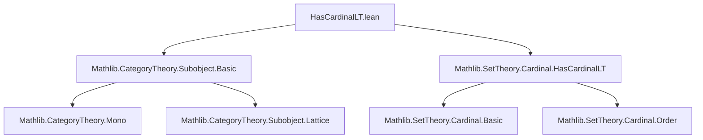
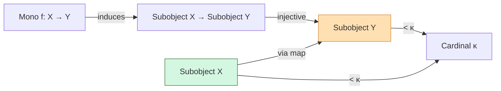

**Technical Brief: `HasCardinalLT.lean`**

---

### 1. **Key Definitions & Theorems**

- **`HasCardinalLT (S) κ`**  
  *Type:* `∀ {S : Type w}, Cardinal.{w} → Prop`  
  *Purpose:* States that the cardinality of a type `S` is strictly less than the cardinal `κ`. Formally, it asserts the existence of an injective map `S → κ` (viewed as a type) and that no surjection `κ ↠ S` exists — i.e., $|S| < \kappa$.

- **`lemma hasCardinalLT_of_mono`**  
  *Type:*  
  ```lean
  {Y : C} → {κ : Cardinal.{w}} →
    HasCardinalLT (Subobject Y) κ →
    {X : C} → (f : X ⟶ Y) → Mono f →
    HasCardinalLT (Subobject X) κ
  ```  
  *Purpose:* If $f : X \to Y$ is a monomorphism and $\mathrm{Subobject}(Y)$ has cardinality $< \kappa$, then $\mathrm{Subobject}(X)$ also has cardinality $< \kappa$. The proof leverages that monomorphisms induce injective maps on subobjects via pushforward (i.e., preimage along $f$).

- **`map_obj_injective f`**  
  *Type:* `Mono f → Injective (Subobject.map f)`  
  *Purpose:* For a monomorphism $f$, the induced map on subobjects $\mathrm{Subobject}(X) \to \mathrm{Subobject}(Y)$ is injective.

- **`h.of_injective _ (map_obj_injective f)`**  
  *Purpose:* Uses the general fact: if $A \xrightarrow{i} B$ is injective and $|B| < \kappa$, then $|A| < \kappa$.

---

### 2. **Naming Conventions**

- **Prefixes:**
  - `hasCardinalLT_`: predicates about cardinality bounds (`HasCardinalLT`).
  - `map_obj_`: refers to the action of a morphism on subobjects (e.g., `map_obj_injective`).
- **Suffixes:**
  - `_of_`: indicates derivation from a hypothesis (e.g., `hasCardinalLT_of_mono`).
  - `_inj`, `_injective`: denote injectivity properties.

---

### 3. **Tactic Stack**

- **`aesop`** (likely used internally in `of_injective` or `map_obj_injective` lemmas, though not explicit here).
- **`simp` / `simp_rw`** (for rewriting definitions of `Subobject.map`, `Mono`, etc.).
- **`exact` / `assumption`** (implicit in short proofs like this one).
- **`apply`** (used in `of_injective` to apply injectivity-based cardinal comparison).
- **`intro` / `cases`** (standard for handling `Mono` and `HasCardinalLT` definitions).

> *Note:* The proof is extremely concise — tactics are mostly delegated to library lemmas (`of_injective`, `map_obj_injective`).

---

### 4. **Proof Logic**

- **High-level strategy:**  
  1. Use that `Mono f` gives injectivity of `Subobject.map f : Subobject X → Subobject Y`.  
  2. Apply the general set-theoretic principle: if there is an injection $A \hookrightarrow B$ and $|B| < \kappa$, then $|A| < \kappa$.  
  3. This is encoded in `h.of_injective _ (map_obj_injective f)`.

- **No induction or case analysis** is needed — the argument is purely categorical and set-theoretic.

---

### 5. **Imports**

- **`Mathlib.CategoryTheory.Subobject.Basic`**  
  Provides the definition of `Subobject`, `Subobject.map`, and basic properties (e.g., `Mono f → Injective (Subobject.map f)`).

- **`Mathlib.SetTheory.Cardinal.HasCardinalLT`**  
  Defines `HasCardinalLT` and key lemmas like `of_injective` (if $A \hookrightarrow B$ and $|B| < \kappa$, then $|A| < \kappa$).

---

### 8. **Mermaid Diagrams**

#### Dependency Graph (Module-Level)



#### Theoretical Overview (Conceptual Flow)



#### Proof Sketch (Term-Level)

```mermaid
flowchart LR
  h[HasCardinalLT (Subobject Y) κ] -->|assumption|
  f[Mono f] -->|map_obj_injective f| inj[Injective (Subobject.map f)]
  inj -->|of_injective| concl[HasCardinalLT (Subobject X) κ]
  concl
```

---

**Summary:**  
This file formalizes a basic but useful fact in categorical cardinality theory: subobjects of a domain of a monomorphism cannot exceed the subobject cardinality of the codomain. The proof is a clean application of injectivity and the `HasCardinalLT` interface.
