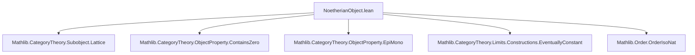
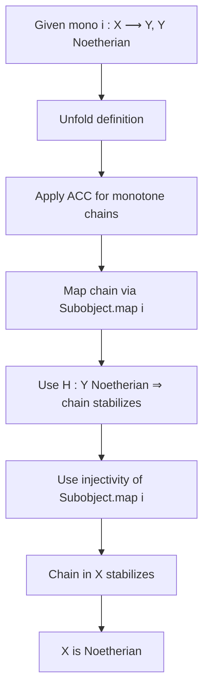

Here is the structured technical brief extracted from `NoetherianObject.lean`:

---

### **1. Key Definitions & Theorems**

| Name | Type / Signature | Purpose |
|------|------------------|---------|
| `isNoetherianObject` | `ObjectProperty C := fun X ↦ WellFoundedGT (Subobject X)` | Defines the *property* of being Noetherian at the level of object properties (i.e., a predicate on objects). |
| `IsNoetherianObject` | `abbrev IsNoetherianObject : Prop := isNoetherianObject.Is X` | Propositional version: “`X` is Noetherian” (used for specific objects). |
| `isNoetherianObject_iff_monotone_chain_condition` | `IsNoetherianObject X ↔ ∀ (f : ℕ →o Subobject X), ∃ n, ∀ m ≥ n, f n = f m` | Equivalence between Noetherianity and the ascending chain condition (ACC) for monotone sequences in `Subobject X`. |
| `isNoetherianObject_iff_not_strictMono` | `IsNoetherianObject X ↔ ∀ f : ℕ → Subobject X, ¬ StrictMono f` | Noetherianity ⇔ no strictly increasing ω-chain in `Subobject X`. |
| `isNoetherianObject_iff_isEventuallyConstant` | `IsNoetherianObject X ↔ ∀ F : ℕ ⥤ MonoOver X, IsFiltered.IsEventuallyConstant F` | Noetherianity ⇔ every functor from `ℕ` (as a discrete poset) to `MonoOver X` is eventually constant. |
| `isNoetherianObject_of_isZero` | `IsZero X → IsNoetherianObject X` | Zero object is Noetherian. |
| `isNoetherianObject_of_mono` | `Mono i : X ⟶ Y → IsNoetherianObject Y → IsNoetherianObject X` | Subobjects of Noetherian objects are Noetherian. |
| `instance IsClosedUnderSubobjects` | `(isNoetherianObject (C := C)).IsClosedUnderSubobjects` | `isNoetherianObject` is closed under subobjects (as a property). |
| `instance ContainsZero` | `(isNoetherianObject (C := C)).ContainsZero` | `isNoetherianObject` contains the zero object. |

---

### **2. Naming Conventions**

- **Prefixes**:
  - `isNoetherianObject_`: for lemmas about the *property* (e.g., `isNoetherianObject_of_mono`).
  - `monotone_chain_condition_of_`, `not_strictMono_of_`, `isEventuallyConstant_of_`: derived consequences of Noetherianity.
- **Suffixes**:
  - `_iff_`: characterizations (↔).
  - `_of_`: implications from assumptions (e.g., `of_mono`, `of_isZero`).
- **Abbreviations**:
  - `IsNoetherianObject` (capitalized) for the propositional version.
  - `isNoetherianObject` (lowercase) for the object property.

---

### **3. Tactic Stack**

Frequently used tactics in proofs:
- `rw` (rewrite with equivalences/definitions)
- `dsimp` (simplify definitions)
- `exact`, `refine`, `intro`, `obtain`
- `simpa` (simplify + apply assumption)
- `convert`, `apply`, `cases`
- `subsingleton`-related reasoning (`Subsingleton.elim`)
- `MonoOver.isIso_iff_subobjectMk_eq`, `PartialOrder.isIso_iff_eq`, etc., used as rewrite rules.

No heavy automation (e.g., `aesop`, `linarith`) — proofs are mostly structural and rely on categorical properties.

---

### **4. Proof Logic**

- **Structure**: Proofs typically proceed by:
  1. Unfolding definitions (`isNoetherianObject`, `WellFoundedGT`, `Subobject`).
  2. Applying equivalences (`isNoetherianObject_iff_*`).
  3. Using categorical properties:
     - Monotone maps `ℕ →o Subobject X` ↔ functors `ℕ ⥤ MonoOver X`.
     - `Subobject.map i` for monomorphism `i`.
     - `Subobject.equivMonoOver` equivalence between `Subobject X` and `MonoOver X`.
  4. Leveraging order-theoretic facts:
     - `wellFoundedGT_iff_monotone_chain_condition`
     - `isWellFounded_iff` ↔ no infinite strictly increasing sequences.
  5. For closure properties (e.g., subobjects), use:
     - Injectivity of `Subobject.map i` for mono `i`.
     - Subsingletonness of `Subobject X` when `X` is zero.

- **Induction**: Not used directly; instead, well-foundedness/ACC is used as a black-box principle.

---

### **5. Imports**

| Module | Role |
|--------|------|
| `Mathlib.CategoryTheory.Subobject.Lattice` | Defines `Subobject X`, its lattice structure, and relation to `MonoOver X`. |
| `Mathlib.CategoryTheory.ObjectProperty.ContainsZero` | Provides `ContainsZero` typeclass for object properties. |
| `Mathlib.CategoryTheory.ObjectProperty.EpiMono` | Related to closure properties (used indirectly via `IsClosedUnderSubobjects`). |
| `Mathlib.CategoryTheory.Limits.Constructions.EventuallyConstant` | Defines `IsEventuallyConstant` for diagrams; key for the equivalence with ACC. |
| `Mathlib.Order.OrderIsoNat` | Relates ordered maps from `ℕ` to chains; used in chain condition characterizations. |

---

### **6. Mermaid Diagrams**

#### **Dependency Graph (Module-Level)**



#### **Conceptual Overview (Theory Flow)**

```mermaid
graph LR
  Subobject[X] -->|ACC| IsNoetherianObject[X]
  IsNoetherianObject -->|definition| ObjectProperty[C]
  ObjectProperty -->|closure| IsClosedUnderSubobjects
  ObjectProperty -->|contains| ContainsZero
  Subobject[X] <-->|equivalence| MonoOver[X]
  MonoOver[X] -->|eventual constancy| IsEventuallyConstant
  IsNoetherianObject[X] <-->|equivalence| ACC[Monotone chains]
  IsNoetherianObject[X] <-->|equivalence| ¬StrictMono[No infinite strictly increasing chains]
```

#### **Proof Strategy Flow (Example: `isNoetherianObject_of_mono`)**



---

### **7. Future Work (from docstring)**

- Prove `isNoetherianObject` defines a *Serre class* in an abelian category (i.e., closed under extensions, subobjects, and quotients).
- Likely requires additional imports: `Mathlib.CategoryTheory.Abelian.*`, `Mathlib.CategoryTheory.SerreClass`.

--- 

Let me know if you'd like the same analysis for related files (e.g., `ArtinianObject.lean`, `NoetherianCategory.lean`).
