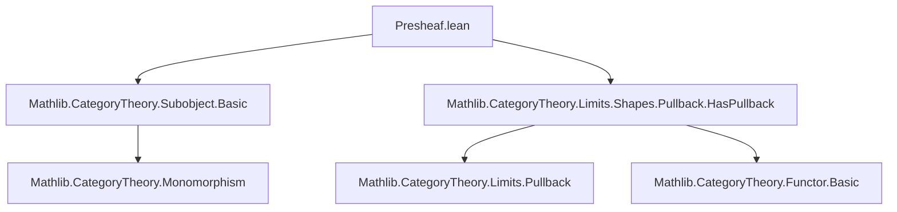

**Technical Brief: `Presheaf.lean` (Subobjects Presheaf)**  
*Domain: Category Theory / Topos Theory (Lean 4 / Mathlib)*  

---

### 1. KEY DEFINITIONS & THEOREMS  

| Name | Type | Purpose |
|------|------|---------|
| `Subobject.presheaf C` | `Cᵒᵖ ⥤ Type max u v` | Defines the *subobjects presheaf*: contravariant functor sending each object `X` to its subobject lattice `Subobject X`, and each morphism `f : X → Y` to pullback along `f`, i.e., `Subobject Y → Subobject X`. |
| `pullback f.unop` | `Subobject Y → Subobject X` | The action of the presheaf on morphisms: maps a subobject `m : M ↣ Y` to its pullback along `f : X → Y`. |
| `pullback_id` | `pullback (id X) = id` | Used to prove `map_id`; ensures identity morphisms act as identity functions on subobjects. |
| `pullback_comp` | `pullback (g ≫ f) = pullback f ≫ pullback g` | Used to prove `map_comp`; ensures composition is preserved contravariantly. |

---

### 2. NAMING CONVENTIONS  

- **Prefixes**:  
  - `presheaf` — main definition name (noun, no verb).  
  - `pullback_` — for constructions involving pullbacks (`pullback_id`, `pullback_comp`).  
- **Suffixes**:  
  - None prominent beyond standard Mathlib conventions (`_op`, `.unop`).  
- **Case**:  
  - `Presheaf` capitalized in title, but `presheaf` lowercase in definition (per Lean convention for definitions).  
- **Notation**:  
  - `X.unop` for objects in `Cᵒᵖ`; `f.unop` for morphisms.  
  - `Subobject X` — standard Mathlib notation for subobjects of `X`.  

---

### 3. TACTIC STACK  

| Tactic | Frequency | Role |
|--------|-----------|------|
| `ext` | High | To prove extensionality of natural transformations / morphisms of presheaves (e.g., `ext : 1`). |
| `simp` | High | Simplification using `pullback_id`, `pullback_comp`, `simps` attributes. |
| `simp_rw` | Not present | — |
| `aesop` | Not present | — |
| `ring` | Not present | — |

> **Note**: Proofs are minimal and rely on `simp`-based automation with lemmas like `pullback_id` and `pullback_comp`, which are likely marked `@[simps]` or have `simp` lemmas registered.

---

### 4. PROOF LOGIC  

- **Structure**:  
  1. Define object part: `obj X := Subobject X.unop`.  
  2. Define morphism part: `map f := (pullback f.unop).obj`.  
  3. Prove functor laws:  
     - `map_id`: Use `ext : 1` + `simp [pullback_id]`.  
     - `map_comp`: Use `ext : 1` + `simp [pullback_comp]`.  
- **Logical Flow**:  
  - *Extensionality* (`ext`) reduces equality of natural transformations to equality of components.  
  - *Simplification* (`simp`) rewrites using known properties of pullbacks (functoriality, identity).  
  - No induction or case analysis needed — the proof is purely equational and relies on categorical properties of pullbacks.

---

### 5. IMPORTS  

| Import | Purpose |
|--------|---------|
| `Mathlib.CategoryTheory.Subobject.Basic` | Provides `Subobject X`, monomorphisms, subobject classification. |
| `Mathlib.CategoryTheory.Limits.Shapes.Pullback.HasPullback` | Provides `HasPullbacks C`, and the `pullback` construction as a functor. |

> **Scope**: Assumes `C` is a locally small category (`Type u`) with pullbacks (`Limits.HasPullbacks C`).  
> **Universe polymorphism**: Explicitly handles universes `u`, `v`, and uses `max u v` for target type universe.

---

### 6. DEPENDENCY & THEORY OVERVIEW  

#### Mermaid Diagram: File Dependencies  


#### Mermaid Diagram: Theory Flow (within Presheaf.lean)  
```mermaid
graph LR
  C[Category C w/ pullbacks] -->|def| Presheaf
  Presheaf -->|obj| Subobject[X]
  Presheaf -->|map f| Pullback[f]
  Pullback[f] -->|functoriality| Subobject[X]
  Subobject[X] -->|monos| M↣X
```

#### Theory Context  
- **Goal**: Construct the *subobject presheaf*, a foundational object in topos theory.  
- **Role in Sheaf Theory**: This presheaf is the *subobject classifier* in the topos of sheaves over a site — here, it is defined on any category with pullbacks (not yet sheafified).  
- **Relation to Representable Functors**: While similar to representable functors (`Hom(-, Y)`), this is *not* representable in general — it is a *power object* in `PSh(C)`.  
- **Reference Alignment**: Follows Section I.3 of [MacLane–Moerdijk, *Sheaves in Geometry and Logic*] (MM92), where the subobject presheaf is defined as $X \mapsto \mathrm{Sub}(X)$, $f \mapsto f^*$ (pullback).

---

### 7. METADATA SUMMARY  

| Attribute | Value |
|----------|-------|
| **File** | `Presheaf.lean` |
| **Module** | `Subobject` |
| **Namespace** | `Subobject` |
| **Main Definition** | `presheaf : Cᵒᵖ ⥤ Type max u v` |
| **License** | Apache 2.0 |
| **Author** | Pablo Donato (2025) |
| **Mathlib Version** | Likely ≥ 4.3.0 (uses `Limits.HasPullbacks`, `Subobject`) |

--- 

Let me know if you'd like the corresponding `simps`-generated lemmas or a formalization of the universal property of this presheaf.
