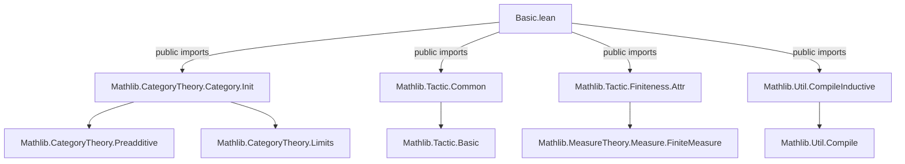
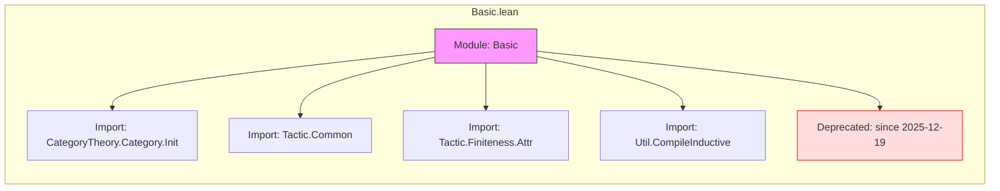

**Technical Brief: `Basic.lean` Module Metadata**

---

### 1. **Key Definitions & Theorems**

- **No explicit definitions or theorems** are declared in this file.  
  - The file serves as a *module declaration* with imports and a deprecation attribute.
  - It does not define any new inductive types, structures, or lemmas.

- **`deprecated_module (since := "2025-12-19")`**  
  - **Type**: `deprecated_module` attribute (Lean 4 attribute for marking modules as deprecated).  
  - **Purpose**: Marks the entire module as deprecated as of the specified date (`2025-12-19`), warning users not to rely on it in new code.

---

### 2. **Naming Conventions**

- **No user-defined identifiers** appear in this file.
- **Module-level naming**: `Basic` — conventional for foundational or utility modules in Lean libraries (e.g., `Mathlib.CategoryTheory.Category.Basic`).
- **Import prefixes**: `public import` indicates re-exported modules (i.e., their contents become part of this module’s public API).

---

### 3. **Tactic Stack**

- **No tactics used** in this file.  
  - Tactic usage is absent because the file contains only module metadata and imports.

---

### 4. **Proof Logic**

- **No proofs present**.  
  - The file contains no proof obligations, lemmas, or theorems.

---

### 5. **Imports**

| Import | Purpose |
|--------|---------|
| `Mathlib.CategoryTheory.Category.Init` | Provides foundational definitions for category theory (e.g., `Category`, `Functor`, `NaturalTransformation`). |
| `Mathlib.Tactic.Common` | Commonly used tactics (e.g., `rintro`, `cases'`, `simpa`). |
| `Mathlib.Tactic.Finiteness.Attr` | Attributes and tactics for reasoning about finiteness (e.g., `finite`, `fintype`). |
| `Mathlib.Util.CompileInductive` | Utilities for compiling inductive types (e.g., `compile_inductive`, used for performance tuning). |

> **Scope**: This module is a *re-export layer* for basic infrastructure used across category theory and general-purpose tactics, likely intended as a convenience import for downstream modules.

---

### 8. **Dependency & Overview Diagrams**

#### Mermaid: Module Dependency Graph

#### Mermaid: File Overview (Content Summary)

---

**Summary**:  
`Basic.lean` is a *deprecated re-export module* that bundles commonly used imports for category theory and tactic infrastructure. It contains no definitions, theorems, or proofs—its sole purpose is to centralize and deprecate a set of foundational imports. Users should migrate to direct imports of the underlying modules.
