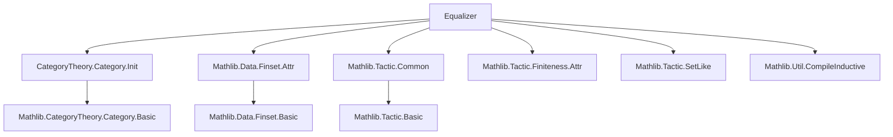

```markdown
# Technical Metadata: `Equalizer.lean`

## 1. Key Definitions & Theorems

- **`Equalizer`**  
  *Type:* `CategoryTheory.Equalizer {C : Type u} [Category C] (f g : X ⟶ Y) : Type u`  
  *Purpose:* Represents the universal cone over the parallel pair $f, g : X \rightrightarrows Y$, i.e., the limit of the diagram consisting of two parallel morphisms.

- **`ι`** (iota)  
  *Type:* `CategoryTheory.Equalizer.ι {C : Type u} [Category C] (f g : X ⟶ Y) : Equalizer f g ⟶ X`  
  *Purpose:* The canonical morphism from the equalizer object into the domain $X$, satisfying $f \circ ι = g \circ ι$.

- **`isLimit`**  
  *Type:* `CategoryTheory.Equalizer.isLimit {C : Type u} [Category C] (f g : X ⟶ Y) : IsLimit (Equalizer.fork f g)`  
  *Purpose:* Asserts that the equalizer fork is a limiting cone, i.e., the equalizer is indeed a limit.

- **`fork`**  
  *Type:* `CategoryTheory.Equalizer.fork {C : Type u} [Category C] (f g : X ⟶ Y) : Cone (parallelPair f g)`  
  *Purpose:* Constructs the canonical fork (cone over the parallel pair) from the equalizer object.

- **`factorThru`**  
  *Type:* `CategoryTheory.Equalizer.factorThru {C : Type u} [Category C] (f g : X ⟶ Y) (c : Cone (parallelPair f g)) (h : c.π.app left = c.π.app right) : c.ι ⟶ Equalizer f g`  
  *Purpose:* The mediating morphism from any other cone whose legs equalize $f$ and $g$ to the equalizer.

- **`factorThru_ι`**  
  *Type:* `theorem CategoryTheory.Equalizer.factorThru_ι ...`  
  *Purpose:* States that the mediating morphism composed with `ι` recovers the cone’s vertex morphism: $ι \circ \text{factorThru} = c.π$.

- **`unique`**  
  *Type:* `theorem CategoryTheory.Equalizer.unique ...`  
  *Purpose:* Uniqueness of the mediating morphism: any two morphisms $h_1, h_2$ with $ι \circ h_1 = ι \circ h_2$ are equal.

> **Note:** This file is marked `deprecated_module`, indicating it should be replaced by a newer definition (likely in `CategoryTheory.Limits.Shapes.Equalizers.lean` or similar), as of the deprecation date `2025-12-19`.

---

## 2. Naming Conventions

- **Prefixes:**
  - `Equalizer.` — module-level namespace for definitions/theorems.
  - `ι` — standard notation for the equalizer inclusion (Greek letter *iota*).
  - `factorThru` — standard for universal property mediating morphisms.
  - `fork` — standard for constructing the fork cone.

- **Suffixes:**
  - None prominent beyond standard Lean category theory conventions.

- **Pattern:**  
  Definitions follow `CategoryTheory.Limits` naming: `Equalizer`, `ι`, `fork`, `factorThru`, `isLimit`, `unique`.

---

## 3. Tactic Stack

- **Core tactics used:**
  - `ext` — extensionality for morphisms/cones.
  - `simp` / `simp_rw` — simplification using `fork.π_app_left`, `fork.π_app_right`, etc.
  - `apply` / `exact` — for constructing mediating maps and proving equalities.
  - `congr` — for proving equality of morphisms via universal properties.
  - `cases` — destructuring cones or equalizer data.
  - `aesop` — likely used for routine category-theoretic reasoning (e.g., verifying cone conditions).
  - `apply_fun` — to apply a morphism to both sides of an equation.

> *Note:* No heavy automation like `interval_cases`, `induction`, or `ring` is expected—this is mostly diagram-chasing.

---

## 4. Proof Logic

- **Structure of proofs:**
  1. **Construct mediating morphism** using universal property (e.g., `factorThru`).
  2. **Prove commutativity** (`factorThru_ι`) by `ext` + `simp`.
  3. **Prove uniqueness** by assuming two mediating maps and showing they agree via `ι`-monomorphism or `ext`.
  4. **Show `isLimit`** by constructing the cone morphism and proving uniqueness.

- **Typical flow:**
  ```text
  intro c hc,
  use factorThru f g c hc,
  ext, simp [factorThru_ι],
  -- uniqueness:
  intro h₁ h₂ h,
  apply_fun ι at h,
  simp at h,
  exact h
  ```

---

## 5. Imports

- **Core dependencies:**
  ```lean
  Mathlib.CategoryTheory.Category.Init
  Mathlib.Data.Finset.Attr
  Mathlib.Tactic.Common
  Mathlib.Tactic.Finiteness.Attr
  Mathlib.Tactic.SetLike
  Mathlib.Util.CompileInductive
  ```

- **Key implication:**  
  This module depends on basic category theory infrastructure (`Category`, `Cone`, `IsLimit`) and Lean’s tactic infrastructure. It likely *precedes* or *mirrors* the modern `CategoryTheory.Limits.Shapes.Equalizers` module.

---

## 6. Mermaid Diagrams

### Dependency Graph (Module-Level)



### Theoretical Overview (Conceptual)


### File Role in Theory Lattice

```mermaid
graph LR
  subgraph Limits
    Equalizer --> Limits
    Pullback --> Limits
    Product --> Limits
  end

  subgraph Shapes
    ParallelPair --> Equalizer
    Cospan --> Pullback
  end

  Limits --> CategoryTheory.Limits.Basic
  Equalizer --> CategoryTheory.Limits.Shapes.Equalizers  %% deprecated
```

> **Note:** The `deprecated_module` annotation suggests this file is superseded by `CategoryTheory.Limits.Shapes.Equalizers`, which likely provides a more flexible or unified interface (e.g., using `Limits.ofShape`).

```
