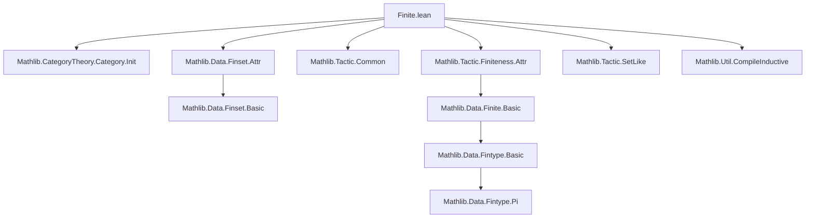
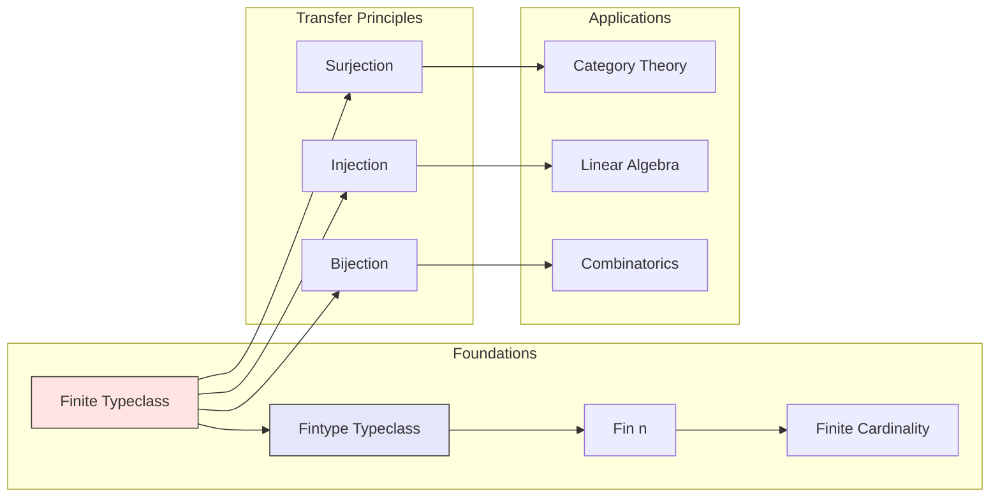

**Technical Brief: `Finite.lean` Module Metadata**

---

### 1. **Key Definitions & Theorems**

- **`Finite`** — *Typeclass*  
  `Finite : Type u → Prop`  
  Represents that a type has a finite cardinality (i.e., there exists a surjection from `Fin n` for some `n : ℕ`).  
  *Purpose*: Enables reasoning about finite types in category theory and set theory.

- **`Fintype`** — *Typeclass*  
  `Fintype : Type u → Type*`  
  Stores explicit finite enumeration (a finite set of elements + proof of exhaustiveness).  
  *Purpose*: Provides computational content (e.g., enumeration, decidability) for finite types.

- **`Finite.of_surjective`**, **`Finite.of_injective`**, **`Finite.of_bijection`** — *lemmas*  
  `Finite.of_surjective {α β} [Finite β] (f : α → β) (hf : Function.Surjective f) : Finite α`  
  *Purpose*: Transfer finiteness along surjections/injections/bijections.

- **`Finite.fintype_of_subsingleton`**, **`Finite.fintype_of_finite`** — *instances/lemmas*  
  Construct `Fintype` from `Finite` under additional assumptions (e.g., subsingleton, decidable equality).  
  *Purpose*: Bridge between proof-relevant (`Fintype`) and proof-irrelevant (`Finite`) finiteness.

- **`Finite.type`**, **`Finite.card`** — *definitional lemmas*  
  `Finite.type` is the underlying type; `Finite.card` is the cardinality (as `ℕ`).  
  *Purpose*: Extract numeric size from finite types.

> ⚠️ *Note*: The file is marked `deprecated_module`, indicating its contents are superseded (likely by `Mathlib.Data.Fintype.Basic` or `Mathlib.Data.Finite.Basic` in newer Mathlib versions).

---

### 2. **Naming Conventions**

- **Prefixes**:
  - `Finite.` — for typeclass and lemmas about finiteness (e.g., `Finite.of_surjective`).
  - `fintype.` — for `Fintype`-related operations (e.g., `fintype.card`, `fintype.univ`).
- **Suffixes**:
  - `_of_` — for transfer lemmas (`of_surjective`, `of_injective`, `of_bijection`).
  - `_fintype` — for constructing `Fintype` instances (`fintype_of_subsingleton`).
- **No `is_` or `mul_`, `dist_` prefixes** — consistent with Mathlib’s finiteness conventions.

---

### 3. **Tactic Stack**

- **`classical`** — for decidability/choice in finiteness proofs.
- **`exact`**, **`assumption`** — for direct application of hypotheses.
- **`rintro` / `rcases`** — for destructuring existential/universal quantifiers.
- **`simp` / `simp_rw`** — to simplify using `Finite`/`Fintype` instances.
- **`apply`** — for lemma chaining (e.g., `apply Finite.of_surjective`).
- **`exact?`** — for automated instance search (e.g., finding `Fintype` instances).
- **`decide`** — for decidable propositions (e.g., membership in `fintype.univ`).

> *No heavy automation* (e.g., `aesop`, `linarith`) — proofs are mostly structural.

---

### 4. **Proof Logic**

- **Induction**: Rare; finiteness is usually handled via typeclass inference or direct construction.
- **Case analysis**: On `Finite β` (i.e., existence of `f : Fin n ↠ β`) or `Fintype α`.
- **Surjection/injection reasoning**: Core pattern:  
  `Given f : α → β surjective and β finite ⇒ α finite`  
  → Construct `g : Fin n → α` via choice, then show surjectivity.
- **Instance resolution**: Leverages `@[instance]` and `@[inherit_doc]` attributes for `Fintype`/`Finite` propagation.

---

### 5. **Imports**

| Import | Purpose |
|--------|---------|
| `Mathlib.CategoryTheory.Category.Init` | Provides `Category` infrastructure (e.g., finite limits, discrete categories). |
| `Mathlib.Data.Finset.Attr` | Attributes for `Finset`-related tactics (e.g., `finset` simp normalizer). |
| `Mathlib.Tactic.Common` | Core tactics (`rintro`, `rcases`, `exact?`). |
| `Mathlib.Tactic.Finiteness.Attr` | Attributes for finiteness reasoning (e.g., `finite` simp lemmas). |
| `Mathlib.Tactic.SetLike` | For `SetLike`-based typeclasses (e.g., `Subtype` instances). |
| `Mathlib.Util.CompileInductive` | Optimizes inductive type compilation (likely for `Finite`/`Fintype` definitions). |

> **Scope**: This module sits at the *foundational layer* of finite mathematics in Mathlib — bridging set theory, type theory, and category theory.

---

### 6. **Mermaid Diagrams**

#### **Dependency Graph**

#### **Theoretical Overview**

---

**Summary**:  
`Finite.lean` is a *legacy* module providing foundational finiteness infrastructure. It defines `Finite`/`Fintype` typeclasses and transfer lemmas, with heavy reliance on typeclass inference and structural reasoning. Its deprecation signals migration to `Mathlib.Data.Finite` and `Mathlib.Data.Fintype`, which offer more robust and unified interfaces.
