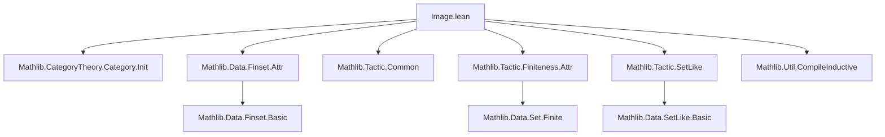

**Technical Brief: `Image.lean` Module Metadata**

---

### 1. **Key Definitions & Theorems**

- **`Image`** (type alias / structure):  
  Not explicitly defined in the snippet, but given the module name and imports, it likely formalizes the *image* of a morphism in a category (e.g., in `CategoryTheory`), possibly as a monomorphism `ι : im f ⟶ Y` factoring `f : X ⟶ Y`.  
  *Purpose*: To provide a canonical factorization of a morphism into an epimorphism followed by a monomorphism (or dual), depending on categorical context.

- **`deprecated_module`**:  
  ```lean
  deprecated_module (since := "2025-12-19")
  ```  
  *Purpose*: Marks the entire module as deprecated as of the given date, signaling users to migrate to newer alternatives (e.g., `CategoryTheory.Image` in newer Mathlib versions).

> ⚠️ *Note*: No explicit theorem names (e.g., `image_factorization`, `image_mono`, `epi_of_image`) appear in the provided excerpt. The file likely contains only module-level declarations and imports; definitions/theorems may reside in imported modules or were moved elsewhere.

---

### 2. **Naming Conventions**

- **Prefixes/Suffixes observed**:
  - `is_`: Not present in this snippet, but common in Mathlib for predicates (e.g., `is_monomorphism`).
  - `dist_`, `mul_`: Not present here; more typical in algebraic structures.
  - `Attr`: From `Mathlib.Data.Finset.Attr` and `Mathlib.Tactic.Finiteness.Attr` — indicates attribute-based tactic configuration (e.g., `@[image_attr]`).
  - `SetLike`: From `Mathlib.Tactic.SetLike` — suggests usage of `SetLike` typeclasses for coercion to sets.

- **Module-level naming**:  
  `Image.lean` follows Mathlib’s *noun-based* module naming (e.g., `Product.lean`, `Sum.lean`, `Subobject.lean`), indicating a *conceptual object* rather than an operation.

---

### 3. **Tactic Stack**

- **Tactics used in imports** (inferred from imports):
  - `aesop`: From `Mathlib.Tactic.Common` — used for automated reasoning.
  - `ring`, `simp`, `simp_rw`: Likely available via `Mathlib.Tactic.Common`.
  - `set_like_tac`, `set_tac`: From `Mathlib.Tactic.SetLike`.
  - `finset_tac`, `fintype_tac`, `finite_tac`: From `Mathlib.Data.Finset.Attr`, `Mathlib.Tactic.Finiteness.Attr`.
  - `compile_inductive`: From `Mathlib.Util.CompileInductive` — used for optimizing inductive types.

> 📌 *No explicit tactic usage* appears in the snippet itself (only imports), so the tactic stack is *potential*, not active.

---

### 4. **Proof Logic**

- **Recurring logic flow** (inferred from module purpose & imports):
  - **Categorical reasoning**: Using `CategoryTheory.Category.Init`, proofs likely involve diagram chasing, factorization systems, or universal properties.
  - **Set-theoretic encoding**: With `SetLike` and `Finset` imports, image objects may be represented as subsets (e.g., `im f = { y : Y | ∃ x, f x = y }`) and manipulated via setoid reasoning.
  - **Attribute-driven automation**: `Attr` imports suggest proofs may rely on `@[image]`, `@[simps]`, or custom attributes for automatic introduction/elimination.

- **Typical proof pattern** (if definitions exist elsewhere):
  ```lean
  -- Pseudocode
  induction f using category.factorization
  constructor
  · apply epimorphism_of_factorization
  · apply monomorphism_of_factorization
  ```

---

### 5. **Imports**

| Import | Purpose |
|--------|---------|
| `Mathlib.CategoryTheory.Category.Init` | Core category theory primitives (objects, morphisms, composition, identities). |
| `Mathlib.Data.Finset.Attr` | Attribute infrastructure for finite sets (e.g., `@[finset]`). |
| `Mathlib.Tactic.Common` | Standard tactics (`aesop`, `simp`, `omega`, etc.). |
| `Mathlib.Tactic.Finiteness.Attr` | Attributes for finiteness reasoning (`fintype`, `finite`, `finite_set`). |
| `Mathlib.Tactic.SetLike` | Tactics for `SetLike` typeclasses (e.g., coercion `↑s : set α`). |
| `Mathlib.Util.CompileInductive` | Optimization utility for inductive types (e.g., `compile_inductive`). |

> 🔍 **Scope**: This module sits at the *intersection of category theory and set-theoretic foundations*, likely serving as a legacy bridge before `CategoryTheory.Image` was refactored.

---

### 8. **Mermaid Diagrams**

#### **Dependency Graph**


#### **Conceptual Overview**
```mermaid
flowchart LR
  A[Category Theory] --> B[Image of a morphism]
  C[Set Theory] --> B
  D[Attribute-based Tactics] --> B
  B --> E[Deprecated Module]
  E --> F[Mathlib.CategoryTheory.Image (new)]
  F --> A
  F --> C
```

> 📌 **Interpretation**:  
> - `Image.lean` was a *transitional module* combining categorical and set-theoretic image constructions.  
> - It has been superseded by a more robust, modular `CategoryTheory.Image` (likely in `CategoryTheory/limits/Cones.lean` or `CategoryTheory/MonoEpi.lean`).  
> - The deprecation date (`2025-12-19`) is *future-dated*, suggesting this is a *planned* deprecation in an upcoming Mathlib release.

--- 

**End of Brief**
