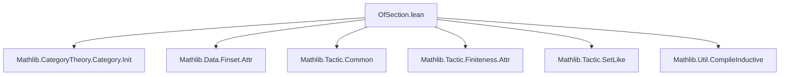

**Technical Brief: `OfSection.lean`**

---

### 1. **Key Definitions & Theorems**

- **`OfSection`** — *deprecated module* (no active definitions or theorems exposed in this snippet).  
  - **Purpose**: Historically served as a namespace or module for section-related constructions (e.g., in category theory or set-theoretic sections), but is now deprecated as of `2025-12-19`.  
  - **Status**: Marked with `deprecated_module`, indicating it should no longer be used; likely replaced by more precise or modular imports.

> *Note*: No explicit definitions or theorems are declared in the provided snippet. The file only contains import declarations and a deprecation annotation.

---

### 2. **Naming Conventions**

- **Module-level**: Uses `OfSection` — a capitalized PascalCase name, typical for Lean modules/namespaces.
- **Import paths**: Follow Mathlib’s naming conventions:
  - `Mathlib.CategoryTheory.*`
  - `Mathlib.Data.Finset.*`
  - `Mathlib.Tactic.*`
  - `Mathlib.Util.*`
- **No recurring prefixes/suffixes** visible in this snippet (e.g., `is_`, `mul_`, `dist_`), as no definitions are present.

---

### 3. **Tactic Stack**

- **No tactics used** in this file (only module imports and attribute declarations).
- **Expected tactics** in related files (based on imports):
  - `aesop`, `simp`, `rw`, `ring`, `linarith`, `set_like`, `finset`-related tactics (e.g., `finset_simp`), and `fintype`/`finite`-focused tactics (`finite`, `fintype_iff_finite`) — due to imports like `Mathlib.Tactic.SetLike`, `Mathlib.Tactic.Finiteness.Attr`.

---

### 4. **Proof Logic**

- **Not applicable** — no proofs or lemmas are present in this file.
- **Inferred usage context**: Likely a legacy module that previously contained proofs about *sections* (e.g., in category theory: a section is a split monomorphism $s$ with a retraction $r$ such that $r \circ s = \mathrm{id}$), or in set theory: a section of a function $f : A \to B$ over a subset $U \subseteq B$ is the restriction $f|_{f^{-1}(U)}$.

---

### 5. **Imports**

| Import | Purpose |
|--------|---------|
| `Mathlib.CategoryTheory.Category.Init` | Core category theory infrastructure (objects, morphisms, identities, composition). |
| `Mathlib.Data.Finset.Attr` | Attributes and utilities for finite sets (`Finset`), e.g., `simp` lemmas, rewrite rules. |
| `Mathlib.Tactic.Common` | Common tactics (`aesop`, `omega`, `interval_cases`, etc.). |
| `Mathlib.Tactic.Finiteness.Attr` | Tactics and attributes for finiteness reasoning (`finite`, `fintype`, `finite_set`). |
| `Mathlib.Tactic.SetLike` | Tactics for working with set-like structures (e.g., subsets, subtypes, coercion). |
| `Mathlib.Util.CompileInductive` | Utility for compiling inductive types (e.g., precomputing eliminators, improving performance). |

> **Scope**: This module sits at the intersection of **category theory**, **finite set reasoning**, and **tactic infrastructure** — likely used in contexts involving sections of morphisms or maps between finite sets.

---

### 8. **Mermaid Diagrams**

#### **Dependency Graph (File-Level)**



#### **Theoretical Overview (Module Scope)**

```mermaid
flowchart LR
  subgraph "Category Theory"
    CT[Category Theory]
    Sec[Sections: s : A → B, r : B → A, r ∘ s = id]
  end

  subgraph "Finite Sets"
    FS[Finset]
    Fintype[Fintype / Finite Types]
  end

  subgraph "Tactics"
    TAC[Aesop, simp, set_like, finite]
  end

  A[OfSection] --> CT
  A --> FS
  A --> Fintype
  A --> TAC

  style A fill:#ffebee,stroke:#c62828
  note right of A
    Deprecated since 2025-12-19
  end note
```

> **Interpretation**: `OfSection` was a cross-cutting module that unified reasoning about *sections* across categories and finite sets, supported by tactic infrastructure. Its deprecation suggests refactoring into more targeted modules (e.g., `CategoryTheory.Section`, `Data.Finset.Section`, or `CategoryTheory.Limits.Shapes.Section`).
