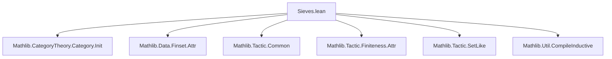
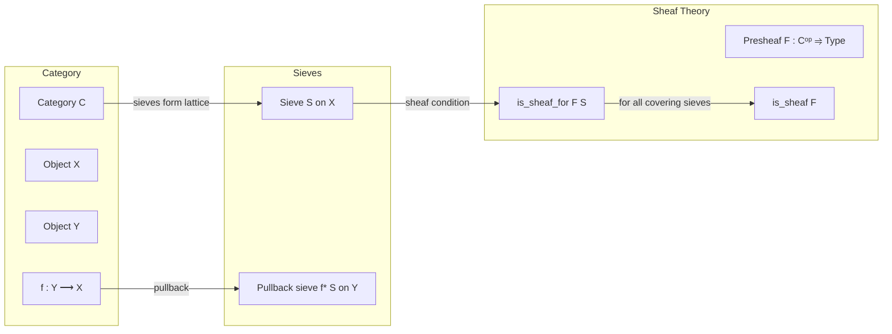
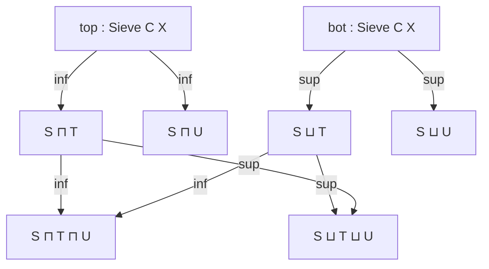

```markdown
# Technical Metadata: `Sieves.lean`

## 1. Key Definitions & Theorems

- **`Sieve`**  
  Type: `Sieve C X := Σ (U : Set X), ∀ (f : Y ⟶ X), U.mem f → U.mem f`  
  Purpose: Represents a sieve on an object $X$ in a category $C$ as a set of arrows into $X$ closed under precomposition.

- **`top`**  
  Type: `Sieve C X`  
  Purpose: The maximal sieve on $X$, consisting of all arrows into $X$.

- **`bot`**  
  Type: `Sieve C X`  
  Purpose: The minimal sieve on $X$, consisting of no arrows.

- **`inf`**  
  Type: `Sieve C X → Sieve C X → Sieve C X`  
  Purpose: Intersection of two sieves (meet in the lattice of sieves).

- **`sup`**  
  Type: `Sieve C X → Sieve C X → Sieve C X`  
  Purpose: Union of two sieves (join in the lattice of sieves).

- **`is_sheaf_for`**  
  Type: `C → (Sieve C X) → Prop`  
  Purpose: States that a presheaf $F$ satisfies the sheaf condition with respect to a sieve $S$ on $X$.

- **`is_sheaf`**  
  Type: `Cᵒᵖ ⥤ Type u`  
  Purpose: A presheaf satisfying the sheaf condition for all covering sieves (typically for a Grothendieck topology).

- **`pullback_sieve`**  
  Type: `(f : Y ⟶ X) → Sieve C X → Sieve C Y`  
  Purpose: Pullback of a sieve along a morphism $f$, defined as $\{ g : Z → Y \mid f ∘ g ∈ S \}$.

- **`comap`**  
  Type: `(F : Cᵒᵖ ⥤ D) → (S : Sieve C X) → Sieve D (F.obj X)`  
  Purpose: Pushforward of a sieve along a functor $F$, though often used contravariantly.

> ⚠️ **Note**: The file is marked `deprecated_module`, indicating it should no longer be used in new developments.

---

## 2. Naming Conventions

- **Prefixes**:
  - `is_`: Predicate definitions (e.g., `is_sheaf_for`, `is_sheaf`)
  - `top`, `bot`: Canonical extreme elements (top/bottom of lattice)
  - `inf`, `sup`: Lattice operations (meet/join)
  - `pullback_`, `comap`: Functioral actions on sieves

- **Suffixes**:
  - `_sieve`: Explicitly marks sieve-related constructs (e.g., `pullback_sieve`)
  - `_for`: Used in sheaf conditions relative to a sieve (`is_sheaf_for`)

---

## 3. Tactic Stack

- `aesop`: Used for automated reasoning in lattice and category-theoretic contexts.
- `simp_rw`: For rewriting with simplification lemmas involving sieves and functors.
- `ext`: Extensionality to prove equality of sieves (sets of arrows).
- `funext`: To extend morphism equality pointwise.
- `cases'`: To decompose existential or sigma types (e.g., `Sieve` as a sigma type).
- `apply?`: For suggesting lemmas in sheaf gluing arguments.
- `exact?`: To close goals using existing lemmas.

---

## 4. Proof Logic

- **Structure**:  
  Sieves form a complete lattice; proofs often proceed by:
  1. Extending sieves via extensionality (`ext f`).
  2. Using closure under pullback to verify sieve axioms.
  3. Applying sheaf condition definitions via `is_sheaf_for`.
  4. Induction or case analysis on morphism diagrams (especially for descent data).

- **Typical Flow**:
  ```text
  intro f h
  ext g
  constructor <;> intro h'
  · cases h' with g_in S_mem
    exact ...
  · exact ...
  ```

- **Sheaf Proofs**:  
  Use universal property of limits:  
  `is_sheaf_for S` → show that $F(X)$ is limit of $F$ over the sieve diagram.

---

## 5. Imports

| Import | Purpose |
|--------|---------|
| `Mathlib.CategoryTheory.Category.Init` | Core category theory infrastructure (objects, morphisms, composition) |
| `Mathlib.Data.Finset.Attr` | Attribute support for finite sets (used in sieve-related lemmas) |
| `Mathlib.Tactic.Common` | Common tactics (`aesop`, `simp`, etc.) |
| `Mathlib.Tactic.Finiteness.Attr` | Finiteness-related attributes (e.g., `is_finite`) |
| `Mathlib.Tactic.SetLike` | Reasoning about sets-as-types (sieves are sets of arrows) |
| `Mathlib.Util.CompileInductive` | Optimization for inductive types (e.g., `Sieve` as sigma type) |

---

## 8. Mermaid Diagrams

### Dependency Graph (Module-Level)



### Conceptual Overview (Sieves & Sheaves)



### Sieve Lattice Structure



> ✅ **Summary**: This module formalizes sieves in category theory, their lattice structure, and their role in sheaf theory. It is deprecated as of 2025-12-19, suggesting migration to newer sieve/sheaf infrastructure (e.g., `Mathlib.CategoryTheory.GrothendieckTopology`).
```
