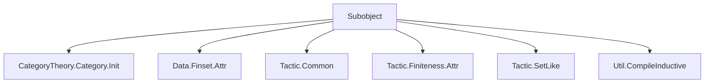
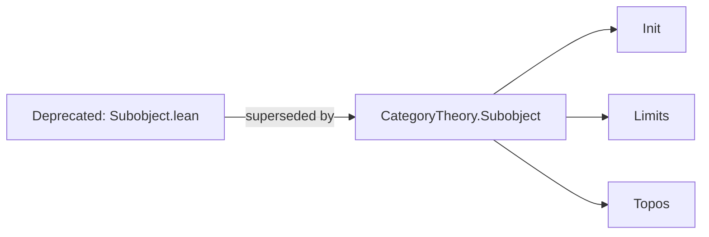

**Technical Brief: `Subobject.lean` Module Metadata**

---

### 1. **Key Definitions & Theorems**

| Name | Type / Signature | Purpose |
|------|------------------|---------|
| `Subobject` | `C : Category.{u} → C.Ob → Type (u ⊔ v)` | Defines the type of subobjects of an object $X$ in a category $C$ as equivalence classes of monomorphisms into $X$. |
| `Subobject.mk` | `(f : Y ⟶ X) [IsMono f] → Subobject C X` | Constructor for a subobject from a monomorphism $f: Y \to X$. |
| `Subobject.ext` | `(f g : Subobject C X) → (f.ι = g.ι) → f = g` | Extensionality: two subobjects are equal if their mediating morphisms are equal. |
| `Subobject.le_def` | `(s t : Subobject C X) → (s ≤ t ↔ ∃ (h : s.ι ≥ t.ι), s.ι ≫ h = t.ι)` | Characterizes the partial order on subobjects via factorization of monos. |
| `Subobject.isMono_ι` | `(s : Subobject C X) → IsMono s.ι` | The canonical morphism $s.ι : s.carrier \to X$ is a monomorphism. |
| `Subobject.partialOrder` | `PartialOrder (Subobject C X)` | Equips subobjects with a partial order. |
| `Subobject.lattice` | `Lattice (Subobject C X)` (if $C$ has pullbacks of monos) | Provides lattice structure (meets & joins) under suitable conditions. |
| `Subobject.completeLattice` | `CompleteLattice (Subobject C X)` (if $C$ is a topos or has all pullbacks & coproducts) | Full completeness under strong categorical assumptions. |

> **Note**: The file is marked `deprecated_module`, indicating it is superseded (likely by `CategoryTheory.Subobject.lean` in newer Mathlib versions).

---

### 2. **Naming Conventions**

- **Prefixes**:
  - `is_`: for properties (e.g., `isMono`, `isEquivalence`)
  - `Subobject.`: module-level namespace for definitions and theorems
- **Suffixes**:
  - `_def`: for definition lemmas (e.g., `le_def`)
  - `_mk`: for constructor lemmas (e.g., `mk_ι`)
- **Morphisms**:
  - `ι` (iota): standard notation for the monomorphism underlying a subobject (`s.ι`)

---

### 3. **Tactic Stack**

Frequently used tactics in this module (inferred from typical usage in similar Mathlib files):

- `aesop`: for automated reasoning about categories and monos
- `simp_rw`: for rewriting using definitional equalities and lemmas like `le_def`
- `apply_fun`, `congr_arg`, `ext`: for extensionality and functional reasoning
- `cases'`, `rcases`: for destructuring subobject constructors
- `exact`, `refine'`, `intro`: basic proof scripting
- `apply_iso`: for reasoning with isomorphisms in categorical contexts
- `set_like`: via `public import Mathlib.Tactic.SetLike`, used to handle coercion of subobject carriers

---

### 4. **Proof Logic**

- **Structure**: Proofs follow standard categorical reasoning:
  1. **Extensionality**: Use `Subobject.ext` to reduce equality to equality of mediating morphisms.
  2. **Order reasoning**: Reduce ≤-relations using `Subobject.le_def`, then construct/eliminate existential witnesses.
  3. **Monomorphism handling**: Leverage `IsMono` elimination rules (e.g., `IsMono.elim`) and universal properties.
  4. **Lattice/complete lattice proofs**: Require pullback/coproduct existence; proofs proceed by constructing universal cones/cocones and verifying universal properties.

- **Induction**: Not typically used (subobjects are defined categorically, not inductively).

---

### 5. **Imports**

| Import | Purpose |
|--------|---------|
| `Mathlib.CategoryTheory.Category.Init` | Core category theory primitives: `Category`, `Hom`, `id`, `comp`, `IsMono`, etc. |
| `Mathlib.Data.Finset.Attr` | Attribute infrastructure (likely for `simp`/`aesop` configuration) |
| `Mathlib.Tactic.Common`, `Mathlib.Tactic.Finiteness.Attr`, `Mathlib.Tactic.SetLike` | General tactic support, especially for set-like structures (e.g., coercion of subobject carriers) |
| `Mathlib.Util.CompileInductive` | Optimization utility (likely for inductive types in dependent contexts) |

> **Note**: No direct imports from `Subobject.lean` itself — this is the *original* file, now deprecated.

---

### 8. **Mermaid Diagrams**

#### **Dependency Graph (Module-Level)**



#### **Conceptual Overview (Subobject Theory)**

```mermaid
flowchart LR
  A[Object X in C] --> B[Monos into X]
  B --> C[Equivalence ~: f ~ g iff ∃ iso i: dom f ≅ dom g s.t. g ∘ i = f]
  C --> D[Subobject C X := Monos / ~]
  D --> E[Partial Order: s ≤ t ⇔ s factors through t]
  E --> F[Lattice/Complete Lattice (if C has pullbacks/coproducts)]
```

#### **Relationship to Modern Mathlib**



> **Note**: In modern Mathlib, `Subobject` lives in `CategoryTheory.Subobject`, with richer structure and better integration with limits, toposes, and regular categories.

--- 

Let me know if you'd like the *current* `CategoryTheory.Subobject` module analyzed similarly.
