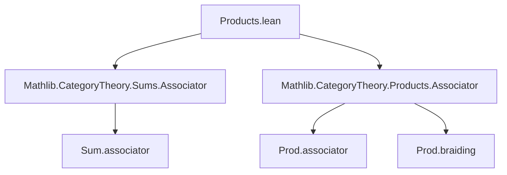

### Technical Brief: `Products.lean` — Universal Property of Sums of Categories

---

#### **1. Key Definitions & Theorems**

| Name | Type / Purpose |
|------|----------------|
| `functorEquiv` | `A ⊕ A' ⥤ B ≌ (A ⥤ B) × (A' ⥤ B)` — The core equivalence expressing that functors out of a *sum* of categories correspond to pairs of functors. |
| `functorEquiv.functor` | Maps a functor $F : A \oplus A' \to B$ to the pair $(F \circ \mathsf{inl},\, F \circ \mathsf{inr})$. |
| `functorEquiv.inverse` | Maps a pair $(F_1, F_2)$ to the functor `Functor.sum' F₁ F₂ : A ⊕ A' → B`. |
| `functorEquiv.unitIso`, `functorEquiv.counitIso` | Natural isomorphisms witnessing the equivalence (via `isoSum`, `inlCompSum'`, `inrCompSum'`). |
| `natTransOfWhiskerLeftInlInr` | Constructs a natural transformation $F \Rightarrow G$ from components on $A$ and $A'$, using `functorEquiv`. |
| `natIsoOfWhiskerLeftInlInr` | Same as above, but for natural *isomorphisms*. |
| `functorEquivFunctorCompFstIso`, `functorEquivFunctorCompSndIso` | Show compatibility of `functorEquiv.functor` with projections: precomposing with `inl` (resp. `inr`) corresponds to projecting first (resp. second). |
| `functorEquivInverseCompWhiskeringLeftInlIso`, `functorEquivInverseCompWhiskeringLeftInrIso` | Dual statements for the inverse direction. |
| `equivalenceFunctorEquivFunctorIso` | Shows that `functorEquiv` intertwines the swap equivalence on sums with the braiding on products. |
| `associativityFunctorEquivNaturalityFunctorIso` | Demonstrates that `functorEquiv` respects associators: the diagram involving `sum.associativity` and `prod.associativity` commutes up to natural isomorphism. |

---

#### **2. Naming Conventions**

- **Prefixes**:
  - `functorEquiv*`: Relating to the main equivalence.
  - `natTransOf*`, `natIsoOf*`: Constructing natural transformations/isos from components.
  - `whiskerLeft*`, `whiskerRight*`: Pre/post-composition with inclusion functors.
  - `inl*`, `inr*`: Related to left/right inclusions $\mathsf{inl}, \mathsf{inr}$.
  - `comp*`: Composition-related (e.g., `sumCompInl`, `inlCompSum'`).
- **Suffixes**:
  - `Iso`: Natural isomorphism.
  - `app`: Component at an object (e.g., `app X`, `app a`).
  - `fst`, `snd`: Projection-related.
- **Notable patterns**:
  - `sum'`, `whiskeringLeft`, `associator`, `braiding`, `swapCompInl`, `inrCompInrCompInverseAssociator` — all standard categorical constructions.

---

#### **3. Tactic Stack**

- **`cat_disch`**: Primary tactic for category-theoretic proofs — likely a custom tactic combining `ext`, `simp`, `congr`, and `funext` for natural transformations and functors.
- **`simp only [...]`**: Used in `associativityFunctorEquivNaturalityFunctorIso` to simplify hom-components.
- **`ext`**, **`dsimp`**, **`simp`**: Implicit in `cat_disch`, used to extend natural transformations and simplify expressions.
- **`all_goals`**: Applied in the final proof block to apply the same simplification strategy to all goals.

---

#### **4. Proof Logic**

- **Structure**: Proofs follow a *structural induction* or *component-wise verification* pattern:
  1. Define the equivalence via explicit functors and natural isomorphisms.
  2. Prove component-wise identities (e.g., `functorEquiv_unit_app_app_inl`) using `rfl`.
  3. For naturality and coherence (e.g., `natTransOfWhiskerLeftInlInr_comp`), reduce to diagram chasing using `cat_disch`.
  4. For higher coherence (e.g., associativity compatibility), construct isomorphisms using known associators and whiskering lemmas, then verify equality of components via `simp` and `ext`.

- **Key reasoning pattern**:
  ```text
  Use functorEquiv to translate between global and component data,
  then verify naturality/coherence by checking each component (inl / inr).
  ```

---

#### **5. Imports**

- `Mathlib.CategoryTheory.Sums.Associator`
- `Mathlib.CategoryTheory.Products.Associator`

These imports provide foundational results about associators and coherence for sums and products of categories, which are essential for proving naturality of `functorEquiv` with respect to associativity and braiding.

---

#### **6. Mermaid Diagrams**

##### **Dependency Graph (Module Level)**



##### **Overview of Theoretical Flow**

```mermaid
graph LR
  A[Sum of categories A ⊕ A'] -->|inl, inr| B[Functors A ⊕ A' → B]
  B -->|functorEquiv| C[(A → B) × (A' → B)]
  C -->|fst, snd| D[A → B]
  C -->|fst, snd| E[A' → B]
  D -->|precompose with inl| B
  E -->|precompose with inr| B
  B -->|natTransOfWhiskerLeftInlInr| F[Natural transformations]
  B -->|natIsoOfWhiskerLeftInlInr| G[Natural isomorphisms]
  subgraph Coherence
    H[Swap] -->|equivalenceFunctorEquivFunctorIso| I[Braiding]
    J[Sum associator] -->|associativityFunctorEquivNaturalityFunctorIso| K[Prod associator]
  end
```

##### **Universal Property Diagram (Conceptual)**

```mermaid
graph LR
  A[A] -->|inl| A⊕A'[A ⊕ A']
  A' -->|inr| A⊕A'
  A⊕A' -->|F| B
  A -->|F ∘ inl| B
  A' -->|F ∘ inr| B
  A⊕A' -->|sum' F₁ F₂| B
  A -->|F₁| B
  A' -->|F₂| B
  style A⊕A' fill:#f9f,stroke:#333
  style B fill:#bbf,stroke:#333
```

---

#### **7. Summary**

This file formalizes the *universal property of coproducts (sums) in the 2-category of categories*, showing that functors out of a sum $A \oplus A'$ are equivalent to pairs of functors $(A \to B, A' \to B)$. It provides:
- An explicit equivalence `functorEquiv`,
- Coherence laws for projections, swaps, and associators,
- Tools to reconstruct global natural transformations/isomorphisms from their components.

The formalization is highly structured, leveraging whiskering, `sum'`, and coherence isomorphisms, with proofs largely automated via `cat_disch`. It serves as a foundational ingredient for higher-categorical constructions involving sums and products.
