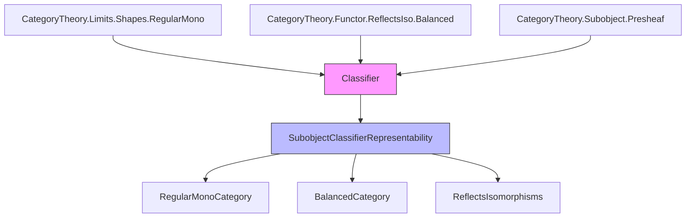

Here is the structured technical brief extracted from `Classifier.lean`:

---

### **1. Key Definitions & Theorems**

| Name | Type / Signature | Purpose |
|------|------------------|---------|
| `Classifier C` | `Structure` | Data of a subobject classifier: objects `Ω₀`, `Ω`, monic `truth : Ω₀ ⟶ Ω`, and for each mono `m : U ⟶ X`, a characteristic map `χ m : X ⟶ Ω` making the square a pullback, uniquely. |
| `HasClassifier C` | `Class Prop` | Asserts existence of at least one `Classifier C`. |
| `Ω₀ C`, `Ω C`, `truth C` | `Abbrev` | Canonical choices (via `some`) of classifier components under `HasClassifier C`. |
| `χ m` | `Def` | Characteristic morphism of mono `m : U ⟶ X`. |
| `isPullback_χ m` | `Lemma` | The defining pullback square for `χ m`. |
| `comm m` | `Lemma` | Commutativity of the classifier pullback square. |
| `unique m χ' hχ'` | `Lemma` | Uniqueness of `χ m` in the pullback square. |
| `truthIsSplitMono` | `Instance` | `truth C` is split mono (since source is terminal). |
| `truthIsRegularMono` | `Def` | `truth C` is regular mono (as split mono ⇒ regular). |
| `isRegularMonoCategory` | `Instance` | Every mono in `C` is regular (pullback of regular mono `truth C`). |
| `representsBy 𝒞` | `Def` | `Classifier C` ⇒ `Subobject.presheaf C` is representable by `𝒞.Ω`. |
| `classifier h` | `Def` | `Subobject.presheaf C` representable by `Ω` ⇒ `Classifier C` exists. |
| `isRepresentable_hasClassifier_iff` | `Theorem` | `HasClassifier C ↔ (Subobject.presheaf C).IsRepresentable` (Prop 1, [MM92, I.3]). |

---

### **2. Naming Conventions**

| Pattern | Examples | Meaning |
|--------|----------|---------|
| `χ` | `χ m`, `χ₀`, `χ'` | Characteristic maps (of monos or objects). |
| `truth` | `truth`, `truth C`, `truth_as_subobject` | The “truth” monomorphism `Ω₀ ⟶ Ω`. |
| `isPullback_χ` | `isPullback_χ m` | Pullback property of `χ m`. |
| `uniq` | `uniq m hχ'` | Uniqueness of characteristic map. |
| `representableBy` | `representableBy 𝒞` | Classifier ⇒ representation. |
| `classifier` | `classifier h` | Representation ⇒ classifier. |
| `π`, `iso`, `Ω₀` | `h.π m`, `h.iso m`, `h.Ω₀` | Components in representation-to-classifier direction. |
| `isTerminalΩ₀` | `c.isTerminalΩ₀`, `h.isTerminalΩ₀` | Proves `Ω₀` is terminal. |
| `homEquiv` | `h.homEquiv`, `homEquiv_eq` | Hom-set bijection from representability. |

---

### **3. Tactic Stack**

| Tactic | Frequency | Role |
|--------|-----------|------|
| `simp` | Very high | Simplify pullback conditions, terminal morphisms, homEquiv. |
| `rw` / `convert` | High | Rewrite using lemmas like `comm`, `uniq`, `homEquiv_eq`. |
| `exact` / `refine` | High | Construct proofs using existing lemmas (e.g., `uniq`, `isPullback`). |
| `dsimp`, `simp only` | Medium | Simplify definitions (e.g., `π`, `χ₀`). |
| `fapply`, `of_iso` | Medium | Construct isomorphisms of pullback squares. |
| `cancel_mono` | Low | Cancel monos in equalities. |
| `Over.forget`, `MonoOver.forget` | Low | Work in overcategories. |
| `Subsingleton.elim` | Low | Use subsingleton property of pullback limits. |

---

### **4. Proof Logic**

- **Classifier ⇒ Representation** (`representableBy`):
  - Define `homEquiv` via pullback: `φ ↦ pullback φ * truth_as_subobject`.
  - Inverse: `x ↦ χ x.arrow`.
  - Use `surjective_χ` to show surjectivity (every subobject arises as pullback of `truth`).
  - Use `uniq` and `isPullback` to show inverses.

- **Representation ⇒ Classifier** (`classifier`):
  - Show `h.Ω₀` is terminal using uniqueness of pullbacks of `h.Ω₀.arrow` along `𝟙 X`.
  - Use `isoΩ₀` to identify `h.Ω₀` with `⊤_ C`.
  - Define `truth := isoΩ₀.inv ≫ h.Ω₀.arrow`.
  - Verify classifier axioms using `h.isPullback`, `h.uniq`, and terminality.

- **Equivalence** (`isRepresentable_hasClassifier_iff`):
  - `→`: Use `representableBy`.
  - `←`: Use `classifier`.

- **Consequences**:
  - `truth` split mono ⇒ regular mono.
  - Every mono is pullback of `truth` ⇒ all monos regular ⇒ `C` is *regular mono category*.
  - Regular mono categories are balanced ⇒ faithful functors reflect isos.

---

### **5. Imports**

| Module | Purpose |
|--------|---------|
| `Mathlib.CategoryTheory.Limits.Shapes.RegularMono` | Regular monomorphisms, their stability, and properties. |
| `Mathlib.CategoryTheory.Functor.ReflectsIso.Balanced` | Balanced categories ⇒ faithful functors reflect isos. |
| `Mathlib.CategoryTheory.Subobject.Presheaf` | Subobject presheaf `Subobject.presheaf C`. |

---

### **6. Mermaid Diagrams**

#### **Dependency Graph (High-Level Theory)**



#### **Overview of `Classifier.lean`**

```mermaid
flowchart LR
  A[Classifier C] -->|data| B[Ω₀, Ω, truth, χ]
  B --> C[Pullback Square]
  C --> D[truth is mono]
  D --> E[truth is split mono]
  E --> F[truth is regular mono]
  F --> G[All monos regular ⇒ IsRegularMonoCategory]

  A --> H[RepresentableBy]
  H --> I[(Subobject.presheaf C).RepresentableBy Ω]

  I --> J[Classifier from Representation]
  J --> K[isRepresentable_hasClassifier_iff]

  style A fill:#f9f,stroke:#333
  style I fill:#bbf,stroke:#333
  style K fill:#9f9,stroke:#333
```

--- 

Let me know if you'd like a formalized dependency graph in `leanpkg.toml` style or a visualization of the `Classifier` structure fields.
