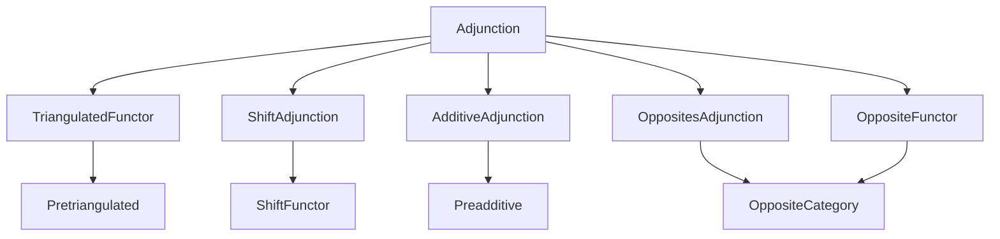
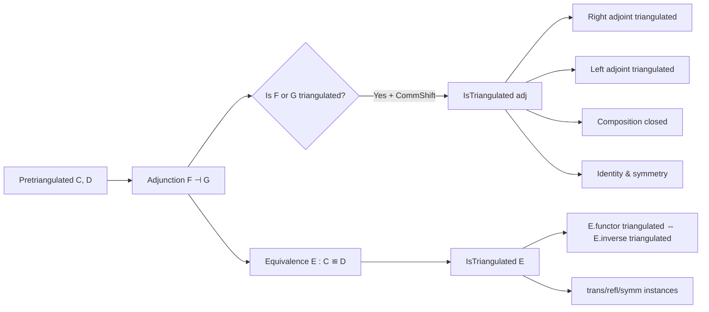
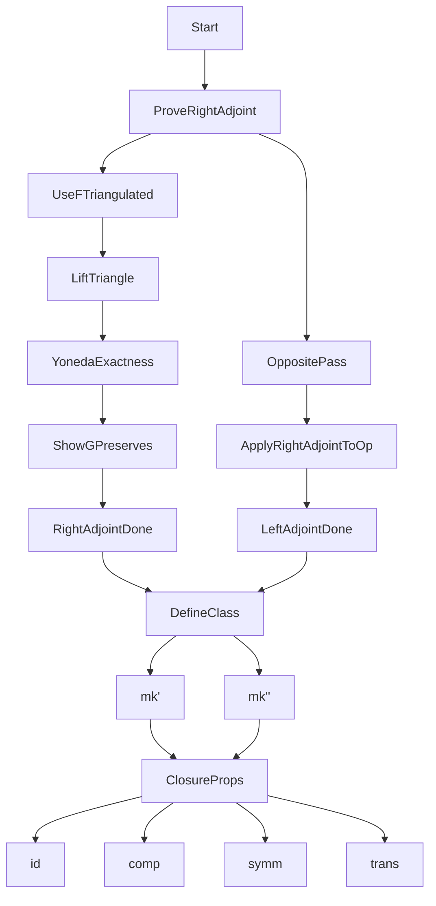

### Technical Brief: `Adjunction.lean` — Triangulated Adjunctions and Equivalences

---

#### **1. Key Definitions & Theorems**

| Name | Type / Signature | Purpose |
|------|------------------|---------|
| `isTriangulated_rightAdjoint` | `[F.IsTriangulated] → G.IsTriangulated` | Proves that if the left adjoint `F` of an adjunction `F ⊣ G` is triangulated, then so is the right adjoint `G`. |
| `isTriangulated_leftAdjoint` | `[G.IsTriangulated] → F.IsTriangulated` | Symmetric result: if `G` is triangulated, then `F` is triangulated. Uses opposite categories. |
| `IsTriangulated` (class) | `Prop` | An adjunction `F ⊣ G` is *triangulated* if:   • `adj.CommShift ℤ` holds (compatibility with ℤ-shifts),   • `F.IsTriangulated`,   • `G.IsTriangulated`. |
| `IsTriangulated.mk'` | `[F.IsTriangulated] → adj.IsTriangulated` | Constructor: if `F` is triangulated, then the whole adjunction is triangulated (since `G` follows). |
| `IsTriangulated.mk''` | `[G.IsTriangulated] → adj.IsTriangulated` | Dual constructor: if `G` is triangulated, then the adjunction is triangulated. |
| `id` | `(Adjunction.id).IsTriangulated` | Instance: identity adjunction is triangulated. |
| `comp` | `[adj.IsTriangulated] → [adj'.IsTriangulated] → (adj.comp adj').IsTriangulated` | Composition of triangulated adjunctions is triangulated. |
| `Equivalence.IsTriangulated` | `abbrev` | An equivalence `E : C ≌ D` is triangulated iff its underlying adjunction `E.toAdjunction` is triangulated. |
| `Equivalence.IsTriangulated.mk'` / `mk''` | `(E.functor.IsTriangulated) → E.IsTriangulated`   `(E.inverse.IsTriangulated) → E.IsTriangulated` | Constructors for triangulated equivalences. |
| `refl`, `symm`, `trans` | Instances for identity, symmetry, and transitivity of triangulated equivalences. | |

---

#### **2. Naming Conventions**

- **Prefixes**:
  - `isTriangulated_`: lemmas establishing triangulatedness of functors or adjunctions.
  - `mk'`, `mk''`: constructors for `IsTriangulated`.
- **Suffixes**:
  - `_rightAdjoint`, `_leftAdjoint`: specify which adjoint is assumed triangulated.
  - `_op`: used in `isTriangulated_leftAdjoint` to pass to opposite categories.
- **Class/instance names**:
  - `IsTriangulated` (class), `IsTriangulated` (abbreviation for equivalences).
- **Method names**:
  - `commShift`, `leftAdjoint_isTriangulated`, `rightAdjoint_isTriangulated`: fields of the class.

---

#### **3. Tactic Stack**

The proofs rely heavily on:
- `aesop`: for automated reasoning about morphisms and diagrams.
- `simp` / `simp only`: simplification with naturality, unit/counit laws, shift compatibility.
- `rw`: rewriting using naturality squares, triangle identities, and properties of shifts.
- `dsimp`: simplifying definitional equalities (e.g., in `comp`, `refl`).
- `obtain` / `refine` / `existsi`: constructing witnesses in exact triangle arguments.
- `apply`, `intro`, `congr_arg`, `funext`: standard tactic usage.
- `mono_iff_cancel_zero`, `cancel_mono`, `Iso.hom_inv_id_app`, `yoneda`: homological algebra tools.
- `coyoneda_exact₁`, `coyoneda_exact₂`, `coyoneda_exact₃`: exactness lemmas for distinguished triangles.

---

#### **4. Proof Logic**

- **Main structure**:
  - **Step 1**: Prove `isTriangulated_rightAdjoint`:
    - Use that `F` is triangulated ⇒ `F` preserves distinguished triangles.
    - Express `G(T)` as a retract/limit via unit/counit.
    - Use coyoneda exactness to lift morphisms and show `G(T)` is distinguished.
    - Key tools: `complete_distinguished_triangle_morphism`, `coyoneda_exact₃`, `isIso_of_yoneda_map_bijective`.
  - **Step 2**: Derive `isTriangulated_leftAdjoint`:
    - Pass to opposite categories: `F ⊣ G` ⇔ `Gᵒᵖ ⊣ Fᵒᵖ`.
    - Apply `isTriangulated_rightAdjoint` to `adj.op`.
    - Use `F.isTriangulated_of_op`.
  - **Step 3**: Define `IsTriangulated` class and prove closure properties:
    - `mk'`/`mk''`: reduce to one side.
    - `id`, `comp`, `symm`, `trans`: use `rw [toAdjunction_*]` + `infer_instance`.

- **Logical flow**:
  - *Induction-free*; relies on universal properties (unit/counit), exactness of distinguished triangles, and Yoneda arguments.
  - Heavy use of *naturality* and *functoriality* of shift functors (`shiftFunctor`, `commShiftIso`).
  - Triangulatedness is *stable under adjunction* once one side is triangulated and shift compatibility holds.

---

#### **5. Imports & Dependencies**

| Import | Role |
|--------|------|
| `Mathlib.CategoryTheory.Triangulated.Functor` | Defines `IsTriangulated` for functors, distinguished triangles. |
| `Mathlib.CategoryTheory.Shift.Adjunction` | Defines `CommShift` for adjunctions (compatibility with ℤ-shifts). |
| `Mathlib.CategoryTheory.Adjunction.Additive` | Ensures additive structure on adjoints. |
| `Mathlib.CategoryTheory.Adjunction.Opposites` | Opposite adjunctions (`adj.op`). |
| `Mathlib.CategoryTheory.Triangulated.Opposite.Functor` | `F.isTriangulated_of_op`. |

---

#### **6. Mermaid Diagrams**

##### **Dependency Graph (Module Level)**

##### **Overview of Theory Flow**

##### **Proof Structure (High-Level)**

---

#### **7. Summary**

This file formalizes a foundational result in homological algebra: **adjoints of triangulated functors are triangulated**, provided the adjunction is compatible with the ℤ-shifts (`CommShift`). It introduces a robust class `IsTriangulated` for adjunctions and equivalences, and proves stability under composition, identity, and symmetry. The proofs combine homological algebra (distinguished triangles, coyoneda exactness) with categorical machinery (unit/counit, opposites, shifts), and are fully mechanized in Lean 4 using `Mathlib`’s triangulated category infrastructure.

--- 

Let me know if you'd like a formalized summary in `lean` comment style or a dependency graph for specific lemmas.
