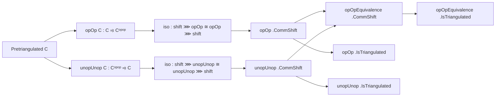

### Technical Brief: `OpOp.lean`

---

#### **1. Key Definitions & Theorems**

| Name | Type / Signature | Purpose |
|------|------------------|---------|
| `OpOpCommShift.iso (n : ℤ)` | `shiftFunctor C n ⋙ opOp C ≅ opOp C ⋙ shiftFunctor Cᵒᵖᵒᵖ n` | Natural isomorphism expressing that `opOp C` commutes with shift by `n`. |
| `UnopUnopCommShift.iso (n : ℤ)` | `shiftFunctor Cᵒᵖᵒᵖ n ⋙ unopUnop C ≅ unopUnop C ⋙ shiftFunctor C n` | Natural isomorphism expressing that `unopUnop C` commutes with shift by `n`. |
| `opOp C .CommShift ℤ` | `Instance` | Proves `opOp C` is compatible with the ℤ-action (shifts), via the above iso. |
| `unopUnop C .CommShift ℤ` | `Instance` | Same for `unopUnop C`. |
| `opOpEquivalence C .CommShift ℤ` | `Instance` | Shows the equivalence `opOpEquivalence C : C ≌ Cᵒᵖᵒᵖ` is compatible with shifts. |
| `opOp C .IsTriangulated` | `Instance` | Proves `opOp C` preserves distinguished triangles (i.e., is a triangulated functor). |
| `unopUnop C .IsTriangulated` | `Instance` | Follows from previous; `unopUnop C` is triangulated. |
| `opOpEquivalence C .IsTriangulated` | `Instance` | The equivalence itself is triangulated (both functors are triangulated and unit/counit are compatible with shifts). |

---

#### **2. Naming Conventions**

- **Prefixes**:
  - `iso_`: Constructs natural isomorphisms expressing compatibility with structure (e.g., `iso_hom_app`, `iso_inv_app`).
  - `commShiftIso_`: Refers to the structure morphism in `CommShift` instances (e.g., `commShiftIso_opOp_hom_app`).
  - `op_`, `unop_`: Operations on morphisms/objects in opposite categories.
  - `shiftFunctorOpIso_`: Standard isomorphisms for shift functors in opposite categories.

- **Suffixes**:
  - `_app`: Refers to component at an object (e.g., `iso_hom_app X`).
  - `_hom`, `_inv`: Refers to forward/inverse components of an isomorphism.
  - `_op`, `_unop`: Indicates application of `op`/`unop` on morphisms.

- **Pattern**: `X.op`, `X.unop`, `f.op`, `f.unop` for lifting objects/morphisms through opposites.

---

#### **3. Tactic Stack**

- **Core tactics**:
  - `ext`: Extensionality for natural transformations / morphisms.
  - `simp`: Heavy use of simplification, especially with `shiftFunctor_*_app`, `op_comp`, `unop_comp`, `Functor.map_comp`.
  - `obtain rfl : m = -n := by lia`: Automatic arithmetic reasoning for integer equalities.
  - `refine`: To construct morphisms or isomorphisms with holes.
  - `dsimp`: Simplify definitional equalities before `simp`.
  - `aesop` not used — relies on manual `simp` + `linarith`.
  - `Category.assoc`, `← op_comp`, `← unop_comp`: Rewriting associativity and opposite composition.

- **Key lemmas used in `simp`**:
  - `shiftFunctorAdd'_eq_shiftFunctorAdd`
  - `shiftFunctorZero_op_hom_app`, `shiftFunctorZero_op_inv_app`
  - `shiftFunctor_op_map _ n m`
  - `shiftFunctorCompIsoId_hom_app`, `shiftFunctorCompIsoId_op_hom_app`
  - `opShiftFunctorEquivalence_counitIso_inv_app`

---

#### **4. Proof Logic**

- **Structure**:
  1. **Define isomorphisms** (`iso`) expressing that `opOp` and `unopUnop` commute with shifts.
     - Constructed via `NatIso.ofComponents`, using `shiftFunctorOpIso` and double `op`/`unop`.
  2. **Verify `CommShift` axioms**:
     - `commShiftIso_zero`: Show identity at shift 0.
     - `commShiftIso_add`: Show compatibility with addition (uses `shiftFunctorAdd'` and naturality).
  3. **Lift to equivalence**:
     - Use `Equivalence.CommShift.mk''` to show the equivalence itself commutes with shifts.
  4. **Triangulatedness**:
     - For `opOp C`: Show it maps distinguished triangles to distinguished ones.
       - Uses `isomorphic_distinguished` and naturality of `shiftFunctorCompIsoId`.
       - Simplifies heavily using `op`, `unop`, and `shiftFunctor_op_map`.
     - For `unopUnop C` and `opOpEquivalence C`: Follows by transfer along equivalence.

- **Induction**: Not used — proofs are direct verification of naturality and triangle preservation.

---

#### **5. Imports**

- `Mathlib.CategoryTheory.Triangulated.Adjunction`: For adjunctions and equivalences in triangulated context.
- `Mathlib.CategoryTheory.Triangulated.Opposite.Basic`: For basic constructions on opposite categories, especially `opOp`, `unopUnop`, and shift functors.

---

#### **6. Theory Overview & Dependency Diagram**

##### **High-Level Theory Flow**

```
Pretriangulated Category C
│
├── Shift functor ℤ-action: shiftFunctor C n
├── Opposite category constructions:
│   ├── opOp C : C ⥤ Cᵒᵖᵒᵖ
│   └── unopUnop C : Cᵒᵖᵒᵖ ⥤ C
│
├── Compatibility with shifts:
│   ├── opOp C .CommShift ℤ
│   └── unopUnop C .CommShift ℤ
│
├── Equivalence opOpEquivalence C : C ≌ Cᵒᵖᵒᵖ
│   └── Its compatibility with shifts: opOpEquivalence C .CommShift ℤ
│
└── Triangulated structure:
    ├── opOp C .IsTriangulated
    ├── unopUnop C .IsTriangulated
    └── opOpEquivalence C .IsTriangulated
```

##### **Mermaid Diagrams**

**Dependency Graph (Module Level)**


**Conceptual Flow (Triangulated Equivalence)**



---

#### **7. Summary**

This file establishes that the canonical equivalence $ C \simeq C^{\mathrm{op}\,\mathrm{op}} $ between a pretriangulated category and its double opposite is **triangulated**, i.e., it preserves the shift functor and distinguished triangles. The key technical work is verifying compatibility with the ℤ-action (shifts) via explicit isomorphisms, and then checking triangulatedness using properties of opposite categories and shift functors.

The formalization is highly structured, with careful use of `op`/`unop` to transport structure across opposites, and heavy reliance on `simp`-based simplification with specialized lemmas about shift functors and their opposites.

--- 

Let me know if you'd like a formalized summary in LaTeX or a proof sketch in natural language.
