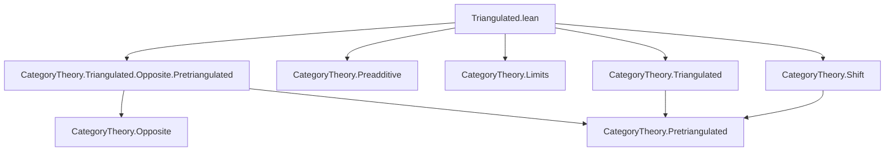
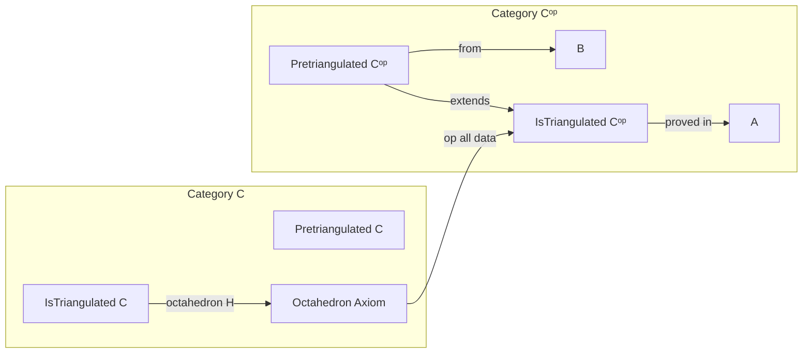
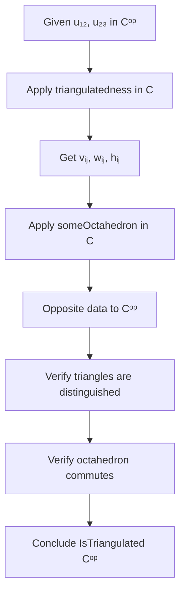

Here is the structured technical brief for `Triangulated.lean`, extracted with precision and aligned with Lean 4 formalization conventions.

---

### **1. Key Definitions & Theorems**

| Name | Type / Purpose |
|------|----------------|
| `IsTriangulated.mk'` | Constructor for `IsTriangulated` structure on `Cᵒᵖ`, using a universal property involving octahedra. |
| `distTriang C` | The class of *distinguished triangles* in a pretriangulated category `C`. |
| `rot_of_distTriang _ h` | Rotation of a distinguished triangle `h : Triangle.mk … ∈ distTriang C`. |
| `someOctahedron _ _ _ _` | Witness of the octahedral axiom: given composable morphisms, produces an octahedron of distinguished triangles. |
| `opShiftFunctorEquivalenceSymmHomEquiv` | Equivalence (bijection) between hom-sets in `C` and `Cᵒᵖ` after shifting: `X⟦n⟧ ⟶ Y ≅ X ⟶ Y⟦-n⟧` in `C`. |
| `mem_distTriang_op_iff` | Characterization of distinguished triangles in `Cᵒᵖ`: a triangle in `Cᵒᵖ` is distinguished iff its op is distinguished in `C`. |
| `shiftFunctorOpIso`, `shiftFunctorComm`, `shift_opShiftFunctorEquivalence_*` | Natural isomorphisms and commutativity laws for shift functors in opposite categories. |

**Main Theorem (implicit)**:  
If `C` is triangulated, then `Cᵒᵖ` is triangulated.  
Formally:  
```lean
instance [IsTriangulated C] : IsTriangulated Cᵒᵖ
```

---

### **2. Naming Conventions**

- **Prefixes**:
  - `op_`: Opposite-category constructions (`opShiftFunctorEquivalence`, `op_comp`, `op_inj`).
  - `distTriang_`: Distinguished triangle constructions (`distTriang`, `distinguished_cocone_triangle₁`).
  - `someOctahedron`: Existential witness for octahedra.
  - `rot_of_distTriang`: Rotation of distinguished triangles.

- **Suffixes**:
  - `_op`: Operations in the opposite category (`v₂₃.op`, `w₁₂.op`).
  - `_unop`: Dual operations (`u₁₂.unop`, `H.comm₄.symm`).
  - `_assoc`: Associativity adjustments (`reassoc_of%`, `unop_comp_assoc`).

- **Variables**:
  - `X₁, X₂, X₃`: Objects in `C`.
  - `u₁₂, u₂₃`: Morphisms in `C`.
  - `Z₁₂, Z₂₃, Z₁₃`: Cones in `C`.
  - `vᵢⱼ, wᵢⱼ`: Legs of distinguished triangles in `C`.
  - `H`: Octahedron data in `C`.

---

### **3. Tactic Stack**

| Tactic | Frequency / Role |
|--------|------------------|
| `obtain` / `rcases` | High — destruct existential witnesses (e.g., `distinguished_cocone_triangle₁`). |
| `refine` | High — construct terms stepwise, especially for `IsTriangulated.mk'`. |
| `rw` | Very high — rewrite using lemmas like `mem_distTriang_op_iff`, `opShiftFunctorEquivalenceSymmHomEquiv_*`. |
| `simp` / `simpa` | Very high — simplify goals using `op`, `shift`, `Iso` properties. |
| `have`, `set` | Medium — intermediate lemmas (e.g., `have := H.comm₃`). |
| `dsimp` | Medium — definitional simplification before rewriting. |
| `exact`, `assumption` | Low — used sparingly after full simplification. |
| `funext`, `ext` | Not present — no extensionality needed here. |
| `aesop`, `linarith`, `ring` | Not present — no arithmetic or propositional reasoning beyond category axioms. |

---

### **4. Proof Logic**

The proof proceeds as follows:

1. **Goal**: Show `Cᵒᵖ` satisfies `IsTriangulated`, i.e., the octahedral axiom holds.
2. **Input**: Morphisms `u₁₂ : X₁ ⟶ X₂`, `u₂₃ : X₂ ⟶ X₃` in `Cᵒᵖ` (i.e., `u₂₃.unop`, `u₁₂.unop` in `C`).
3. **Step 1**: Use triangulatedness of `C` to get distinguished triangles:
   - `v₁₂ : Z₁₂ ⟶ X₁`, `w₁₂ : X₂ ⟶ Z₁₂⟦1⟧` over `u₁₂.unop`
   - `v₂₃ : Z₂₃ ⟶ X₂`, `w₂₃ : X₃ ⟶ Z₂₃⟦1⟧` over `u₂₃.unop`
   - `v₁₃ : Z₁₃ ⟶ X₁`, `w₁₃ : X₃ ⟶ Z₁₃⟦1⟧` over `u₁₂.unop ≫ u₂₃.unop`
4. **Step 2**: Apply octahedral axiom in `C` to get an octahedron `H` over these three triangles.
5. **Step 3**: Opposite all data to get candidate morphisms and triangles in `Cᵒᵖ`.
6. **Step 4**: Verify:
   - Each triangle in `Cᵒᵖ` is distinguished using `mem_distTriang_op_iff` and `isomorphic_distinguished`.
   - The octahedron axioms (`comm₁`–`comm₄`, `mem`) hold in `Cᵒᵖ`, using:
     - `opShiftFunctorEquivalenceSymmHomEquiv_left_inv` to invert equivalences.
     - `shiftFunctor.map_surjective` / `map_injective` to lift/reflect morphisms.
     - Naturality and coherence of shift functors (`shiftFunctorComm`, `shift_opShiftFunctorEquivalence_*`).
7. **Step 5**: Conclude via `IsTriangulated.mk'`.

**Key Insight**: The proof leverages the *duality* between cones and cocones in opposite categories, and the fact that distinguished triangles in `Cᵒᵖ` correspond to those in `C` via `op`.

---

### **5. Imports**

| Module | Role |
|--------|------|
| `CategoryTheory.Triangulated.Opposite.Pretriangulated` | Provides the *pretriangulated* structure on `Cᵒᵖ` (shift, rotation, etc.). |
| `CategoryTheory.Preadditive` | Needed for additive structure and shift functor additivity. |
| `CategoryTheory.Limits` | Implicit via `Limits` (used for shift functor properties). |
| `CategoryTheory.Shift` | Shift functors, `shiftFunctor`, `shiftFunctorComm`, `shiftFunctorOpIso`. |
| `CategoryTheory.Triangulated` | Core definitions: `IsTriangulated`, `distTriang`, `Octahedron`, `someOctahedron`. |

---

### **6. Mermaid Diagrams**

#### **Dependency Graph (File-Level)**



#### **Overview of Theory Flow**



#### **High-Level Proof Structure**



---

### **7. Additional Notes**

- **No choice used**: All existence claims are constructive via `distinguished_cocone_triangle₁` and `someOctahedron`.
- **Shift grading**: Uses `ℤ`-grading (e.g., `shiftFunctor C n` for `n : ℤ`), critical for Verdier duality context.
- **Opposite category subtleties**: The proof carefully handles the sign conventions via `shiftFunctorOpIso` and `opShiftFunctorEquivalenceSymmHomEquiv`.

--- 

Let me know if you'd like the formalization of the dual statement (`C triangulated ⇒ Cᵒᵖ triangulated`) in a more abstract categorical style, or a tactic-level trace of the proof.
