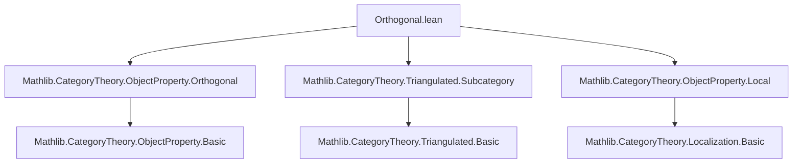
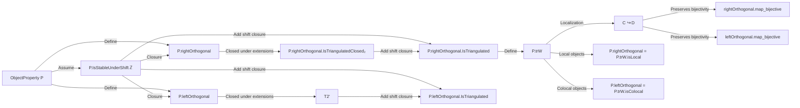

### Technical Brief: `Orthogonal.lean`

---

#### **1. Key Definitions & Theorems**

| Name | Type / Signature | Purpose |
|------|------------------|---------|
| `P.rightOrthogonal` | `ObjectProperty C → ObjectProperty C` | Defines the class of objects $Y$ such that $\forall X, P(X) \Rightarrow \text{Hom}(X,Y) = 0$. |
| `P.leftOrthogonal` | `ObjectProperty C → ObjectProperty C` | Dual: objects $X$ such that $\forall Y, P(Y) \Rightarrow \text{Hom}(X,Y) = 0$. |
| `isStableUnderShift` | `P.IsStableUnderShift M` | Property that $P$ is closed under shifts by elements of an additive group $M$. |
| `IsTriangulatedClosed₂` | `P.IsTriangulatedClosed₂` | Closure under extensions in distinguished triangles: if $X \to Y \to Z \to \Sigma X$ is distinguished, and $X,Z$ satisfy $P$, then $Y$ does. |
| `IsTriangulated` | `P.IsTriangulated` | $P$ is a triangulated subcategory: closed under shifts, extensions, and retracts. |
| `trW` | `P.trW` | The class of weak equivalences induced by $P$: morphisms whose fiber/cofiber lies in $P^\perp$ (or $^\perp P$). |
| `isLocal_trW` | `P.trW.isLocal = P.rightOrthogonal` | The *localization* of $C$ at $P.trW$ has as its local objects precisely $P^\perp = P.rightOrthogonal$. |
| `isColocal_trW` | `P.trW.isColocal = P.leftOrthogonal` | Dually, the colocal objects for $P.trW$ are $^\perp P = P.leftOrthogonal$. |
| `rightOrthogonal.map_bijective_of_isTriangulated` | `[P.IsTriangulated] → [IsTriangulated C] → hY : P.rightOrthogonal Y → L : C ⥤ D [L.IsLocalization P.trW] → Function.Bijective (L.map : (X ⟶ Y) → _)` | Shows that maps into a right-orthogonal object remain bijective under localization at $P.trW$. |
| `leftOrthogonal.map_bijective_of_isTriangulated` | Dual of above, for maps out of left-orthogonal objects. |

---

#### **2. Naming Conventions**

- **Prefixes**:
  - `isStableUnderShift`: indicates closure under shift functors.
  - `IsTriangulated`, `IsTriangulatedClosed₂`: indicate triangulated-closure properties.
  - `rightOrthogonal`, `leftOrthogonal`: standard notation for orthogonal classes.
  - `trW`: short for *triangulated weak equivalences*.
  - `isLocal`, `isColocal`: denote local/colocal classes w.r.t. a class of morphisms.

- **Suffixes**:
  - `_of_isTriangulated`: indicates a result that assumes $P$ is triangulated.
  - `_mk'`: used in constructing instances via a universal property (e.g., `IsTriangulatedClosed₂.mk'`).

- **General pattern**: `P.<property>` for constructions depending on $P$; duals often use symmetric naming (`left` vs `right`, `colocal` vs `local`).

---

#### **3. Tactic Stack**

- **Core tactics**:
  - `obtain ⟨g, rfl⟩ := ...`: used repeatedly to extract factorizations via exactness in triangulated categories.
  - `simp [...]`: simplification using hom-adjunctions (`homEquiv_unit`, `homEquiv_counit`), shift properties, and zero morphism axioms.
  - `rw [...]`: rewriting using lemmas like `isLocal_trW`, `isColocal_trW`, `trW_iff'`, etc.
  - `exact ...`, `refine ...`: for constructing proofs and instances.
  - `ext Y` / `ext X`: extensionality for object properties.
  - `cancel_epi`, `cancel_mono`: used to cancel monos/epis after localization.

- **Advanced reasoning**:
  - `Pretriangulated.Triangle.coyoneda_exact₂`, `yoneda_exact₂`: exactness of Hom sequences in triangulated categories.
  - `shiftEquiv`, `shiftFunctor`: manipulation of shift adjunctions.

---

#### **4. Proof Logic**

- **Structure of proofs**:
  - **Induction / case analysis** is not used here; instead, the logic is *homological*:
    - Use of *exact triangles* and *Hom exact sequences*.
    - Factorization via surjectivity/injectivity of hom-equivs from shift adjunctions.
    - Localization arguments via fraction calculus (`exists_rightFraction`, `exists_leftFraction`).
  - **Typical flow**:
    1. Assume $f : X \to Y$ with $P(X)$.
    2. Use exactness (e.g., `yoneda_exact₂`) to factor $f$ through a cone or shift.
    3. Apply orthogonality condition (e.g., $hY(g) = 0$) to deduce $f = 0$ or injectivity/surjectivity.
    4. For localization: use that $L$ inverts $P.trW$, then lift/extend maps using orthogonality.

- **Key lemmas**:
  - `isLocal_trW` and `isColocal_trW` are proven by double inclusion, using exact triangle sequences and orthogonality.
  - Bijectivity lemmas rely on:
    - Description of morphisms in localization via fractions.
    - Orthogonality to kill kernels/cokernels.
    - Cancellation properties in additive categories.

---

#### **5. Imports & Dependencies**

| Module | Role |
|--------|------|
| `Mathlib.CategoryTheory.ObjectProperty.Orthogonal` | Defines `rightOrthogonal`, `leftOrthogonal`, basic properties. |
| `Mathlib.CategoryTheory.Triangulated.Subcategory` | Defines triangulated subcategories, closure properties (`IsTriangulated`, `IsTriangulatedClosed₂`). |
| `Mathlib.CategoryTheory.ObjectProperty.Local` | Defines local/colocal classes w.r.t. morphism classes (`isLocal`, `isColocal`). |

- **Core infrastructure used**:
  - `Limits`, `Pretriangulated`, `Additive`, `HasShift`, `HasZeroMorphisms`, `Preadditive`.
  - Localization theory: `Localization`, `MorphismProperty`, `IsLocalization`.

---

#### **6. Mermaid Diagrams**

##### **Dependency Graph (Module Level)**

##### **Conceptual Overview of Theory Flow**

---

#### **7. Summary**

This file establishes foundational results about orthogonality in triangulated categories:  
- **Main theorem**: If $P$ is a triangulated subcategory, then its right/left orthogonal classes are also triangulated.  
- **Key insight**: The class of weak equivalences $P.trW$ (morphisms with fiber/cofiber in $P$) has as its *local objects* precisely $P^\perp$, and *colocal objects* precisely $^\perp P$.  
- **Application**: This justifies using orthogonality to construct Bousfield localizations and derived categories in homological algebra.

The proofs rely heavily on the homological algebra of triangulated categories: exact triangles, shift adjunctions, and localization calculus.
