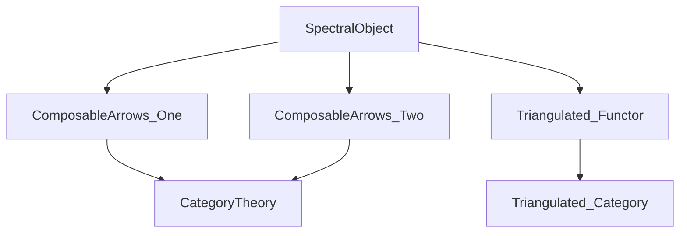

Here is the structured technical brief extracted from `SpectralObject.lean`:

---

### **1. Key Definitions & Theorems**

| Name | Type / Signature | Purpose |
|------|------------------|---------|
| `SpectralObject` | `Structure` | A spectral object in a pretriangulated category `C` indexed by `ι` consists of: <br>• A functor `ω₁ : ComposableArrows ι 1 ⥤ C` <br>• A natural transformation `δ' : functorArrows ι 1 2 2 ⋙ ω₁ → ω₁ ⋙ shiftFunctor 1` <br>• A witness that for each `D : ComposableArrows ι 2`, the induced triangle is distinguished. |
| `ω₂` | `def` | The functorial distinguished triangle associated to a spectral object: `ω₂ : ComposableArrows ι 2 ⥤ Triangle C`. |
| `δ` | `def` | The connecting morphism `X.ω₁.obj (mk₁ g) → (X.ω₁.obj (mk₁ f))⟦1⟧` for composable `f : i → j`, `g : j → k`. |
| `triangle` | `def` | The distinguished triangle `X.ω₁.obj (mk₁ f) → X.ω₁.obj (mk₁ (f ≫ g)) → X.ω₁.obj (mk₁ g) → [1]`. |
| `triangle_distinguished` | `lemma` | The triangle defined above is distinguished. |
| `precomp` | `def` | Precomposition of a spectral object with a functor `F : ι' ⥤ ι`. |
| `mapTriangulatedFunctor` | `def` | Image of a spectral object under a triangulated functor `F : C ⥤ D`. |
| `Hom` | `Structure` | Morphism between spectral objects: a natural transformation `α : X.ω₁ ⇒ Y.ω₁` commuting with the connecting maps `δ`. |
| `Category (SpectralObject C ι)` | `instance` | Makes `SpectralObject C ι` a category. |
| `Hom.ext` | `lemma` | Extensionality: morphisms are equal if their underlying natural transformations are. |
| `Functor.mapTriangulatedSpectralObject` | `def` | Induced functor between categories of spectral objects: `SpectralObject C ι ⥤ SpectralObject D ι`. |

---

### **2. Naming Conventions**

- **Prefixes**:
  - `ω₁`, `ω₂`: denote the underlying functors of a spectral object.
  - `δ`, `δ'`: denote connecting morphisms (at object and natural transformation level).
  - `precomp`, `mapTriangulatedFunctor`, `mapTriangulatedSpectralObject`: denote constructions induced by functors.
- **Suffixes**:
  - `'` (e.g., `δ'`): used for natural transformations (global level), while `δ` is the component at composable pair `(f, g)`.
  - `obj`, `app`: standard for functor/object and natural transformation components.
  - `Iso`, `mapIso`: for isomorphisms and their induced maps.
- **Pattern**:
  - `mk₁`, `mk₂`: constructors for `ComposableArrows`.
  - `mapFunctorArrows`, `functorArrows`: indexing functors for diagram shapes.

---

### **3. Tactic Stack**

Frequent tactics used in proofs:
- `cat_disch`: used repeatedly to discharge diagram-commutativity obligations in pretriangulated categories.
- `simp only [...]`: heavily used with custom simp lemmas (`δ`, `Iso.inv_hom_id`, `Functor.map_id`, etc.).
- `rw [...] at *`: for rewriting naturality and triangle conditions.
- `convert ... using 3`: for structured proof refinement.
- `obtain ⟨...⟩ := ...`: for destructuring existential hypotheses (e.g., surjectivity of `mk₂`).
- `dsimp`: for simplifying definitions (especially whiskering and shift functors).
- `cancel_epi`, `cancel_mono`: for canceling monos/epis in triangle morphisms.
- `symm`: for reversing equalities.

---

### **4. Proof Logic**

- **Structure of proofs**:
  - **Definition verification** (e.g., `precomp`, `mapTriangulatedFunctor`) proceeds by:
    1. Defining the underlying data (`ω₁`, `δ'`).
    2. Proving naturality of `δ'`.
    3. Verifying distinguishedness of triangles using:
       - Surjectivity of `mk₂` to reduce to composable pairs.
       - Stability of distinguished triangles under isomorphism.
       - Naturality of `δ'` and properties of `F` (e.g., `F.IsTriangulated`, `F.CommShift`).
  - **Morphism category**:
    - Identity and composition are defined componentwise.
    - `Hom.ext` ensures extensionality.
    - `comm` lemma ensures naturality square with shifts commutes.
  - **Functoriality**:
    - `mapTriangulatedSpectralObject` uses whiskering and naturality of `F.commShiftIso`.

- **Inductive/structural reasoning**:
  - No explicit induction; reasoning is diagrammatic and categorical.
  - Relies on properties of:
    - `ComposableArrows` (especially `mk₁`, `mk₂`, `mapFunctorArrows`).
    - Pretriangulated structure (`distTriang`, `shiftFunctor`, `Triangle.mk`).
    - Triangulated functors (`map_distinguished`, `commShiftIso`).

---

### **5. Imports**

- `Mathlib.CategoryTheory.ComposableArrows.One`
- `Mathlib.CategoryTheory.ComposableArrows.Two`
- `Mathlib.CategoryTheory.Triangulated.Functor`

These imports provide:
- Diagram shapes for spectral sequences (`ComposableArrows`).
- Theory of triangulated categories, shifts, and triangulated functors.

---

### **6. Mermaid Diagrams**

#### **Dependency Graph (Module Level)**



#### **Overview of File Structure**

```mermaid
graph TD
  A[SpectralObject C ι] --> B[ω₁ : ComposableArrows ι 1 ⥤ C]
  A --> C[δ' : functorArrows ι 1 2 2 ⋙ ω₁ ⇒ ω₁ ⋙ shift 1]
  A --> D[distinguished' : Triangle.mk ... ∈ distTriang]
  
  A --> E[ω₂ : ComposableArrows ι 2 ⥤ Triangle C]
  A --> F[δ : X.ω₁.obj (mk₁ g) → (X.ω₁.obj (mk₁ f))⟦1⟧]
  A --> G[triangle : Triangle C]
  
  A --> H[precomp : SpectralObject C ι' ]
  A --> I[mapTriangulatedFunctor : SpectralObject D ι]
  
  A --> J[Hom : SpectralObject C ι → SpectralObject C ι → Type]
  A --> K[Category (SpectralObject C ι)]
  
  I --> L[Functor.mapTriangulatedSpectralObject]
```

#### **Morphism & Functoriality Flow**

```mermaid
graph LR
  ι' -- F --> ι
  SpectralObject C ι -- precomp F --> SpectralObject C ι'

  C -- F (triangulated) --> D
  SpectralObject C ι -- mapTriangulatedFunctor F --> SpectralObject D ι

  X -- α : Hom X Y --> Y
  SpectralObject C ι -- mapTriangulatedSpectralObject F --> SpectralObject D ι
```

---

Let me know if you'd like a formalized summary in Lean syntax or a high-level theory sketch for integration into a larger formalization pipeline.
