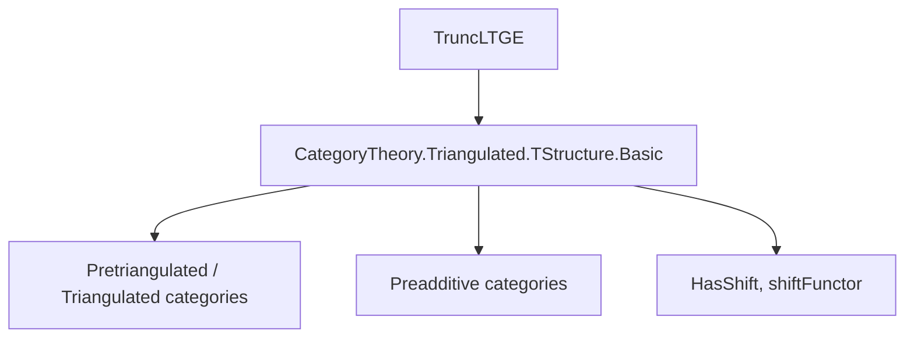
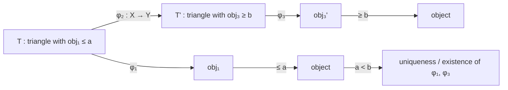

Here is the structured technical brief for `TruncLTGE.lean`:

---

### **1. Key Definitions & Theorems**

| Name | Type | Purpose |
|------|------|---------|
| `triangle` | `Triangle C` | Auxiliary distinguished triangle `obj₁ → X → obj₃ → obj₁⟦1⟧` with `obj₁ < n`, `obj₃ ≥ n`. Not for direct use. |
| `triangle_distinguished` | `triangle t n X ∈ distTriang C` | Certifies that `triangle` is distinguished. |
| `triangle_obj₁_isLE` | `t.IsLE (triangle t n X).obj₁ (n - 1)` | Ensures left term is `< n`. |
| `triangle_obj₃_isGE` | `t.IsGE (triangle t n X).obj₃ n` | Ensures right term is `≥ n`. |
| `triangleMap` | `triangle t n X ⟶ triangle t n Y` | Morphism of triangles induced by `φ : X ⟶ Y`. |
| `triangleFunctor` | `C ⥤ Triangle C` | Functorial assignment of `triangle` over `C`. |
| `truncLT n` | `C ⥤ C` | `< n`-truncation functor: `π₁ ∘ triangleFunctor`. |
| `truncLTι n` | `t.truncLT n ⟶ 𝟭 C` | Unit-like natural transformation (inclusion of truncation). |
| `truncGE n` | `C ⥤ C` | `≥ n`-truncation functor: `π₃ ∘ triangleFunctor`. |
| `truncGEπ n` | `𝟭 C ⟶ t.truncGE n` | Co-unit-like natural transformation (projection). |
| `truncGEδLT n` | `t.truncGE n ⟶ t.truncLT n ⋙ shiftFunctor C 1` | Connecting morphism in the distinguished triangle. |
| `triangleLTGE n` | `C ⥤ Triangle C` | Functorial distinguished triangle: `(truncLT n) X → X → (truncGE n) X → ...` |
| `triangle_map_ext` | `f₁ = f₂` | Uniqueness of triangle morphisms when middle maps agree and endpoints satisfy `≤ a < b ≤`. |
| `triangle_map_exists` | `∃ f : T ⟶ T'` | Extension of a middle map to a full triangle morphism under `a < b`. |
| `triangle_iso_exists` | `∃ e' : T ≅ T'` | Extension of a middle isomorphism to a triangle isomorphism under `a < b`. |

---

### **2. Naming Conventions**

- **Prefixes**:
  - `truncLT`, `truncGE`: truncation functors (less-than / greater-or-equal).
  - `truncLTι`, `truncGEπ`, `truncGEδLT`: natural transformations associated to truncations.
  - `triangle`: auxiliary triangle; `triangleFunctor`: its functorial version.
  - `triangle_map_ext`, `triangle_map_exists`, `triangle_iso_exists`: extension/uniqueness lemmas for triangle morphisms.

- **Suffixes**:
  - `_ext`: extensionality/uniqueness lemmas.
  - `_exists`: existence lemmas.
  - `_distinguished`: certifies distinguishedness.
  - `_isLE`, `_isGE`: typeclass instances for t-structure bounds.

- **`π₁`, `π₃`, `π₂`**: projections from `Triangle C` (source, target, middle objects).

- **`ι`, `π`, `δ`**: standard homological algebra notation (inclusion, projection, connecting map).

---

### **3. Tactic Stack**

Frequently used tactics:
- `cat_disch`: category-theoretic discharge (likely custom).
- `rw`, `simp`, `dsimp`: simplification and rewriting.
- `infer_instance`: typeclass inference.
- `lia`: linear integer arithmetic (for `a ≤ b`, `a < b`).
- `obtain ⟨...⟩`: destructuring existential/dependent hypotheses.
- `ext`: extensionality for natural transformations / morphisms.
- `rw [← H.choose.comm₁, H.choose_spec]`: use choice properties.

---

### **4. Proof Logic**

- **Existence & uniqueness of triangle morphisms**:
  - Use `triangle_map_exists` / `triangle_map_ext` with bounds `a, b` satisfying `a < b`.
  - Rely on `t.IsLE` / `t.IsGE` to apply `t.zero_of_isLE_of_isGE`.

- **Functoriality**:
  - Define `triangleFunctor` via `triangleMap`, using `triangle_map_exists`.
  - Prove functor laws via `triangle_map_ext'` (uniqueness).

- **Truncation functors**:
  - Constructed as compositions: `triangleFunctor ⋙ π₁` and `triangleFunctor ⋙ π₃`.
  - Natural transformations via `whiskerLeft` with canonical triangle morphisms (`π₁Toπ₂`, `π₂Toπ₃`, `π₃Toπ₁`).

- **Distinguished triangle**:
  - `triangleLTGE n` packages the truncation triangle as a functor.
  - Verified distinguished via `triangleFunctor_obj_distinguished`.

- **Inductive/recursive structure**:
  - No explicit induction; relies on choice (`choose`) from `t.exists_triangle`.

---

### **5. Imports**

- `Mathlib.CategoryTheory.Triangulated.TStructure.Basic`: core definitions of t-structures and distinguished triangles.

---

### **6. Mermaid Diagrams**

#### **Dependency Graph (Module Level)**



#### **Overview of `TruncLTGE.lean`**

```mermaid
graph TD
  A[T-structure t on C] --> B[Construct triangle for X, n]
  B --> C[triangle : Triangle C]
  C --> D[triangleFunctor : C → Triangle C]
  D --> E[truncLT = π₁ ∘ triangleFunctor]
  D --> F[truncGE = π₃ ∘ triangleFunctor]
  E --> G[truncLTι : truncLT ⇒ id]
  F --> H[truncGEπ : id ⇒ truncGE]
  F --> I[truncGEδLT : truncGE ⇒ truncLT[1]]
  E & A & F --> J[triangleLTGE : C → Triangle C]
  J --> K[Distinguished triangle: truncLT X → X → truncGE X → ...]
```

#### **Triangle Morphism Logic Flow**



---

### **7. Theory Context**

- **Setting**: Pretriangulated category `C` with a t-structure `t`.
- **Goal**: Construct truncation functors and natural transformations realizing the standard distinguished triangle.
- **Key tool**: Choice of triangles from `t.exists_triangle`, justified by t-structure axioms.
- **Novelty**: Fully functorial truncations, with explicit connecting morphism and naturality.

--- 

Let me know if you'd like a formalized summary in Lean or a high-level theorem statement.
