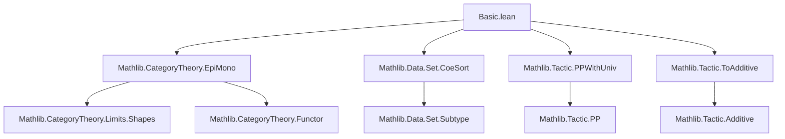
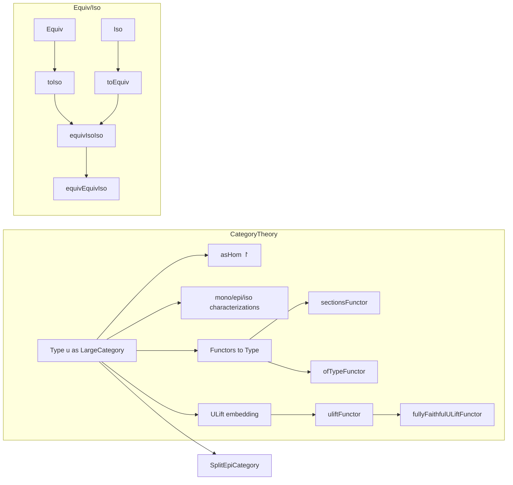

**Technical Brief: `Basic.lean` — Category Theory over `Type`**

---

### 1. **Key Definitions & Theorems**

| Name | Type / Signature | Purpose |
|------|------------------|---------|
| `types` | `LargeCategory (Type u)` | Defines the category of types in universe `u` with functions as morphisms. |
| `asHom` | `(f : α → β) → α ⟶ β` | Wraps a function to be recognized as a morphism in `Type`. |
| `↾ f` | Notation for `asHom f` | Syntactic sugar for `asHom`. |
| `sections (F : J ⥤ Type)` | `Set (∀ j, F.obj j)` | Sections of a functor: natural choices of elements across the diagram. |
| `sectionsFunctor` | `(J ⥤ Type) ⥤ Type` | Functor sending a diagram to its sections. |
| `uliftFunctor.{v, u}` | `Type u ⥤ Type (max u v)` | Embeds `Type u` into a higher universe via `ULift`. |
| `fullyFaithfulULiftFunctor` | `uliftFunctor.FullyFaithful` | Proves `uliftFunctor` is fully faithful. |
| `homOfElement (x : X)` | `PUnit ⟶ X` | Morphism from unit type representing an element. |
| `mono_iff_injective` | `Mono f ↔ Function.Injective f` | Monos in `Type` are exactly injective functions. |
| `epi_iff_surjective` | `Epi f ↔ Function.Surjective f` | Epis in `Type` are exactly surjective functions. |
| `ofTypeFunctor` | `Functor m → LawfulFunctor m → Type u ⥤ Type v` | Converts a lawful Lean functor to a categorical functor. |
| `Equiv.toIso` | `X ≃ Y → X ≅ Y` | Equivalence → categorical isomorphism. |
| `Iso.toEquiv` | `X ≅ Y → X ≃ Y` | Categorical isomorphism → equivalence. |
| `equivIsoIso` | `X ≃ Y ≅ X ≅ Y` | Equivalence and isomorphism are isomorphic (as types). |
| `equivEquivIso` | `X ≃ Y ≃ (X ≅ Y)` | Equivalence and isomorphism are equivalent. |
| `isIso_iff_bijective` | `IsIso f ↔ Function.Bijective f` | Isomorphisms in `Type` are exactly bijections. |
| `isSplitEpi_of_epi` | Instance | Every epi in `Type` splits (uses surjective inverse). |

---

### 2. **Naming Conventions**

- **Prefixes**:
  - `types_`: properties of the `Type` category (e.g., `types_id`, `types_comp`).
  - `uliftFunctor_`: properties of the `ULift` embedding (e.g., `uliftFunctor_obj`, `uliftFunctor_map`).
  - `homOfElement_`: element-to-morphism correspondence.
  - `mono_iff_`, `epi_iff_`, `isIso_iff_`: characterizations of categorical notions in terms of set-theoretic properties.
  - `ofTypeFunctor_`: conversion from Lean’s `Functor` to categorical functors.

- **Suffixes**:
  - `_apply`: applied version of a lemma (e.g., `types_id_apply`, `types_comp_apply`).
  - `_iff_`: equivalence between categorical and set-theoretic notions (e.g., `mono_iff_injective`).
  - `_Trivial`: canonical isomorphism to identity (e.g., `uliftTrivial`, `uliftFunctorTrivial`).
  - `_Functor`, `_Iso`, `_Equiv`: naming for constructions involving functors, isomorphisms, equivalences.

- **Notation**:
  - `↾ f` for `asHom f`.
  - `𝟙 X` for identity morphism.
  - `≫` for composition (categorical order: `f ≫ g = g ∘ f`).

---

### 3. **Tactic Stack**

- **Core tactics**:
  - `rfl`, `simp`, `funext`, `congr_fun`, `ext`
- **Category-specific**:
  - `cat_disch` (custom tactic for category theory proofs, likely in `Mathlib.Tactic`)
  - `infer_instance`
- **Set/Function reasoning**:
  - `cases`, `exact`, `apply`, `rw`, `dsimp`, `simp only`
- **Equivalence reasoning**:
  - `Equiv.ext`, `Equiv.apply_symm_apply`, `Equiv.symm_apply_apply`
- **Subtype reasoning**:
  - `Subtype.ext_iff`, `subtype_ext_iff`

---

### 4. **Proof Logic**

- **Structure**:
  - Most proofs follow a *two-way implication* (`↔`) pattern: prove both directions separately.
  - For categorical characterizations (`mono`, `epi`, `iso`), proofs reduce to set-theoretic properties (`injective`, `surjective`, `bijective`) using:
    - `homOfElement` to represent elements as morphisms from `PUnit`.
    - `ULift` for universe management in epimorphism proofs.
    - `naturality`, `funext`, and `congr_fun` for component-wise reasoning in natural transformations.
  - `uliftFunctor` proofs use:
    - Explicit construction of preimage for fullness.
    - Faithfulness via `ULift.up`/`.down` injectivity.
  - `equivIsoIso`/`equivEquivIso` use:
    - `simps` to automatically generate simplification lemmas.
    - `Iso.toEquiv`/`Equiv.toIso` to bridge categorical and equivalence worlds.

- **Induction**: Not used here — mostly direct construction and extensionality.

---

### 5. **Imports**

| Import | Purpose |
|--------|---------|
| `Mathlib.CategoryTheory.EpiMono` | Definitions and lemmas about monos/epis. |
| `Mathlib.Data.Set.CoeSort` | coercion from subsets to types. |
| `Mathlib.Tactic.PPWithUniv` | Universe pretty-printing. |
| `Mathlib.Tactic.ToAdditive` | Additive translation support. |

---

### 6. **Mermaid Diagrams**

#### **Dependency Graph (Top-Level)**



#### **Overview of `Basic.lean` Theory**



#### **Key Equivalences & Isomorphisms**

```mermaid
graph LR
  X[Equiv X Y] -- toIso --> Y[Iso X Y]
  Y -- toEquiv --> X
  X <-->|equivIsoIso| Y
  X <~>|equivEquivIso| Y
```

---

### 7. **Notes**

- **Universe Management**: Careful use of `max u v` and `ULift.{v}` ensures morphism and object universes align.
- **Lawful Functors**: `ofTypeFunctor` requires `LawfulFunctor` to ensure identity and composition laws hold categorically.
- **Split Epis**: Every epi splits in `Type` using `Function.surjInv`, making `Type` a *split epimorphic* category.
- **Notation**: `\upr` in Lean → `↾ f`, for ergonomic morphism wrapping.

--- 

Let me know if you'd like a formalized dependency graph (e.g., in `.lean` format) or a summary of related files (e.g., `Limits/Types.lean`, `Monad/Types.lean`).
