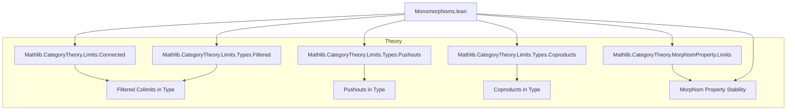
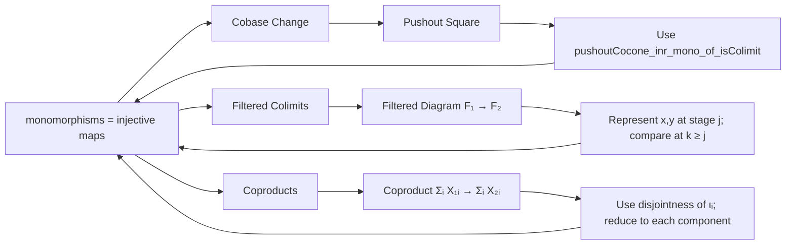

**Technical Brief: Stability of Monomorphisms in `Type`**

---

### 1. **Key Definitions & Theorems**

| Name / Instance | Type | Purpose |
|----------------|------|---------|
| `monomorphisms (Type u)` | `MorphismProperty (Type u)` | The morphism property of monomorphisms in the category `Type u`. Defined via `mono_iff_injective` (injective functions). |
| `instance : (monomorphisms (Type u)).IsStableUnderCobaseChange` | `IsStableUnderCobaseChange` | Shows monomorphisms are stable under pushouts (cobase change) in `Type`. Proof uses `pushoutCocone_inr_mono_of_isColimit`. |
| `instance : MorphismProperty.IsStableUnderFilteredColimits (monomorphisms (Type u))` | `IsStableUnderFilteredColimits` | Shows monomorphisms are stable under filtered colimits in `Type`. Proof reduces to injectivity of colimit maps and uses properties of filtered colimits in `Type`. |
| `instance (T : Type u') : MorphismProperty.IsStableUnderCoproductsOfShape (monomorphisms (Type u)) T` | `IsStableUnderCoproductsOfShape` | Shows monomorphisms are stable under coproducts indexed by a fixed type `T`. Uses disjointness of coproduct injections (`Cofan.inj_injective_of_isColimit`). |
| `instance : MorphismProperty.IsStableUnderCoproducts (monomorphisms (Type u))` | `IsStableUnderCoproducts` | Global version: monomorphisms stable under arbitrary coproducts (follows from previous instance). |

> **Note**: `mono_iff_injective` is used repeatedly to translate categorical monomorphisms in `Type` to injective functions.

---

### 2. **Naming Conventions**

- **Prefixes**:
  - `isStableUnder…`: for stability properties of morphism properties.
  - `monomorphisms`: for the morphism property of monos.
  - `coproduct…`, `pushout…`, `FilteredColimit…`: for constructions in limits/colimits.
- **Suffixes**:
  - `_of_isColimit`: when colimit universal property is used.
  - `_inj_…`: when injectivity of colimit legs is used (e.g., `inj_jointly_surjective`, `inj_injective`).
- **Variable naming**:
  - `X₁, X₂, X₃, X₄`: objects in diagrams.
  - `t, l, r, b`: legs of a pushout square.
  - `c₁, c₂`: cocones for colimits.
  - `φ, hφ`: morphisms between colimit cocones.

---

### 3. **Tactic Stack**

| Tactic | Usage |
|--------|-------|
| `simp only [...] at ... ⊢` | Heavy use of simplification with lemmas like `mono_iff_injective`, `functorCategory`, `cofan_mk_inj`, `Sigma.ι_map`, etc. |
| `intro`, `exact`, `rfl` | Basic proof structure. |
| `obtain ⟨…⟩ := ...` | Extracting witnesses from existential statements (e.g., from joint surjectivity of colimit legs). |
| `replace hφ (j : J) := ...` | Reindexing hypotheses for pointwise reasoning in functor categories. |
| `rw [...]` | Rewriting using naturality, cone/wedge equations. |
| `dsimp` | Simplify definitional equalities (e.g., in function application). |
| `congr_fun`, `congr_arg` | Reasoning about extensionality of functions and morphisms. |

---

### 4. **Proof Logic**

- **General pattern**:
  1. Translate categorical monomorphism condition to *injectivity* via `mono_iff_injective`.
  2. Use universal properties of colimits/pushouts to reduce elements in colimits to elements in some stage.
  3. Use properties of the indexing category (e.g., filteredness, disjointness of coproduct injections) to compare representatives.
  4. Apply injectivity at a stage, then lift back via colimit cocone maps.

- **Specific flows**:
  - **Cobase change**: Given a pushout square with top arrow mono, show right leg is mono by using `pushoutCocone_inr_mono_of_isColimit`.
  - **Filtered colimits**: For $f : F_1 \to F_2$ pointwise mono, show colimit map $\colim F_1 \to \colim F_2$ is mono: pick representatives in some stage $j$, use filteredness to compare, apply injectivity at a later stage $k$.
  - **Coproducts**: Use disjointness of coproduct injections (`Cofan.inj_injective_of_isColimit`) to reduce to injectivity of each component.

---

### 5. **Imports & Dependencies**

| Import | Role |
|--------|------|
| `Mathlib.CategoryTheory.Limits.Connected` | For properties of connected diagrams (used implicitly in filtered colimits). |
| `Mathlib.CategoryTheory.Limits.Types.Filtered` | Explicit constructions and lemmas for filtered colimits in `Type`. |
| `Mathlib.CategoryTheory.Limits.Types.Pushouts` | Pushout constructions and universal properties in `Type`. |
| `Mathlib.CategoryTheory.Limits.Types.Coproducts` | Coproducts in `Type`, including `coproductIsCoproduct`, `Cofan` infrastructure. |
| `Mathlib.CategoryTheory.MorphismProperty.Limits` | General theory of stability of morphism properties under limits/colimits. |

> **Future extensions** (mentioned in docstring):
- `Mathlib.CategoryTheory.MorphismProperty.TransfiniteComposition`: stability under transfinite composition will be automatic.
- `Mathlib.CategoryTheory.MorphismProperty.Retract`: stability under retracts holds generally.

---

### 6. **Mermaid Diagrams**

#### **Dependency Graph (Module-Level)**

#### **Overview of Proof Structure**

--- 

This file formalizes foundational stability properties of monomorphisms in `Type`, crucial for developing homological algebra and topos theory in Lean.
