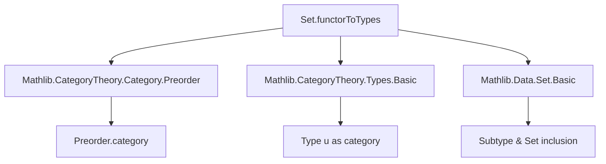
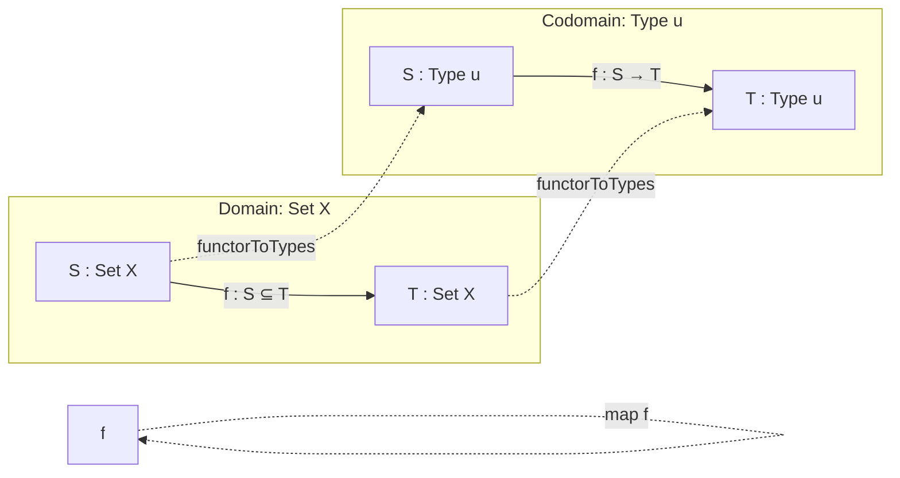

**Technical Brief: `Set.functorToTypes` in Lean 4 (Mathlib)**

---

### 1. **Key Definitions & Theorems**

| Name | Type | Purpose |
|------|------|---------|
| `functorToTypes` | `{X : Type u} → Set X ⥤ Type u` | Defines the *forgetful functor* from the category of subsets of `X` (i.e., `Set X`, the thin category of subsets ordered by inclusion) to the category of types. It sends a subset `S : Set X` to its underlying type `S` (as a subtype), and an inclusion `f : S ⊆ T` to the induced map on underlying elements. |
| `@[simps obj map]` | Attribute | Automatically generates projection lemmas for `obj` and `map`, enabling simplification and unfolding of the functor’s action on objects and morphisms. |

**Note**: In Mathlib, `Set X` denotes the *thin category* whose objects are subsets of `X` and morphisms `S ⟶ T` are proofs of `S ⊆ T`. The underlying type of a subset `S` is the subtype `{x // x ∈ S}`, denoted `S` (via coercion).

---

### 2. **Naming Conventions**

- **Prefix `functorTo…`**: Indicates a canonical functor from a structured category (e.g., `Set X`, `Preorder X`) to a more “basic” one (e.g., `Type u`).
- **`obj` / `map`**: Standard category-theoretic notation for functor components.
- **`leOfHom`**: Extracts the inclusion proof from a morphism `f : S ⟶ T` in `Set X` (since `Set X` is a thin category, `Hom(S, T)` is a proposition: `S ⊆ T`).

---

### 3. **Tactic Stack**

- **`simp` / `simps`**: The `@[simps]` attribute triggers automatic generation of simplification lemmas (`obj_eq`, `map_eq`, etc.).
- **`ext` / `funext`**: Implicitly used in `simps` to prove equality of functions/morphisms.
- **`aesop` / `tauto`**: Likely used in downstream proofs (not present here, but standard in related files).
- **`rfl` / ` rfl`**: For definitional equalities (e.g., `obj S = S` holds definitionally).

---

### 4. **Proof Logic**

- **Construction**: The functor is defined *explicitly* by specifying:
  - `obj`: Sends `S : Set X` (a subtype) to itself (as a type).
  - `map`: For `f : S ⟶ T` (i.e., `h : S ⊆ T`), sends `⟨x, hx⟩` to `⟨x, h hx⟩`.
- **Verification**: The `@[simps]` attribute ensures that the functor laws (`map_id`, `map_comp`) hold definitionally or by `rfl`, since `Set X` is thin and morphisms are unique when they exist.

No induction or case analysis is needed — the definition is *structural* and leverages Lean’s coercion and subtype machinery.

---

### 5. **Imports**

| Module | Role |
|--------|------|
| `Mathlib.CategoryTheory.Category.Preorder` | Provides `Preorder.category` and the fact that `Set X` (as a subsingleton-preorder) is a category. |
| `Mathlib.CategoryTheory.Types.Basic` | Defines `Type u` as a category (with all morphisms as functions). |
| `Mathlib.Data.Set.Basic` | Supplies `Set X`, subtypes (`{x // x ∈ S}`), and inclusion maps. |

---

### 6. **Mermaid Diagrams**

#### **Dependency Graph**


#### **Overview of File Structure**
```mermaid
flowchart LR
  subgraph "File: Set.lean"
    direction TB
    A[Universe u] --> B[Category theory setup]
    B --> C[Define Set X as category]
    C --> D[Define functorToTypes]
    D --> E[@[simps] annotations]
  end
  D --> F[Mathlib.CategoryTheory.Functor]
  D --> G[Mathlib.CategoryTheory.NaturalTransformation]
```

#### **Categorical Intuition**


---

### 7. **Key Insight**

This functor is foundational for *fibered constructions* (e.g., dependent sums over subsets) and appears in contexts like sheaf theory or descent, where one needs to “forget” the inclusion structure and work with underlying types. Its simplicity reflects the *thinness* of `Set X`: all diagrams commute automatically, simplifying verification.

--- 

Let me know if you'd like the corresponding `naturalIsomorphism` lemmas or extensions (e.g., `functorToTypes` as a fibration).
