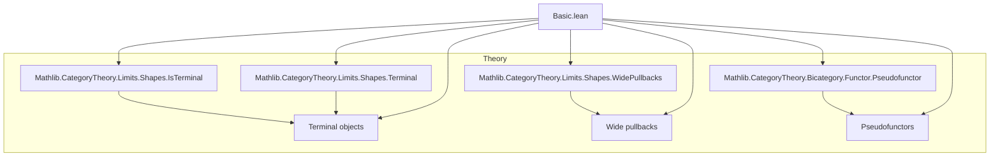

### Technical Brief: `Basic.lean` — Formalization of `WithTerminal` and `WithInitial`

---

#### **1. Key Definitions & Theorems**

| Name | Type / Signature | Purpose |
|------|------------------|---------|
| `WithTerminal` | `inductive WithTerminal : Type u` | Adjoins a terminal object `star` to a category `C`. |
| `WithInitial` | `inductive WithInitial : Type u` | Adjoins an initial object `star` to a category `C`. |
| `Hom` (for `WithTerminal`) | `WithTerminal C → WithTerminal C → Type v` | Defines morphism sets: `of X ⟶ of Y = X ⟶ Y`, `star ⟶ of Y = PEmpty`, `X ⟶ star = PUnit`. |
| `Hom` (for `WithInitial`) | `WithInitial C → WithInitial C → Type v` | Dual: `of X ⟶ star = PEmpty`, `star ⟶ Y = PUnit`. |
| `incl` | `C ⥤ WithTerminal C` / `C ⥤ WithInitial C` | Inclusion functor mapping `X ↦ of X`, `f ↦ f`. |
| `starTerminal` | `Limits.IsTerminal star` | Proves `star` is terminal in `WithTerminal C`. |
| `starInitial` | `Limits.IsInitial star` | Proves `star` is initial in `WithInitial C`. |
| `lift` | `C ⥤ D → (Z : D) → (∀ x, F.obj x ⟶ Z) → (hM : ...) → WithTerminal C ⥤ D` | Universal extension of `F : C ⥤ D` to `WithTerminal C`, sending `star ↦ Z`. |
| `liftUnique` | Uniqueness of `lift` up to iso | Given `G : WithTerminal C ⥤ D` agreeing with `F` on `C` and `G.star ≅ Z`, then `G ≅ lift F M hM`. |
| `inclLift` | `incl ⋙ lift F M hM ≅ F` | Shows inclusion followed by lift recovers original functor. |
| `map` | `(F : C ⥤ D) → WithTerminal C ⥤ WithTerminal D` | Functorial action on base functors. |
| `mapId`, `mapComp` | Natural isomorphisms | Witness coherence for identity and composition. |
| `map₂` | Natural transformation lift | Lifts natural transformations. |
| `prelaxfunctor`, `pseudofunctor` | `PrelaxFunctor Cat Cat`, `Pseudofunctor Cat Cat` | Constructs `WithTerminal` and `WithInitial` as (pseudo)functors `Cat → Cat`. |
| `equivComma` | `(WithTerminal C ⥤ D) ≌ Comma (𝟭 (C ⥤ D)) (Functor.const C)` | Equivalence between extended functors and comma objects. |
| `widePullbackShapeEquiv` | `WidePullbackShape J ≌ WithTerminal (Discrete J)` | Identifies wide pullback shape with `WithTerminal` over discrete category. |
| `WithTerminal.opEquiv`, `WithInitial.opEquiv` | `(WithTerminal C)ᵒᵖ ≌ WithInitial Cᵒᵖ` | Opposite duality between the two constructions. |

---

#### **2. Naming Conventions**

- **Prefixes**:
  - `star_`: properties of the adjoined object (`star_terminal`, `star_initial`, `starIsoTerminal`, `starIsoInitial`).
  - `incl_`: inclusion-related constructions (`incl`, `inclLift`, `inclLiftToTerminal`, etc.).
  - `lift_`: universal extension constructions (`lift`, `liftUnique`, `liftStar`, `liftToTerminal`, etc.).
  - `map_`: functoriality (`map`, `mapId`, `mapComp`, `map₂`).
  - `of_`: embedding of original objects (`of X`, `down`, `homFrom`, `homTo`).
- **Suffixes**:
  - `_terminal`, `_initial`: variants for terminal/initial cases.
  - `_Equiv`, `_Iso`: equivalence or isomorphism statements.
  - `_obj`, `_map`: components of functors/natural transformations.
- **Special**:
  - `homFrom`, `homTo`: morphisms to/from `star`.
  - `mkCommaObject`, `ofCommaObject`: comma-category correspondence.

---

#### **3. Tactic Stack**

Frequent tactics used:
- `rfl`, `simp`, `simp only`, `simp_rw`: simplification and definitional equality.
- `cases X`, `cases f`: case analysis on inductive types.
- `aesop`, `cat_disch`: automated reasoning in thin categories and category-theoretic contexts.
- `ext`: extensionality for natural transformations / functors.
- `congr 1`, `change`, `rw`, `erw`: rewriting and congruence.
- `subsingleton`: for proving hom-sets are subsingletons (thinness).
- `dsimp`, `convert`, `exact`: fine-grained proof scripting.

---

#### **4. Proof Logic**

- **Inductive structure**: Proofs often proceed by case analysis on `X : WithTerminal C` or `Y : WithInitial C`, distinguishing `of x` vs `star`.
- **Uniqueness arguments**: Use `Unique` instances (e.g., `instance {X} : Unique (X ⟶ star)`) to prove terminality/initiality.
- **Universal properties**:
  - `lift` is defined by pattern matching on objects and morphisms.
  - Naturality and functoriality are verified by case analysis and simplification.
  - Uniqueness (`liftUnique`) uses `NatIso.ofComponents` and case analysis, with naturality conditions encoded in hypotheses.
- **Equivalence proofs**:
  - `equivComma` constructs functors both ways and shows unit/counit are iso via `liftUnique`.
- **Pseudofunctor coherence**:
  - Verified componentwise (`ext X; cases X`) using `mapId`, `mapComp`, etc.

---

#### **5. Imports**

- `Mathlib.CategoryTheory.Limits.Shapes.IsTerminal`
- `Mathlib.CategoryTheory.Limits.Shapes.Terminal`
- `Mathlib.CategoryTheory.Limits.Shapes.WidePullbacks`
- `Mathlib.CategoryTheory.Bicategory.Functor.Pseudofunctor`

These indicate the module sits in the context of:
- Limits and colimits (terminal/initial objects, wide pullbacks),
- Bicategorical structures (pseudofunctors, whiskering, coherence laws),
- Category-theoretic constructions over `Cat`.

---

#### **6. Mermaid Diagrams**

##### **Dependency Graph (Module-Level)**



##### **Overview of `WithTerminal` Construction**

```mermaid
graph TD
  C[Category C] -->|incl| WithTerminalC[WithTerminal C]
  WithTerminalC -->|starTerminal| Terminal[star is terminal]
  WithTerminalC -->|lift| D[D]
  C -->|F| D
  D -->|Z| TerminalObj[Z : D]
  lift -->|inclLift| F
  lift -->|liftUnique| G[Unique extension]

  WithTerminalC -->|map F| WithTerminalD[WithTerminal D]
  map F -->|mapId, mapComp| Pseudofunctor[As pseudofunctor Cat → Cat]
```

##### **Equivalence with Comma Category**

```mermaid
graph LR
  (WithTerminal C ⥤ D) <-->|equivComma| Comma[Comma(1, const C)]

  Comma -->|mkCommaObject| FunExt[Functor extension]
  Comma -->|ofCommaObject| FunExt

  FunExt -->|inclLift| F
  FunExt -->|liftUnique| Unique
```

##### **Duality via Opposite**

```mermaid
graph LR
  (WithTerminal C)ᵒᵖ <-->|WithTerminal.opEquiv| WithInitial Cᵒᵖ
  (WithInitial C)ᵒᵖ <-->|WithInitial.opEquiv| WithTerminal Cᵒᵖ
```

---

#### **7. Summary**

This file formalizes the foundational *one-point completion* constructions for categories: `WithTerminal` and `WithInitial`. It establishes:
- Their categorical structure via `Hom`, `id`, `comp`,
- Universal properties via `lift`, `inclLift`, `liftUnique`,
- Functoriality and pseudofunctoriality over `Cat`,
- Equivalence with comma categories (encoding extended functors as “pointed” functors),
- Duality via opposites.

The proofs rely heavily on case analysis, thinness (`Subsingleton` homs), and simplification of `PEmpty`/`PUnit`-valued morphisms. The module serves as a building block for more advanced limit/colimit constructions (e.g., wide pullbacks via `widePullbackShapeEquiv`).
