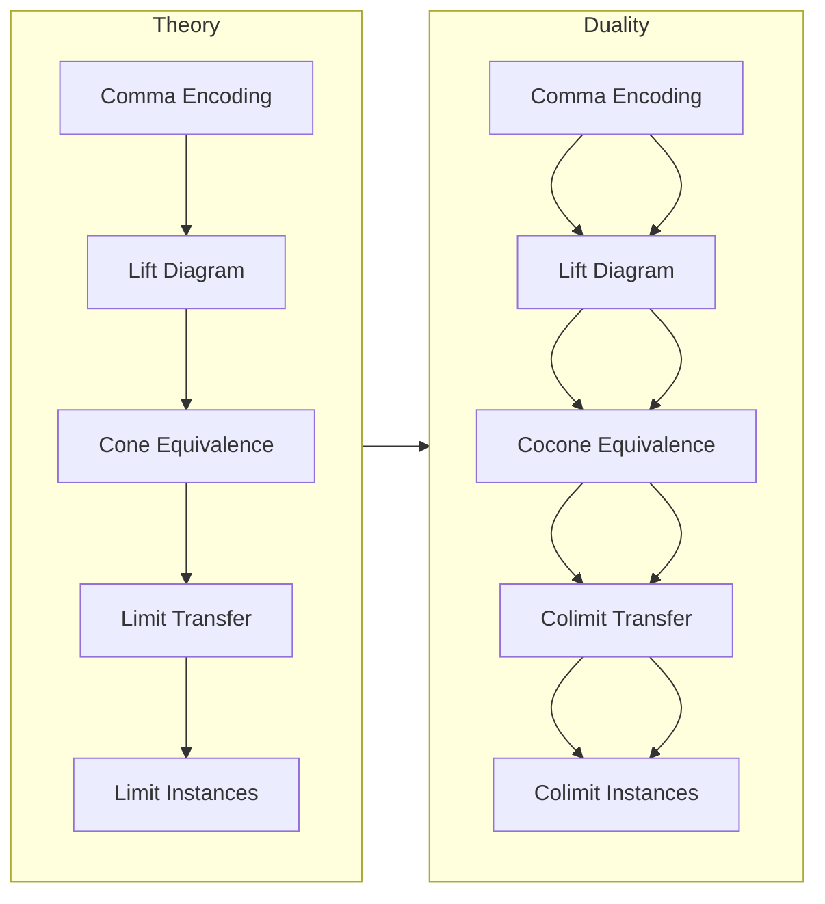

### Technical Brief: `Cone.lean` — Relations between `Cone`, `WithTerminal`, and `Over`

---

#### **1. Key Definitions & Theorems**

| Name | Type / Signature | Purpose |
|------|------------------|---------|
| `commaFromOver` | `(J ⥤ Over X) ⥤ Comma (𝟭 (J ⥤ C)) (Functor.const J)` | Encodes a functor $K : J \to \overline{X}$ as a comma morphism from $K \circ \mathrm{forget}$ to the constant functor at $X$. |
| `liftFromOver` | `(J ⥤ Over X) ⥤ WithTerminal J ⥤ C` | Extends $K : J \to \overline{X}$ to $\widetilde{K} : \mathbf{1}_J^\triangleright \to C$ by sending the terminal object `star` to $X$. |
| `coneLift` | `Cone K ⥤ Cone (liftFromOver.obj K)` | Embeds cones over $K$ (in $\overline{X}$) into cones over $\widetilde{K}$ (in $C$). |
| `coneBack` | `Cone (liftFromOver.obj K) ⥤ Cone K` | Recovers a cone over $K$ from a cone over $\widetilde{K}$. |
| `coneEquiv` | `Cone K ≌ Cone (liftFromOver.obj K)` | Equivalence of cone categories: cones over $K$ ↔ cones over its extension. |
| `isLimitEquiv` | `IsLimit (coneEquiv.functor.obj t) ≃ IsLimit t` | A cone $t$ is limiting for $K$ iff its image under `coneLift` is limiting for $\widetilde{K}$. |
| `Over.hasLimit_of_hasLimit_liftFromOver` | `(HasLimit (liftFromOver.obj F)) → HasLimit F` | If the extended diagram has a limit, so does the original diagram in $\overline{X}$. |
| `instance HasLimitsOfShape J (Over X)` | `[HasLimitsOfShape (WithTerminal J) C] → HasLimitsOfShape J (Over X)` | Limits in $\overline{X}$ exist if limits of shape $\mathbf{1}_J^\triangleright$ exist in $C$. |
| `commaFromUnder` | `(J ⥤ Under X) ⥤ Comma (Functor.const J) (𝟭 (J ⥤ C))` | Dual to `commaFromOver`, for undercategories. |
| `liftFromUnder` | `(J ⥤ Under X) ⥤ WithInitial J ⥤ C` | Dual to `liftFromOver`, extends $K : J \to \underline{X}$ to $J^\triangleleft \to C$. |
| `coconeLift` / `coconeBack` | `Cocone K ↔ Cocone (liftFromUnder.obj K)` | Dual constructions for cocones. |
| `coconeEquiv` | `Cocone K ≌ Cocone (liftFromUnder.obj K)` | Equivalence of cocone categories. |
| `isColimitEquiv` | `IsColimit (coconeEquiv.functor.obj t) ≃ IsColimit t` | Colimit preservation under extension. |
| `Under.hasColimit_of_hasColimit_liftFromUnder` | `(HasColimit (liftFromUnder.obj F)) → HasColimit F` | Colimits descend from extended diagrams. |
| `instance HasColimitsOfShape J (Under X)` | `[HasColimitsOfShape (WithInitial J) C] → HasColimitsOfShape J (Under X)` | Colimits in $\underline{X}$ follow from those in $C$. |

---

#### **2. Naming Conventions**

- **Prefixes**:
  - `liftFromOver`, `liftFromUnder`: extension of diagrams via terminal/initial objects.
  - `coneLift`, `coconeLift`: forward direction of cone/cocone correspondence.
  - `coneBack`, `coconeBack`: inverse direction.
  - `commaFromOver`, `commaFromUnder`: encoding into comma categories.
- **Suffixes**:
  - `Equiv`: equivalence of categories (e.g., `coneEquiv`, `coconeEquiv`).
  - `Comp`: compatibility with composition (e.g., `liftFromOverComp`, `liftFromUnderComp`).
- **`isLimitEquiv` / `isColimitEquiv`**: logical equivalence of limiting property.

---

#### **3. Tactic Stack**

Frequent tactics used in proofs:
- `aesop`: for automated naturality and diagram chasing.
- `simp [← Comma.comp_left]`, `simp [← Comma.comp_right]`: simplification using comma category composition laws.
- `by cat_disch`: category-theoretic discharge tactic (likely custom or imported).
- `ext`: extensionality for natural transformations / morphisms.
- `simpa using ...`: simplifies using a hypothesis.
- `ofIsoLimit`, `ofIsoColimit`: convert isomorphisms of cones to limit/colimit equivalences.
- `NatIso.ofComponents`: construct natural isomorphism from componentwise isos.

---

#### **4. Proof Logic**

The logical flow follows a standard pattern for *adjunction-like* equivalences between diagram categories:

1. **Encoding**: Represent $K : J \to \overline{X}$ as a comma morphism via `commaFromOver`.
2. **Extension**: Use `equivComma.inverse` to lift to a functor on `WithTerminal J`.
3. **Cone correspondence**:
   - Define `coneLift` and `coneBack` explicitly on objects and morphisms.
   - Prove they are inverses using extensionality (`Cones.ext`) and simplification lemmas (`simp`).
4. **Limit preservation**:
   - Use `IsLimit.ofConeEquiv` to transfer limit status across the equivalence.
   - Derive existence results (`HasLimit`, `HasColimit`) via instances.

The dual story for undercategories mirrors this, replacing `WithTerminal` with `WithInitial`, cones with cocones, and left/right composition accordingly.

---

#### **5. Imports**

Primary dependencies:
- `Mathlib.CategoryTheory.Comma.Over.Basic`
- `Mathlib.CategoryTheory.WithTerminal.Basic`
- `Mathlib.CategoryTheory.Limits.Basic` (via `open Limits`)
- `Mathlib.CategoryTheory.Functor.Basic` (implicit via `J ⥤ C`, etc.)

These imports indicate the file sits at the intersection of:
- Comma categories,
- Over/under categories,
- Limits/colimits in enriched settings,
- Terminal/initial object extensions (`WithTerminal`, `WithInitial`).

---

#### **6. Mermaid Diagrams**

##### **Dependency Graph (High-Level)**

```mermaid
graph TD
  A[Comma Categories] --> B[Over X]
  A --> C[WithTerminal J]
  B --> D[Cone K]
  C --> E[Cone (liftFromOver K)]
  D <-->|coneEquiv| E
  D -->|isLimitEquiv| F[IsLimit]
  E -->|isLimitEquiv| F
  C --> G[HasLimitsOfShape]
  B -->|instance| G
```

##### **Overview of File Structure**



---

#### **7. Summary**

This file formalizes a foundational correspondence between diagrams over/under an object $X$ and diagrams in $C$ extended by a terminal/initial object. It shows that limits/colimits in over/under categories can be computed as limits/colimits in $C$ of the extended diagram — a key step for developing calculus of limits in slice/coslice settings.

The equivalence of cone categories (`coneEquiv`) is the core technical tool, enabling transfer of universal properties. The proof strategy is constructive and reversible, with explicit inverses and naturality checks.

This underpins future developments in:
- Slice category limits,
- Fibered categories,
- Grothendieck constructions,
- Parametrized homotopy theory in HoTT/CT settings.

--- 

Let me know if you'd like a formalized dependency graph (e.g., `leanpkg` tree), or a proof sketch in natural language.
