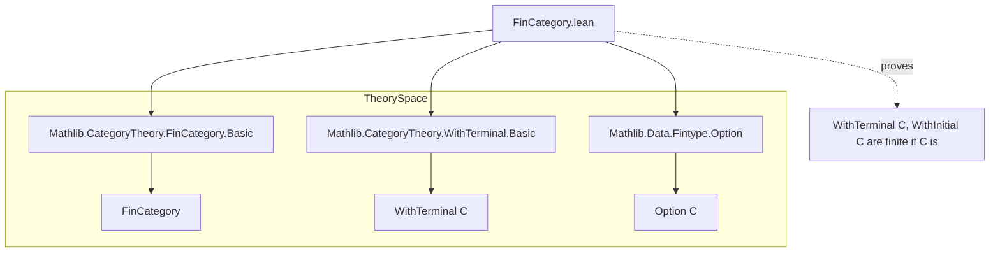

**Technical Brief: `FinCategory.lean`**

---

### 1. KEY DEFINITIONS & THEOREMS

| Name | Type / Signature | Purpose |
|------|------------------|---------|
| `optionEquiv` (WithTerminal) | `Option C ≃ WithTerminal C` | Constructs an equivalence between `Option C` and `WithTerminal C`, showing they are isomorphic as types. |
| `optionEquiv` (WithInitial) | `Option C ≃ WithInitial C` | Same as above, but for `WithInitial C`. |
| `instFintype` (WithTerminal) | `[Fintype C] → Fintype (WithTerminal C)` | Proves that if `C` has finitely many objects, then so does `WithTerminal C`. |
| `instFintype` (WithInitial) | `[Fintype C] → Fintype (WithInitial C)` | Same for `WithInitial C`. |
| `instFinCategory` (WithTerminal) | `[SmallCategory C] → [FinCategory C] → FinCategory (WithTerminal C)` | Shows that if `C` is a finite category (small + finitely many morphisms), then `WithTerminal C` is also finite. |
| `instFinCategory` (WithInitial) | `[SmallCategory C] → [FinCategory C] → FinCategory (WithInitial C)` | Same for `WithInitial C`. |

---

### 2. NAMING CONVENTIONS

- **Prefixes**:
  - `inst_`: Used for typeclass instances (`instFintype`, `instFinCategory`).
  - `optionEquiv`: Standard naming for equivalences involving `Option`.
- **Suffixes**:
  - `Equiv`: Indicates an equivalence of types (`optionEquiv`).
  - `Obj`, `Hom`: Implicit in `fintypeObj`, `fintypeHom` (from `FinCategory`).
- **Case**: `camelCase` for definitions (`optionEquiv`, `fintypeHom`), `PascalCase` for namespaces (`CategoryTheory.WithTerminal`).

---

### 3. TACTIC STACK

- `cases a <;> simp`: Dominant tactic pattern for proving left/right inverses of equivalences.
- `inferInstance`: Used repeatedly to discharge `Fintype` goals by leveraging existing instances.
- `simp`: Used in `left_inv`/`right_inv` proofs to simplify after case analysis.

No heavy automation (e.g., `aesop`, `ring`, `linarith`) is used—proofs are mostly structural and definitional.

---

### 4. PROOF LOGIC

- **Equivalence proofs** (`optionEquiv`):
  - Define forward/backward maps explicitly.
  - Prove inverse properties via case analysis on the `Option`/`WithTerminal`/`WithInitial` constructors, followed by `simp`.
- **Fintype proofs**:
  - Use `ofEquiv` to transport finiteness along the equivalence.
- **FinCategory proofs**:
  - Deconstruct `fintypeHom` by cases on the source/target of morphisms (e.g., `star`, `of a`).
  - Use `inferInstance` to fill in `Fintype` goals for:
    - `PUnit` (singleton type) for endomorphisms of `star`,
    - `PEmpty` (empty type) for morphisms *to* or *from* `star` in the appropriate direction,
    - existing `Fintype (a ⟶ b)` for internal morphisms.

---

### 5. IMPORTS

| Import | Purpose |
|--------|---------|
| `Mathlib.CategoryTheory.FinCategory.Basic` | Provides `FinCategory`, `fintypeObj`, `fintypeHom`. |
| `Mathlib.CategoryTheory.WithTerminal.Basic` | Defines `WithTerminal C`, `of`, `star`. |
| `Mathlib.Data.Fintype.Option` | Provides `Fintype (Option C)` and related lemmas. |

---

### 6. DEPENDENCY & OVERVIEW DIAGRAM



```mermaid
graph LR
  C[Category C] -->|add star| WithTerminal[WithTerminal C]
  C -->|add star| WithInitial[WithInitial C]
  WithTerminal -->|equivalent to| OptionC[Option C]
  WithInitial -->|equivalent to| OptionC
  OptionC -->|finite if C is| FintypeC[Fintype C]
  FintypeC -->|transport| FintypeWithTerminal[Fintype (WithTerminal C)]
  FintypeC -->|transport| FintypeWithInitial[Fintype (WithInitial C)]
```

---

### 7. SUMMARY

This module establishes that adding a terminal (resp. initial) object to a finite category preserves finiteness of objects and morphisms. The key insight is that `WithTerminal C` and `WithInitial C` are both equivalent to `Option C`, and finiteness is preserved under equivalence. Morphism finiteness is verified by case analysis on the presence of `star`, using `PUnit` and `PEmpty` for trivial hom-sets.
