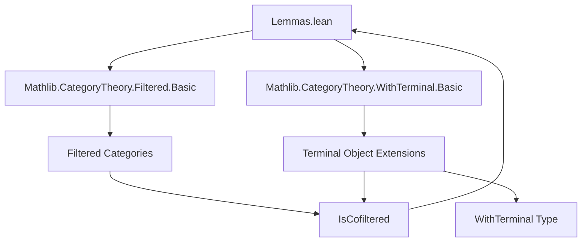

**Technical Brief: `Lemmas.lean` — Further Lemmas on `WithTerminal`**

---

### 1. **Key Definitions & Theorems**

| Name | Type / Signature | Purpose |
|------|------------------|---------|
| `WithTerminal.cone_objs` | `cone_objs : Π (x y : WithTerminal C), Cone (discreteFun2 x y)` | Constructs a cocone over any pair of objects in `WithTerminal C`, used to prove cofilteredness. |
| `WithTerminal.cone_maps` | `cone_maps : Π (x y : WithTerminal C) (f g : x ⟶ y), f = g → ...` | Shows that any two parallel arrows in `WithTerminal C` have a common cocone morphism (i.e., coequalizer-like condition). |
| `instance [IsCofilteredOrEmpty C] : IsCofiltered (WithTerminal C)` | `IsCofiltered (WithTerminal C)` | Main theorem: if `C` is cofiltered or empty, then `WithTerminal C` is cofiltered. |
| `instance [IsFilteredOrEmpty C] : IsFiltered (WithInitial C)` | `IsFiltered (WithInitial C)` | Dual result: if `C` is filtered or empty, then `WithInitial C` is filtered. |

> **Note**: `minToLeft`, `minToRight`, `eqHom`, `eq_condition` are internal helper constructions used in the `min`/`eq` cases.

---

### 2. **Naming Conventions**

- **Prefixes**:
  - `is_`: e.g., `IsCofiltered`, `IsFiltered`, `IsCofilteredOrEmpty`, `IsFilteredOrEmpty`.
  - `cone_`: e.g., `cone_objs`, `cone_maps`.
  - `min`, `eq`: used for case analysis on terminal/initial objects.
- **Suffixes**:
  - `_toLeft`, `_toRight`: indicate projection from a minimum (e.g., `minToLeft`, `minToRight`).
  - `_condition`: indicates a proof obligation (e.g., `eq_condition`).
- **Case patterns**:
  - `star`, `of _`: pattern-matching on `WithTerminal` constructors.
  - `default`: used for the terminal object in `WithTerminal`.

---

### 3. **Tactic Stack**

| Tactic | Usage |
|--------|-------|
| `match` | Explicit pattern matching on `WithTerminal` constructors (`star`, `of _`). |
| `trivial` | Proves trivial equalities (e.g., uniqueness of morphisms to/from `star`). |
| `Subsingleton.elim _ _` | Uses subsingleton property of hom-sets in a category to conclude equality. |
| `IsIso.eq_comp_inv` | Used to simplify morphism equalities involving isomorphisms. |
| `eq f g` | Constructs equality proof from `f = g` (via `Subsingleton.elim` or `rfl`). |
| `min` | Used to construct a common lower bound in cofiltered categories. |
| `opEquiv` / `.symm` | Used in dualization argument for `WithInitial`. |
| `isFiltered_of_isCofiltered_op` | Lemma importing equivalence between filteredness of `C` and cofilteredness of `Cᵒᵖ`. |

---

### 4. **Proof Logic**

- **For `WithTerminal` cofilteredness**:
  1. **Case analysis** on inputs `x, y : WithTerminal C`:
     - `star` (added terminal object) vs `of y`, `of x` vs `star`, or `of x` vs `of y`.
  2. For `of x`, `of y`, use `min x y` as a common lower bound (requires `IsCofilteredOrEmpty C`).
  3. Use `minToLeft`, `minToRight` to get morphisms to the min.
  4. For morphism equality, use `Subsingleton.elim` or `IsIso.eq_comp_inv` to reduce to `rfl`.

- **For `WithInitial` filteredness**:
  1. Use equivalence `Cᵒᵖ ≃ C` (via `opEquiv`).
  2. Observe that `WithInitial C ≃ (WithTerminal Cᵒᵖ)ᵒᵖ`.
  3. Apply `isFiltered_of_isCofiltered_op` after establishing `WithTerminal Cᵒᵖ` is cofiltered.

---

### 5. **Imports**

| Import | Purpose |
|--------|---------|
| `Mathlib.CategoryTheory.Filtered.Basic` | Provides `IsCofiltered`, `IsFiltered`, and basic lemmas. |
| `Mathlib.CategoryTheory.WithTerminal.Basic` | Defines `WithTerminal`, `star`, `of`, and basic structure. |
| `CategoryTheory` module scope | Provides `IsCofilteredOrEmpty`, `IsFilteredOrEmpty`, `min`, etc. |

---

### 6. **Mermaid Diagrams**

#### **Dependency Graph (Module Level)**



#### **Overview of Theoretical Flow**

```mermaid
flowchart LR
  C[Category C] -->|IsCofilteredOrEmpty| A[WithTerminal C]
  A -->|instance| B[IsCofiltered (WithTerminal C)]
  C -->|IsFilteredOrEmpty| D[WithInitial C]
  D -->|instance| E[IsFiltered (WithInitial C)]
  C -->|opEquiv| C_op[Cᵒᵖ]
  C_op -->|WithTerminal| T_op[WithTerminal Cᵒᵖ]
  T_op -->|op| D
  B -->|dualize| E
```

---

### 7. **Summary**

This file establishes that adding a terminal (resp. initial) object to a cofiltered (resp. filtered) category preserves cofilteredness (resp. filteredness). The proofs rely on case analysis over the extended object constructors (`star`, `of _`) and use standard category-theoretic tools like subsingleton hom-sets and categorical equivalences. The structure is typical of Lean’s `Mathlib` style: explicit pattern matching, minimal tactic usage, and heavy reliance on definitional equality and subsingleton properties.
