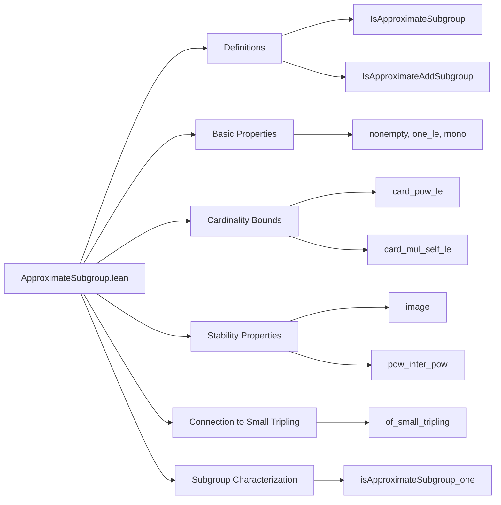

### Technical Brief: `ApproximateSubgroup.lean`

---

#### **1. Key Definitions & Theorems**

| Name | Type | Purpose |
|------|------|---------|
| `IsApproximateSubgroup K A` | `Prop` | Defines a *K-approximate subgroup*: symmetric set `A` containing `1`, with `A²` covered by ≤ *K* left-translates of `A`. |
| `IsApproximateAddSubgroup K A` | `Prop` | Additive counterpart: symmetric additive set containing `0`, with `2 • A` covered by ≤ *K* translates of `A`. |
| `one_mem`, `inv_eq_self`, `sq_covBySMul` | fields of `IsApproximateSubgroup` | Core structure: identity in `A`, symmetry (`A⁻¹ = A`), and small covering number of `A²`. |
| `nonempty` | `hA : IsApproximateSubgroup K A → A.Nonempty` | Proves nonemptiness via `1 ∈ A`. |
| `one_le` | `hA : IsApproximateSubgroup K A → 1 ≤ K` | Lower bound on approximation constant `K`. |
| `mono` | `K ≤ L → IsApproximateSubgroup K A → IsApproximateSubgroup L A` | Monotonicity in `K`. |
| `card_pow_le` | `#(A^n) ≤ K^(n-1) * #A` | Polynomial growth of powers of finite approximate subgroups. |
| `card_mul_self_le` | `#(A * A) ≤ K * #A` | Special case of `card_pow_le` for `n = 2`. |
| `image` | `f : G → H` group hom → `f '' A` is `K`-approximate subgroup | Stability under homomorphic image. |
| `subgroup` | `IsApproximateSubgroup 1 H` for any subgroup `H` | Subgroups are 1-approximate subgroups. |
| `of_small_tripling` | `#A³ ≤ K * #A` ⇒ `A²` is `K³`-approximate subgroup | Connects small tripling to approximate subgroups. |
| `pow_inter_pow_covBySMul_sq_inter_sq` | `CovBySMul G (K^(m−1) * L^(n−1)) (A^m ∩ B^n) (A² ∩ B²)` | Covering bound for intersections of powers. |
| `pow_inter_pow` | `A^m ∩ B^n` is `(K^(2m−1) * L^(2n−1))`-approximate subgroup | Intersections of powers (≥2) of approximate subgroups remain approximate subgroups. |
| `isApproximateSubgroup_one` | `IsApproximateSubgroup 1 A ↔ ∃ H : Subgroup G, H = A` | Characterizes 1-approximate subgroups as genuine subgroups. |

---

#### **2. Naming Conventions**

- **Prefixes**:
  - `isApproximateSubgroup_`: for lemmas about the predicate itself (e.g., `one_mem`, `inv_eq_self`, `isApproximateSubgroup_one`).
  - `pow_inter_pow_`: for intersection-of-powers lemmas.
  - `card_`: for cardinality bounds (`card_pow_le`, `card_mul_self_le`).
  - `mono`, `image`, `subgroup`, `of_small_tripling`: descriptive action-based names.

- **Suffixes**:
  - `_covBySMul`: for covering lemmas involving `CovBySMul`.
  - `_le`: for upper bounds (cardinality, constants).
  - `_subset`: implicit in `pow_subset_pow_mul_of_sq_subset_mul` (used internally).

- **Notation**:
  - `A ^ n`: multiplicative power of set `A`.
  - `A⁻¹`, `-A`: inverse/set negation.
  - `K • A`, `a • A`: scalar multiplication / left translation.
  - `CovBySMul G K X A`: “`X` is covered by ≤ *K* left-translates of `A`”.

---

#### **3. Tactic Stack**

| Tactic | Usage Frequency | Purpose |
|--------|-----------------|---------|
| `gcongr` | Very High | Propagate inequalities in cardinality bounds, subset relations. |
| `simp` / `simp_rw` | High | Simplify set operations (`image`, `mul`, `inv`, `pow`, `smul`), use definitional equalities. |
| `rw` | High | Rewrite using lemmas like `pow_succ`, `sq`, `inv_pow`, `hA.inv_eq_self`. |
| `exact` / `intro` / `cases` | Medium | Standard proof structure (e.g., destruct `CovBySMul` witnesses). |
| `have` / `obtain` | High | Extract witnesses from `CovBySMul`, `ruzsa_covering_mul`, etc. |
| `norm_cast` | Medium | Handle coercion between `Finset G` and `Set G`. |
| `aesop` / `linarith` | Low-Medium | For arithmetic inequalities (e.g., `1 ≤ K`, `2 ≤ m`). |
| `by_contra` | Low | Rarely, for contradiction arguments (e.g., `hA.nonempty.ne_empty`). |

---

#### **4. Proof Logic**

- **Structure**:
  1. **Decomposition**: Most proofs start by destructing `CovBySMul` to get finite witness sets `F`.
  2. **Cardinality Bounds**: Use `Finset.card_pow_le`, `Finset.card_mul_le`, `Finset.card_image_le`, `Finset.card_image₂_le`.
  3. **Set Inclusion Chains**: Build inclusions stepwise using:
     - `pow_subset_pow_mul_of_sq_subset_mul` (from `A² ⊆ F * A`)
     - `smul_set_mono`, `subset_iUnion`, `iUnion₂_inter_iUnion₂`
     - Symmetry (`inv_eq_self`) to rewrite `A⁻¹ * A = A²`.
  4. **Induction/Recursion**: `card_pow_le` uses induction on `n`, with base cases `n = 0,1` and step `n+2`.
  5. **Homomorphism Stability**: `image` uses `map_one`, `image_inv`, `image_mul`, and monotonicity of `#(f '' F)`.

- **Key Logical Flow**:
  - To prove `IsApproximateSubgroup K A`, show:
    - `1 ∈ A`
    - `A⁻¹ = A`
    - `∃ F, #F ≤ K ∧ A² ⊆ F • A`
  - To prove covering lemmas (`CovBySMul`), construct an explicit finite set (often `F₁^m × F₂^n` mapped via a function `f`).

---

#### **5. Imports & Scope**

| Module | Role |
|--------|------|
| `Mathlib.Algebra.Group.Subgroup.Pointwise` | Set operations on subgroups (`inv`, `mul`, `pow`, `smul`). |
| `Mathlib.Combinatorics.Additive.CovBySMul` | Covering relation `CovBySMul` (central to definition). |
| `Mathlib.Combinatorics.Additive.RuzsaCovering` | Ruzsa covering lemma (`ruzsa_covering_mul`) used in `of_small_tripling`. |
| `Mathlib.Combinatorics.Additive.SmallTripling` | Tools for sets with small doubling/tripling (`small_pow_of_small_tripling`). |

- **Scope**:
  - `open scoped Finset Pointwise`: Enables `A * B`, `A ^ n`, `a • A`, `#A`, etc.
  - `variable {G : Type*} [Group G] {A B : Set G} {K L : ℝ} {m n : ℕ}`: Generic group-theoretic context.

---

#### **6. Mermaid Diagrams**

##### **Dependency Graph (Core Concepts)**

```mermaid
graph TD
  A[Group G] --> B[Set G]
  B --> C[IsApproximateSubgroup K A]
  C --> D[one_mem : 1 ∈ A]
  C --> E[inv_eq_self : A⁻¹ = A]
  C --> F[sq_covBySMul : A² ⊆ F • A, #F ≤ K]
  F --> G[CovBySMul G K (A^2) A]
  G --> H[Mathlib.Combinatorics.Additive.CovBySMul]
  C --> I[card_pow_le]
  C --> J[image]
  C --> K[pow_inter_pow]
  L[SmallTripling] --> M[of_small_tripling]
  M --> C
  N[Subgroup H] --> O[subgroup : IsApproximateSubgroup 1 H]
  O --> C
```

##### **Overview of File Structure**



---

#### **7. Theory Context**

- **Place in Additive Combinatorics**:
  - Approximate subgroups bridge *subgroups* and *sets with small doubling/tripling*.
  - Key theme: **quantitative weakening** of subgroup axioms → retains structural control (polynomial growth, closure under homomorphisms, intersections of powers).
  - Used in proofs of **Breuillard–Green–Tao structure theorem**, **Freiman’s theorem**, etc.

- **Relation to Other Lean Modules**:
  - `SmallTripling.lean`: `of_small_tripling` shows that small tripling ⇒ approximate subgroup (after squaring).
  - `RuzsaCovering.lean`: Provides the covering lemma used to construct `CovBySMul` witnesses.
  - `Pointwise.lean`: Supplies algebraic set operations (`*`, `inv`, `pow`, `smul`) essential for definitions.

--- 

Let me know if you'd like a formalized dependency graph (e.g., for `leanpkg`), or a comparison with additive vs multiplicative formalizations.
