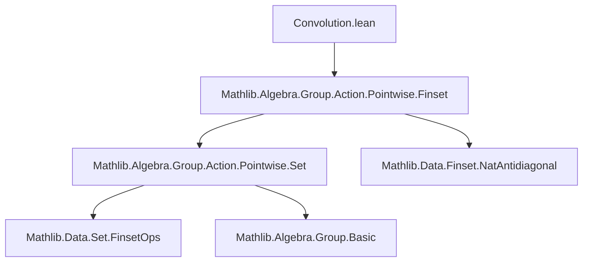
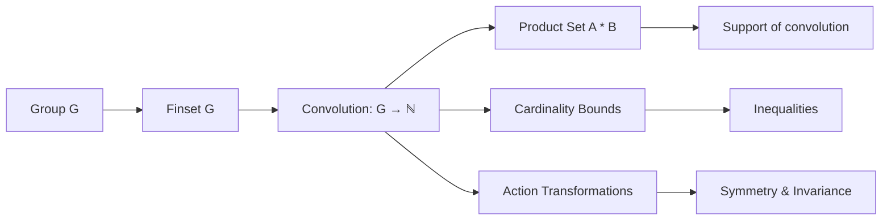

### Technical Brief: Convolution of Finite Subsets in a Group

---

#### **1. Key Definitions & Theorems**

| Name | Type / Signature | Purpose |
|------|------------------|---------|
| `convolution` | `def convolution (A B : Finset G) : G → ℕ` | Maps each group element `x` to the number of representations `x = a * b` with `a ∈ A`, `b ∈ B`. |
| `card_smul_inter_smul` | `#((x • A) ∩ (y • B)) = A.convolution B⁻¹ (x⁻¹ * y)` | Relates cardinality of intersection of scaled sets to convolution with inverse. |
| `card_inter_smul` | `#(A ∩ (x • B)) = A.convolution B⁻¹ x` | Special case of above with left scaling by `1`. |
| `card_smul_inter` | `#((x • A) ∩ B) = A.convolution B⁻¹ x⁻¹` | Special case with right scaling by `1`. |
| `card_mul_inv_eq_convolution_inv` | `#{ab ∈ A ×ˢ B | ab.1 * ab.2⁻¹ = x} = A.convolution B⁻¹ x` | Shows convolution also counts representations with inverse in second coordinate. |
| `convolution_pos` | `0 < A.convolution B x ↔ x ∈ A * B` | Convolution is positive iff `x` lies in the product set. |
| `convolution_ne_zero` | `A.convolution B x ≠ 0 ↔ x ∈ A * B` | Equivalent formulation of positivity. |
| `convolution_eq_zero` | `A.convolution B x = 0 ↔ x ∉ A * B` | Complement of above. |
| `convolution_le_card_left` | `A.convolution B x ≤ #A` | Upper bound by size of first argument. |
| `convolution_le_card_right` | `A.convolution B x ≤ #B` | Upper bound by size of second argument. |
| `convolution_inv` | `A.convolution B x⁻¹ = B⁻¹.convolution A⁻¹ x` | Symmetry under inversion and reversal. |
| `op_smul_convolution_eq_convolution_smul` | `(A <• s).convolution B = A.convolution (s • B)` | Commutativity of left/right multiplication with convolution. |
| `smul_convolution_eq_convolution_inv_mul` | `(s •> A).convolution B x = A.convolution B (s⁻¹ * x)` | Behavior under left multiplication of first argument. |
| `convolution_op_smul_eq_convolution_mul_inv` | `A.convolution (B <• s) x = A.convolution B (x * s⁻¹)` | Behavior under right multiplication of second argument. |

---

#### **2. Naming Conventions**

- **Prefixes**:
  - `card_`: Cardinality-related lemmas.
  - `convolution_`: Core convolution properties.
  - `op_`, `smul_`, `vadd_`: Action-related transformations (`op` = multiplicative opposite, `smul` = left action, `vadd` = right action).
- **Suffixes**:
  - `_eq_convolution_`: Equating convolution expressions.
  - `_le_card_`: Bounding convolution by set cardinalities.
  - `_inv`: Involves inverses or inversion.
  - `_pos`, `_ne_zero`, `_eq_zero`: Positivity/nonzero/zero characterizations.

---

#### **3. Tactic Stack**

Frequently used tactics in proofs:
- `simp` (with `+contextual`, `←`, `inv`, `smul`, `mul`, etc.)
- `aesop` (especially for logical reasoning about `↔`, `≠`, `≤`)
- `rw` (with `←`, `inv_inv`, `mul_inv_rev`, etc.)
- `nth_rw` (for targeted rewriting at specific positions)
- `exact`, `simpa`, `refl`, `linarith` (for simple goals or closing)

---

#### **4. Proof Logic**

- **Structure**: Most proofs follow a pattern:
  1. **Rewrite** using definitions (`convolution`, `smul`, `inv`, etc.).
  2. **Apply bijection lemmas** like `card_nbij'` to count elements via bijections.
  3. **Simplify** using group axioms (`mul_assoc`, `mul_inv_rev`, `inv_inv`, etc.).
  4. **Use set-theoretic identities** (`inter_comm`, `inter_subset_left`, etc.).
  5. **Apply monotonicity** (`card_le_card`) for bounds.
- **Induction** is not used — all arguments are finite and rely on counting/bijection principles.
- **Symmetry arguments** (e.g., `convolution_inv`) use `inter_comm` and inversion properties.

---

#### **5. Imports**

- `Mathlib.Algebra.Group.Action.Pointwise.Finset`: Provides foundational tools for:
  - Pointwise actions (`•`, `<•`, `•>`),
  - Inverse sets (`A⁻¹`),
  - Product sets (`A * B`, `A ×ˢ B`),
  - Cardinality lemmas (`card_nbij'`, `card_le_card`, etc.).

---

#### **8. Mermaid Diagrams**

##### **Dependency Graph (Module-Level)**



##### **Overview of Theory Flow**



##### **Key Relationships**

```mermaid
flowchart LR
  A[card((x•A) ∩ (y•B))] -->|card_smul_inter_smul| B[A.convolution B⁻¹ (x⁻¹*y)]
  C[card(A ∩ (x•B))] -->|card_inter_smul| B
  D[card((x•A) ∩ B)] -->|card_smul_inter| B
  E[#{ab | ab.1*ab.2⁻¹ = x}] -->|card_mul_inv_eq_convolution_inv| B
  B --> F[convolution_pos/ne_zero/eq_zero]
  B --> G[convolution_le_card_*]
  B --> H[convolution_inv/op_smul_*]
```

---

This module formalizes convolution as a counting function over group products, with rich algebraic structure and behavior under group actions. It serves as a foundational tool for additive combinatorics in non-abelian settings.
