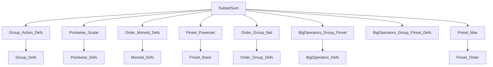
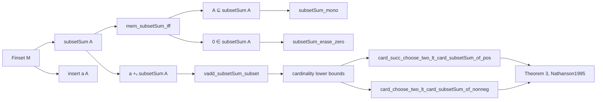

### Technical Brief: `SubsetSum.lean`

---

#### **1. Key Definitions & Theorems**

| Name | Type / Signature | Purpose |
|------|------------------|---------|
| `subsetSum` | `def subsetSum (A : Finset M) : Finset M` | Computes the set of all subset sums of `A` in a commutative monoid `M`. |
| `mem_subsetSum_iff` | `a ∈ A.subsetSum ↔ ∃ B ⊆ A, ∑ b ∈ B, b = a` | Characterizes membership in `subsetSum` via existence of a subset summing to `a`. |
| `zero_mem_subsetSum` | `0 ∈ A.subsetSum` | States that the empty subset sum (0) is always in `subsetSum`. |
| `subset_subsetSum` | `A ⊆ A.subsetSum` | Every element of `A` appears as a singleton subset sum. |
| `subsetSum_mono` | `A ⊆ B → A.subsetSum ⊆ B.subsetSum` | Monotonicity of `subsetSum` w.r.t. inclusion. |
| `subsetSum_erase_zero` | `(A.erase 0).subsetSum = A.subsetSum` | Removing zero from `A` does not change its subset sums. |
| `vadd_finset_subsetSum_subset_subsetSum_insert` | `a ∉ A → a +ᵥ A.subsetSum ⊆ (insert a A).subsetSum` | Adding a new element `a` to `A` allows shifting all previous subset sums by `a`. |
| `nonneg_of_mem_subsetSum` | `(∀ x ∈ A, 0 ≤ x) → ∀ x ∈ A.subsetSum, 0 ≤ x` | If all elements of `A` are nonnegative, then all subset sums are nonnegative. |
| `card_add_card_subsetSum_lt_card_subsetSum_insert_max` | Under positivity and ordering assumptions, `#A + #A.subsetSum < #(insert a A).subsetSum` | Key combinatorial inequality used in counting subset sums. |
| `card_succ_choose_two_lt_card_subsetSum_of_pos` | If all elements of `A` are positive, then `(#A + 1).choose 2 < #A.subsetSum` | Quadratic lower bound on subset sum set size for positive sets. |
| `card_choose_two_lt_card_subsetSum_of_nonneg` | If all elements of `A` are nonnegative, then `#A.choose 2 < #A.subsetSum` | Same bound without strict positivity (handles zero via erasure). |

---

#### **2. Naming Conventions**

- **Prefixes**:
  - `subsetSum_`: for definitions/lemmas about `subsetSum`.
  - `vadd_finset_`: for lemmas involving vector addition (`+ᵥ`) on finsets.
  - `nonneg_of_`, `mem_`, `card_`, `zero_mem_`, `subset_`: standard Lean/Mathlib naming for properties.

- **Suffixes**:
  - `_iff`: for biconditional characterizations.
  - `_mono`: for monotonicity lemmas.
  - `_erase_zero`: for lemmas involving erasure of zero.
  - `_insert`: for lemmas about inserting elements.

- **Operators**:
  - `+ᵥ`: scalar addition on finsets (`vadd_finset`).
  - `∑ b ∈ B, b`: finset sum (`Finset.sum`).
  - `B.sum id`: equivalent to above.

---

#### **3. Tactic Stack**

Frequently used tactics in proofs:

| Tactic | Usage |
|--------|-------|
| `simp` / `simp_rw` | Simplifying definitions (`subsetSum`, `mem_subsetSum_iff`, `sum_empty`, etc.). |
| `aesop` | Automated reasoning for order and set-theoretic goals (e.g., disjointness, inclusion). |
| `rw` / `grw` | Rewriting using equalities (especially `card_insert`, `sum_insert`, `subsetSum_erase_zero`). |
| `gcongr` | For monotonicity goals involving cardinalities or inclusions. |
| `exact`, `intro`, `cases`, `obtain` | Standard proof structure. |
| `linarith`, `lia` | For arithmetic inequalities (e.g., positivity, ordering). |
| `calc` | Chain of equalities/inequalities (used in `card_add_card_subsetSum_lt_card_subsetSum_insert_max`). |

---

#### **4. Proof Logic**

- **Structure**:
  - **Inductive/constructive reasoning** on finsets (via `induction_on_max`).
  - **Set-theoretic decomposition**: proving inclusion and disjointness of sets like `insert 0 A` and `a +ᵥ A.subsetSum`.
  - **Cardinality counting**: using `card_union_of_disjoint`, `card_insert`, `card_image_of_injOn`.
  - **Order-theoretic lemmas**: leveraging `IsOrderedCancelAddMonoid` to deduce strict/nonstrict inequalities.

- **Typical flow**:
  1. Reduce goal using `mem_subsetSum_iff`.
  2. Construct witness subset `B` (e.g., `∅`, `{a}`, `insert a B`, `B.erase 0`).
  3. Use `sum_insert`, `sum_erase`, `sum_empty` to compute sums.
  4. Apply monotonicity or disjointness to bound cardinalities.

- **Key insight**:
  - Subset sums grow at least quadratically in size when elements are positive/nonnegative — a discrete analog of sumset growth in additive combinatorics.

---

#### **5. Imports & Dependencies**

| Module | Role |
|--------|------|
| `Mathlib.Algebra.Group.Action.Defs` | For `vadd` (vector addition). |
| `Mathlib.Algebra.Group.Pointwise.Finset.Scalar` | For `+ᵥ` and `vadd_finset`. |
| `Mathlib.Algebra.Order.Monoid.Defs` | Ordered monoid structure. |
| `Mathlib.Data.Finset.Powerset` | For `powerset`, used in definition of `subsetSum`. |
| `Mathlib.Algebra.Order.Group.Nat` | For `nonneg`, `lt`, `add_pos`, etc., in ordered monoids. |
| `Mathlib.Algebra.Order.BigOperators.Group.Finset` | For `sum_nonneg`, ordering of sums. |
| `Mathlib.Algebra.BigOperators.Group.Finset.Defs` | Basic sum lemmas (`sum_empty`, `sum_insert`). |
| `Mathlib.Data.Finset.Max` | For `induction_on_max`. |

---

#### **6. Mermaid Diagrams**

##### **Dependency Graph (Module-Level)**

##### **Overview of `SubsetSum.lean`**

---

#### **7. Theory Context**

- **Domain**: Additive combinatorics / additive number theory.
- **Mathematical source**: Theorem 3 in *Inverse theorems for subset sums* (Nathanson, 1995).
- **Goal**: Quantitative lower bounds on the size of subset sum sets in ordered cancellative commutative monoids (e.g., `ℕ`, `ℤ≥0`, `ℝ≥0`).
- **Applications**: Sumset estimates, zero-sum problems, combinatorial number theory.

--- 

Let me know if you'd like a formalization roadmap or a porting plan to other proof assistants (e.g., Coq, Isabelle).
