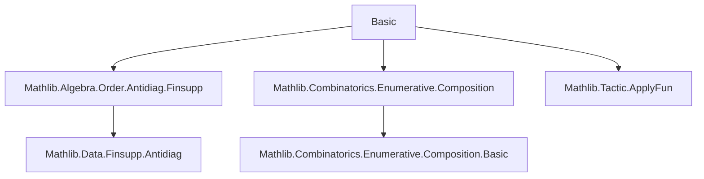

**Technical Brief: `Basic.lean` — Partition Theory in Lean 4 (Mathlib)**  
*Based on source file `Basic.lean` (Mathlib module for partitions of natural numbers)*

---

### 1. **Key Definitions & Theorems**

| Name | Type / Signature | Purpose |
|------|------------------|---------|
| `Partition n` | `Structure` | Represents a partition of `n` as a multiset of positive integers summing to `n`. |
| `ofComposition n c` | `Composition n → Partition n` | Converts a composition (ordered sum) to a partition (unordered) by forgetting order. |
| `ofSums n l hl` | `(l : Multiset ℕ) → l.sum = n → Partition n` | Constructs a partition from a multiset summing to `n`, filtering out zeros. |
| `ofMultiset l` | `Multiset ℕ → Partition l.sum` | Special case of `ofSums` where the sum is taken directly. |
| `ofSym s` | `Sym σ n → Partition n` | Extracts the multiplicity partition from a symmetric power element `s`. |
| `toFinsuppAntidiag p` | `Partition n → ℕ →₀ ℕ` | Encodes a partition as a finitely supported function `i ↦ i * count(i)` lying in the antidiagonal of `n`. |
| `indiscrete n` | `Partition n` | Partition with a single part `n`. |
| `restricted n p` | `ℕ → Prop → Finset (Partition n)` | Filters partitions where all parts satisfy predicate `p`. |
| `countRestricted n m` | `ℕ → Finset (Partition n)` | Partitions where each part appears `< m` times. |
| `odds n` | `Finset (Partition n)` | Partitions into odd parts. |
| `distincts n` | `Finset (Partition n)` | Partitions into distinct parts. |
| `oddDistincts n` | `Finset (Partition n)` | Intersection of `odds n` and `distincts n`. |

| Theorem | Type | Purpose |
|---------|------|---------|
| `ofComposition_surj` | `Function.Surjective (ofComposition n)` | Shows every partition arises from some composition. |
| `toFinsuppAntidiag_injective` | `Function.Injective (toFinsuppAntidiag)` | Injectivity of the finsupp encoding. |
| `toFinsuppAntidiag_mem_finsuppAntidiag` | `p.toFinsuppAntidiag ∈ (Finset.Icc 1 n).finsuppAntidiag n` | Validates that the encoding lies in the correct antidiagonal. |
| `UniquePartitionZero` | `Unique (Partition 0)` | Only one partition of 0: the empty multiset. |
| `UniquePartitionOne` | `Unique (Partition 1)` | Only one partition of 1: `{1}`. |
| `count_ofSums_of_ne_zero` | `i ≠ 0 → (ofSums …).parts.count i = l.count i` | Count stability under zero-filtering. |
| `countRestricted_two` | `countRestricted n 2 = distincts n` | Connects `countRestricted` with distinctness. |

---

### 2. **Naming Conventions**

- **Structure & constructor prefixes**:
  - `of_…`: Conversion *from* another structure (e.g., `ofComposition`, `ofSums`, `ofMultiset`, `ofSym`).
  - `to_…`: Conversion *to* another representation (e.g., `toFinsuppAntidiag`).
  - `indiscrete`, `restricted`, `countRestricted`, `odds`, `distincts`, `oddDistincts`: Descriptive names for specific families of partitions.

- **Suffixes**:
  - `_parts`: Accessor for the multiset of parts (e.g., `indiscrete_parts`, `partition_one_parts`).
  - `_surj`, `_injective`, `_mem_…`: Standard proof naming for properties.

- **Predicate naming**:
  - `restricted`, `countRestricted`, `odds`, `distincts`, `oddDistincts`: Use natural-language qualifiers.

---

### 3. **Tactic Stack**

Frequently used tactics in proofs:

| Tactic | Usage |
|--------|-------|
| `simp` / `simp only` | Simplification of sums, counts, filters, `Multiset` operations. |
| `grind` | Custom tactic (likely from `Mathlib.Tactic`) for automated reasoning about `Multiset` membership, positivity, and inequalities. |
| `rw` / `congr` / `ext` | Equality reasoning, especially `Partition.ext` (extensionality via multiset equality). |
| `simpa` | Simplify and discharge goal using assumptions. |
| `convert` / `apply` | Goal-directed rewriting, especially when matching sums. |
| `have` / `suffices` | Intermediate lemma introduction. |
| `intro` / `cases` | Standard intro/case analysis. |
| `funext` / `funext_iff.mp` | Extensionality for functions. |
| `multiset`-specific lemmas: `sum_add`, `sum_eq_zero_iff`, `filter_add_not`, `toFinset_sum_count_eq`, `Multiset.ext`, `Multiset.count_pos`, etc.

---

### 4. **Proof Logic**

Typical proof patterns:

- **Structure extensionality**: Prove `p = q` by `Partition.ext`, i.e., show `p.parts = q.parts`.
- **Induction on multiset/composition**: Especially in surjectivity proofs (`ofComposition_surj`).
- **Zero-filtering lemmas**: Use `count_filter_of_pos`, `count_filter_of_neg`, `filter_eq_self`, `filter_add_not`.
- **Sum decomposition**: Split multiset into zero and non-zero parts:  
  $ l = l_{=0} + l_{\ne 0} $, then use $ \text{sum}(l) = \text{sum}(l_{=0}) + \text{sum}(l_{\ne 0}) $.
- **Finsupp encoding**: Show membership in antidiagonal via subset inclusion of support in `Icc 1 n`, and sum preservation.
- **Uniqueness proofs**: Use `Unique.mk` + `uniq`, often via `Partition.ext` and `Multiset` lemmas (e.g., `replicate_one`, `eq_replicate_card`).

---

### 5. **Imports & Dependencies**

| Import | Role |
|--------|------|
| `Mathlib.Algebra.Order.Antidiag.Finsupp` | Provides `finsuppAntidiag`, used in `toFinsuppAntidiag_mem_finsuppAntidiag`. |
| `Mathlib.Combinatorics.Enumerative.Composition` | Defines `Composition n`, used in `ofComposition`. |
| `Mathlib.Tactic.ApplyFun` | Likely used for `apply_fun`-style reasoning (though not directly visible here). |
| `Multiset` (open) | Core library for multiset arithmetic, filtering, counting, sum. |

---

### 6. **Mermaid Diagrams**

#### **Dependency Graph (Module-Level)**



#### **Overview of `Partition` Theory Flow**

```mermaid
graph LR
  Composition -->|ofComposition| Partition
  Multiset -->|ofMultiset| Partition
  Sym σ n -->|ofSym| Partition
  Partition -->|toFinsuppAntidiag| Finset.Icc 1 n →₀ ℕ

  Partition -->|restricted| Finset (Partition n)
  Partition -->|countRestricted| Finset (Partition n)
  Partition -->|odds| Finset (Partition n)
  Partition -->|distincts| Finset (Partition n)

  Composition -- surjective --> Partition
  Partition -- injective encoding --> FinsuppAntidiag
```

#### **Key Equivalences & Surjections**

```mermaid
graph LR
  Composition n -- surj. --> Partition n
  Multiset n -- ofMultiset --> Partition n
  Sym σ n -- ofSym --> Partition n
  Partition n -- injective --> (Finset.Icc 1 n).finsuppAntidiag n
```

---

### 7. **Theoretical Scope & Goals**

- **Primary goal**: Enable formalization of **Euler’s partition theorem** (partitions into odd parts ↔ partitions into distinct parts), via sets like `odds n`, `distincts n`, `oddDistincts n`.
- **Implementation strategy**: Use `Multiset` for flexibility and rich API (count, sum, filter, dedup, etc.).
- **Future work**: Link to **Young diagrams** (via Ferrers diagrams or integer matrices).

---

### 8. **Tags & References**

- **Tags**: `partition`, `number theory`, `multiset`, `composition`, `symmetric power`, `finsupp`, `antidiagonal`
- **Reference**: [Wikipedia: Partition (number theory)](https://en.wikipedia.org/wiki/Partition_(number_theory))

--- 

*End of Technical Brief.*
