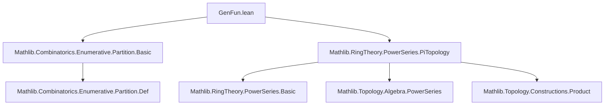
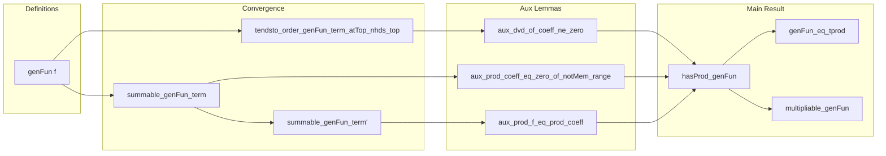

Here is the structured technical metadata extracted from `GenFun.lean`:

---

### **1. Key Definitions & Theorems**

| Name | Type / Signature | Purpose |
|------|------------------|---------|
| `genFun` | `def genFun (f : ℕ → ℕ → R) : R⟦X⟧` | Defines the generating function for partitions weighted by a character function $f(i,c)$, using the sum-over-partitions definition. |
| `coeff_genFun` | `lemma coeff_genFun (f : ℕ → ℕ → R) (n : ℕ)` | Shows that the $n$-th coefficient of `genFun f` is $\sum_{p \in n.\text{Partition}} \prod_{i \in p} f(i, \#i)$. |
| `tendsto_order_genFun_term_atTop_nhds_top` | `theorem` | Proves that the order (lowest degree of nonzero term) of the $j$-th term in the infinite product tends to $\infty$ as $j \to \infty$, ensuring convergence in the $\mathfrak{m}$-adic topology. |
| `summable_genFun_term` | `theorem` | Shows that for each fixed $i$, the series $\sum_j f(i+1,j+1) \cdot X^{(i+1)(j+1)}$ converges (is summable) in the power series ring with $\mathfrak{m}$-adic topology. |
| `summable_genFun_term'` | `theorem` | Unshifted version of `summable_genFun_term`, for $i \ne 0$. |
| `aux_dvd_of_coeff_ne_zero` | `private theorem` | Technical lemma used to relate divisibility of coefficients in a finsupp antidiagonal to nonzero product terms. |
| `aux_prod_coeff_eq_zero_of_notMem_range` | `private theorem` | Shows that if a finsupp element is not in the image of `toFinsuppAntidiag`, then the corresponding product of series coefficients vanishes. |
| `aux_prod_f_eq_prod_coeff` | `private theorem` | Relates the product over parts of a partition weighted by $f$ to a product of coefficients of truncated generating series. |
| `hasProd_genFun` | `theorem` | Main result: the generating function equals the infinite product $\prod_{i=1}^\infty \left(1 + \sum_{j=1}^\infty f(i,j) X^{ij}\right)$. |
| `multipliable_genFun` | `theorem` | Consequence of `hasProd_genFun`: the product is multipliable (i.e., independent of enumeration). |
| `genFun_eq_tprod` | `theorem` | Explicit equality: `genFun f = ∏' i, (1 + ∑' j, f (i+1, j+1) • X ^ ((i+1)*(j+1)))`. |

---

### **2. Naming Conventions**

- **Prefixes**:
  - `genFun`: core definition.
  - `coeff_`: coefficient extraction lemmas.
  - `tendsto_`, `summable_`, `aux_`: technical convergence/divisibility lemmas.
  - `hasProd_`, `multipliable_`, `genFun_eq_tprod`: product convergence and representation lemmas.

- **Suffixes**:
  - `_term`, `_term'`: variants of terms in infinite sums/products.
  - `_atTop_nhds_top`, `_atTop`: filter-theoretic convergence statements.
  - `_injOn`, `_mem_range`, `_notMem_range`: set-theoretic membership/discrimination lemmas.

- **Variable naming**:
  - `f`: character function $f(i,c)$.
  - `i`, `j`: indices for parts and multiplicities.
  - `p`, `g`, `s`: partitions, finsupp elements, finite sets.
  - `R`: base commutative semiring (often with topology).

---

### **3. Tactic Stack**

Frequently used tactics:
- `simp`, `rw`, `simp_rw`: simplification and rewriting.
- `grind`, `nontriviality`, `by_cases`, `contrapose!`: Lean 4-specific automation and proof-shape control.
- `grw`: `grind` + `rw`.
- `apply`, `refine`, `exact`: proof construction.
- `sum_subset_zero_on_sdiff`, `mem_of_subset`, `mem_finsuppAntidiag.mp`: combinatorial set/finsupp reasoning.
- `tsum_eq_single`, `tsum_congr`, `tsum_apply`: manipulation of infinite sums (tsums).
- `WithPiTopology.continuous_coeff`, `map_tsum`, `map_add`, `map_smul`: topology-aware continuity and algebraic manipulation.

---

### **4. Proof Logic**

- **Structure**:
  1. **Convergence lemmas** (`tendsto_order_`, `summable_`) ensure infinite sums/products behave well in the $\mathfrak{m}$-adic topology.
  2. **Auxiliary lemmas** (`aux_*`) bridge combinatorial partition data (`p.parts`, `toFinsuppAntidiag`) with analytic expressions (coefficients of infinite products).
  3. **Main theorem** `hasProd_genFun`:
     - Uses `HasProd` definition via coefficient-wise convergence.
     - Reindexes product via `addRightEmbedding 1`.
     - Applies `coeff_prod` and rewrites using `coeff_genFun`.
     - Uses injectivity of `toFinsuppAntidiag` and partitions the sum over `s` into image + complement.
     - Shows complement contributes zero via `aux_prod_coeff_eq_zero_of_notMem_range`.
     - Shows image terms match partition contributions via `aux_prod_f_eq_prod_coeff`.

- **Induction/Case Analysis**:
  - Not explicit induction; instead, relies on finite support of `p.parts.toFinsupp`, and finite sums/products over `s`.
  - Cases on membership (`x ∈ s`), nonzeroness (`i ≠ 0`), and support properties.

---

### **5. Imports**

- `Mathlib.Combinatorics.Enumerative.Partition.Basic`: defines `Partition`, `n.Partition`, `toFinsuppAntidiag`, etc.
- `Mathlib.RingTheory.PowerSeries.PiTopology`: provides `R⟦X⟧`, `WithPiTopology`, `summable`, `HasProd`, `tprod`, continuity of coefficient maps.

---

### **6. Mermaid Diagrams**

#### **Dependency Graph (Module-Level)**



#### **Overview of Theory Flow**



#### **Specialization Examples (Conceptual)**

```mermaid
flowchart LR
  genFun[f] -->|f(i,c)=1| p[n]
  genFun[f] -->|f(i,1)=1, f(i,c>1)=0| distincts[n]
  genFun[f] -->|f(i,c)=1 iff c<m| countRestricted[n m]
  genFun[f] -->|f(i,c)=1 iff i odd| odds[n]
  genFun[f] -->|f(i,c)=1 iff p i| restricted[n p]
```

---

Let me know if you'd like formalization-level diagrams (e.g., `Lean`-style `structure`/`class` dependencies) or a focus on a specific specialization (e.g., Euler’s partition theorem).
