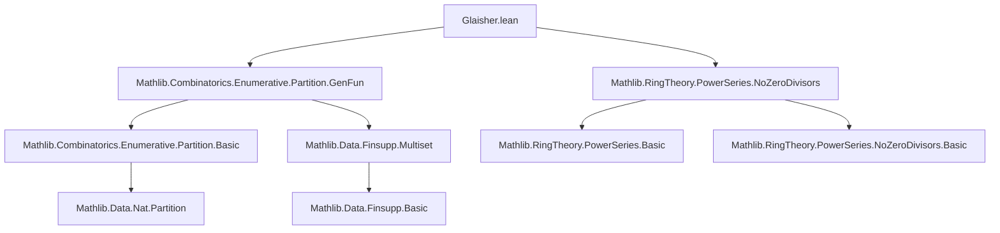

### Technical Brief: Glaisher’s Theorem in Lean 4 (`Glaisher.lean`)

---

#### **1. Key Definitions & Theorems**

| Name | Type / Signature | Purpose |
|------|------------------|---------|
| `restricted n p` | `Partition n → Prop` | Partitions of `n` where all parts satisfy predicate `p` (e.g., not divisible by `m`). |
| `countRestricted n m` | `Partition n → Prop` | Partitions of `n` where no part appears ≥ `m` times. |
| `hasProd_powerSeriesMk_card_restricted` | `HasProd (fun i ↦ if p (i+1) then ∑' j, X^((i+1)*j) else 1) (PowerSeries.mk fun n ↦ #restricted n p)` | Generating function for `restricted` partitions equals infinite product over allowed parts. |
| `hasProd_powerSeriesMk_card_countRestricted` | `HasProd (fun i ↦ ∑ j ∈ range m, X^((i+1)*j)) (PowerSeries.mk fun n ↦ #countRestricted n m)` | Generating function for `countRestricted` partitions equals infinite product of truncated geometric series. |
| `aux_mul_one_sub_X_pow` | `∏' i, if ¬m ∣ i+1 then ∑' j, X^((i+1)*j) else 1 * ∏' i, (1 - X^(i+1)) = ∏' i, (1 - X^((i+1)*m))` | Key algebraic identity used to relate the two generating functions via Euler’s identity. |
| `powerSeriesMk_card_restricted_eq_powerSeriesMk_card_countRestricted` | Equality of two `PowerSeries.mk`s (coefficients = partition counts) | Core analytic step: generating functions are equal ⇒ coefficients equal. |
| `card_restricted_eq_card_countRestricted` | `#restricted n (¬ m ∣ ·) = #countRestricted n m` | **Glaisher’s Theorem**: partitions with parts not divisible by `m` ↔ partitions with multiplicities < `m`. |
| `card_odds_eq_card_distincts` | `#odds n = #distincts n` | **Euler’s Partition Theorem** (special case `m = 2`): partitions into odd parts = partitions into distinct parts. |

---

#### **2. Naming Conventions**

- **Predicates**: `p : ℕ → Prop`, often negated divisibility `¬ m ∣ ·`.
- **Restriction types**:
  - `restricted n p`: partitions satisfying `p` on parts.
  - `countRestricted n m`: partitions with multiplicities `< m`.
- **Generating function lemmas**:
  - `hasProd_powerSeriesMk_card_*`: assert `HasProd` for generating functions.
  - `powerSeriesMk_card_*_eq_tprod`: express generating function as `tprod`.
- **Algebraic identities**:
  - `aux_*`: auxiliary lemmas for main proof steps.
  - `multipliable_*`: ensure convergence of infinite products in `R⟦X⟧`.
- **Main theorems**:
  - `card_*_eq_card_*`: equality of partition counts.

Prefixes/suffixes:
- `card_`: cardinality of partition sets.
- `powerSeriesMk_card_`: generating function coefficients.
- `hasProd_`, `multipliable_`, `tprod_`: product convergence and representation.

---

#### **3. Tactic Stack**

| Tactic | Usage |
|--------|-------|
| `convert` | Match target up to definitional equality (e.g., `hasProd_genFun`). |
| `ext1`, `ext` | Extensionality for power series / functions. |
| `split_ifs`, `simp_rw`, `simp` | Simplify case splits and rewrite using definitional equalities. |
| `rw [tsub_left_inj, mul_left_inj', add_left_inj]` | Algebraic manipulation in proofs involving divisibility and bijections. |
| `grind` | Custom tactic (likely from `Mathlib.Tactic`) for automated simplification of arithmetic. |
| `nontriviality R` | Reduce to nontrivial ring case (often needed for division arguments). |
| `apply mul_right_cancel₀` | Cancel nonzero factors in ring with no zero divisors. |
| `tprod_congr`, `tprod_eq_tprod_of_ne_one_bij` | Prove equality of infinite products via bijection or termwise equality. |
| `sum_congr`, `sum_range_eq_add_Ico`, `sum_Ico_eq_sum_range` | Manipulate finite sums in generating function derivations. |

---

#### **4. Proof Logic**

The proof follows a **generating function strategy**:

1. **Step 1: Derive generating functions**  
   - Show `∑_{n} (#restricted n p) X^n = ∏_{i: p(i)} (1 + X^i + X^{2i} + ⋯)`  
   - Show `∑_{n} (#countRestricted n m) X^n = ∏_{i ≥ 1} (1 + X^i + ⋯ + X^{(m-1)i})`

2. **Step 2: Relate via Euler’s identity**  
   - Use Euler’s product formula:  
     $$
     \prod_{i=1}^\infty (1 - X^i) = \sum_{k=-\infty}^\infty (-1)^k X^{k(3k-1)/2}
     $$
     but more directly:  
     $$
     \prod_{i=1}^\infty \frac{1}{1 - X^i} = \prod_{i=1}^\infty (1 + X^i + X^{2i} + \cdots)
     $$
   - Prove key identity:  
     $$
     \left(\prod_{i \nmid m} \frac{1}{1 - X^i}\right) \cdot \prod_{i} (1 - X^i) = \prod_{i} (1 - X^{im})
     $$

3. **Step 3: Cancel common factors**  
   - Multiply both sides by `∏ (1 - X^i)` and use `aux_mul_one_sub_X_pow` to reduce to equality of truncated products.

4. **Step 4: Conclude coefficient equality**  
   - Use `PowerSeries.ext_iff` to deduce equality of coefficients ⇒ equality of partition counts.

5. **Special case `m = 2`**  
   - `¬2 ∣ i` ⇔ `i` odd  
   - `countRestricted n 2` ⇔ no part repeated ≥2 times ⇔ all parts distinct  
   ⇒ Euler’s theorem.

---

#### **5. Imports & Dependencies**

| Import | Role |
|--------|------|
| `Mathlib.Combinatorics.Enumerative.Partition.GenFun` | General theory of partition generating functions (`genFun`, `restricted`, `countRestricted`, `odds`, `distincts`). |
| `Mathlib.RingTheory.PowerSeries.NoZeroDivisors` | Ensures `R⟦X⟧` has no zero divisors (needed for `mul_right_cancel₀`). |
| `TopologicalSpace`, `T2Space`, `IsTopologicalSemiring`, `IsTopologicalRing` | Ensure convergence of infinite products (`HasProd`, `Multipliable`, `tprod`). |
| `Finset`, `Finsupp`, `SetCoe` | For finite sum/product manipulations and coercion. |

---

#### **6. Mermaid Diagrams**

##### **Dependency Graph (Module-Level)**



##### **Overview of Theoretical Flow**

```mermaid
flowchart LR
  subgraph Setup
    P1[Partition Theory] --> P2[restricted n p]
    P1 --> P3[countRestricted n m]
  end

  subgraph Generating Functions
    P2 --> G1[hasProd_powerSeriesMk_card_restricted]
    P3 --> G2[hasProd_powerSeriesMk_card_countRestricted]
  end

  subgraph Algebraic Identity
    G1 & G2 --> A1[aux_mul_one_sub_X_pow]
    A1 --> A2[∏ (1 - X^i) cancels]
  end

  subgraph Equality
    A2 --> E1[powerSeriesMk_card_restricted_eq_...]
    E1 --> E2[card_restricted_eq_card_countRestricted]
    E2 --> E3[card_odds_eq_card_distincts]
  end

  style E3 fill:#d4f7e2,stroke:#2e8b57
```

---

#### **7. Summary**

This file formalizes **Glaisher’s theorem** and its special case **Euler’s partition theorem** using generating functions in Lean 4. The proof leverages:
- Infinite product convergence in `R⟦X⟧` (via `HasProd`, `Multipliable`),
- Algebraic manipulation of geometric series,
- Cancellation in domains with no zero divisors,
- And finally, coefficient comparison via `PowerSeries.ext`.

The structure is clean and modular: generating functions are derived separately, then related via a key identity, culminating in a short final proof of equality of partition counts.

--- 

Let me know if you'd like a formalized dependency graph (e.g., `.dot` format) or a tactic-level proof trace.
