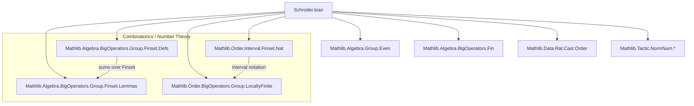

**Technical Metadata Brief: Schroder.lean**

---

### 1. **Key Definitions & Theorems**

| Name | Type / Signature | Purpose |
|------|------------------|---------|
| `largeSchroder : ℕ → ℕ` | Recursive function | Defines the *large Schröder numbers* via $L(0) = 1$, $L(n+1) = L(n) + \sum_{i=0}^n L(i) \cdot L(n-i)$ |
| `smallSchroder : ℕ → ℕ` | Recursive function | Defines the *small Schröder numbers*: $S(0)=1$, $S(1)=1$, $S(n+1)=L(n)/2$ for $n\ge1$ |
| `largeSchroder_zero` | `largeSchroder 0 = 1` | Base case simplification lemma |
| `largeSchroder_one`, `largeSchroder_two` | `= 2`, `= 6` | First few values computed from definition |
| `largeSchroder_succ` | `largeSchroder (n+1) = largeSchroder n + ∑ i ≤ n, largeSchroder i * largeSchroder (n-i)` | Reformulation of recursion using `∑ i ≤ n` instead of `Fin`-sum |
| `even_largeSchroder` | `n ≠ 0 → Even (largeSchroder n)` | Proves all large Schröder numbers beyond $n=0$ are even |
| `smallSchroder_zero`, `smallSchroder_one` | `= 1` | Initial values for small Schröder numbers |
| `smallSchroder_succ_eq_largeSchroder_div_two` | `n ≠ 0 → smallSchroder (n+1) = largeSchroder n / 2` | Connects small and large Schröder numbers |
| `two_mul_smallSchroder_succ` | `n ≠ 0 → 2 * smallSchroder (n+1) = largeSchroder n` | Inverts previous lemma using evenness |
| `smallSchroder_succ` | Recursive formula for $S(n+1)$ in terms of earlier $S$'s | Main combinatorial recurrence for small Schröder numbers |

---

### 2. **Naming Conventions**

- **Prefixes**:
  - `largeSchroder_`, `smallSchroder_`: module-specific naming for Schröder-related functions/lemmas.
  - `even_`, `two_mul_`: indicate parity or doubling properties.
- **Suffixes**:
  - `_zero`, `_one`, `_two`: for base-case simplifications.
  - `_succ`: for successor-case lemmas.
  - `_div_two`: indicates division by 2 in definition or proof.
- **Function names**: camelCase (`largeSchroder`, `smallSchroder`), consistent with Lean/Mathlib style.

---

### 3. **Tactic Stack**

Frequently used tactics in proofs:

| Tactic | Role |
|--------|------|
| `simp` | Simplification using definitional equalities and lemmas (e.g., `largeSchroder_zero`) |
| `rw` | Rewriting using equalities (e.g., `two_mul_smallSchroder_succ`) |
| `congr!` + `with` | Congruence reasoning with lambda-style variable binding |
| `obtain _ | k := k` | Case analysis on `Fin` indices (0 or succ) |
| `have : k < n + 1 := ...` | Intermediate arithmetic reasoning |
| `lia` | Linear integer arithmetic (used heavily for index bounds and inequalities) |
| `sum_Ioc_add_eq_sum_Icc`, `sum_Ioo_add_eq_sum_Ioc` | Interval sum reindexing lemmas |
| `Finset.mul_sum`, `mul_mul_mul_comm` | Manipulating sums and products |
| `even_sum`, `mul_right` | Parity reasoning via `Even` typeclass |

---

### 4. **Proof Logic**

- **Inductive structure**: Proofs about `largeSchroder` and `smallSchroder` proceed by **induction on `n`**, often splitting into base cases (`n = 0`, `n = 1`) and inductive steps (`n + 2`).
- **Parity arguments**: For `even_largeSchroder`, the proof uses:
  - Base case: `n = 1` is even (value 2).
  - Inductive step: sum of even terms (by IH) and products of evens → even.
- **Recurrence derivations**: For `smallSchroder_succ`, the proof:
  1. Multiplies both sides by 2 to reduce to large Schröder recurrence.
  2. Rewrites large Schröder terms using `2 * smallSchroder`.
  3. Expands sums over intervals (`Ioo`, `Ioc`, `Icc`) and simplifies.
  4. Cancels factor of 2 using `mul_left_cancel`.
- **Interval manipulation**: Heavy use of `Finset` interval lemmas (`Iio_eq_range`, `Icc_bot`, `sum_Ioc_add_eq_sum_Icc`, etc.) to shift summation bounds.

---

### 5. **Imports & Dependencies**

**Core libraries used**:

| Module | Purpose |
|--------|---------|
| `Mathlib.Algebra.BigOperators.Group.Finset.Defs` | Definitions for sums over finite sets |
| `Mathlib.Algebra.Group.Even` | `Even` predicate and basic properties |
| `Mathlib.Order.Interval.Finset.Nat` | Interval notation (`Iio`, `Iic`, `Ioo`, `Ioc`, `Icc`) on `ℕ` |
| `Mathlib.Algebra.BigOperators.Fin` | Sums over `Fin n` |
| `Mathlib.Algebra.BigOperators.Group.Finset.Lemmas` | Lemmas for finite sums (e.g., reindexing, splitting) |
| `Mathlib.Order.BigOperators.Group.LocallyFinite` | Tools for locally finite ordered groups (used in sum manipulations) |
| `Mathlib.Data.Rat.Cast.Order` | Rational number casting and order (not directly used here, but may be needed for future extensions) |
| `Mathlib.Tactic.NormNum.*` | Normalization tactics for arithmetic (`abs`, `div_mod`, `pow`, etc.) |

---

### 6. **Mermaid Diagrams**

#### **Dependency Graph (Module-Level)**



#### **Overview of Theory Flow**

```mermaid
flowchart LR
  subgraph Definitions
    L[largeSchroder] -->|recursive def| R[Recurrence]
    S[smallSchroder] -->|def via L/2| R
  end

  subgraph Properties
    R --> E[Evenness of L(n>0)]
    E --> T[2·S(n+1) = L(n)]
  end

  subgraph Main Results
    T --> S2[smallSchroder recurrence]
    S2 --> C[Combinatorial interpretations]
  end

  style E fill:#ffe4e1,stroke:#333
  style S2 fill:#e6e6fa,stroke:#333
```

---

### 7. **Tags & Metadata Summary**

- **Tags**: `Schroeder`, `Schroder`, `combinatorics`, `recurrence`, `parity`
- **OEIS reference**: A006318 (large Schröder numbers)
- **Status**: Initial formalization — definitions, basic properties, and recurrence for small Schröder numbers established.

--- 

Let me know if you'd like a formalization plan for extending this module (e.g., generating functions, lattice path interpretations, or asymptotics).
