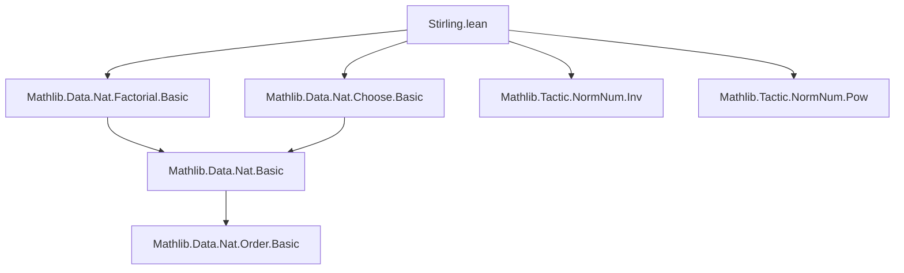
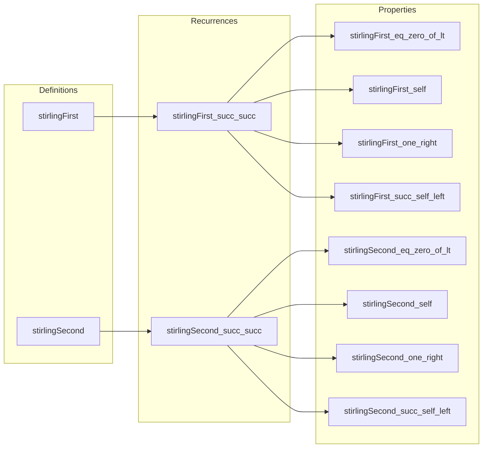

### Technical Brief: Stirling Numbers in Lean 4 (`Stirling.lean`)

---

#### **1. Key Definitions & Theorems**

| Name | Type | Purpose |
|------|------|---------|
| `stirlingFirst : ℕ → ℕ → ℕ` | `ℕ → ℕ → ℕ` | Unsigned Stirling numbers of the first kind: counts permutations of `n` elements with `k` disjoint cycles. Defined recursively. |
| `stirlingSecond : ℕ → ℕ → ℕ` | `ℕ → ℕ → ℕ` | Stirling numbers of the second kind: counts partitions of `n` elements into `k` nonempty subsets. Defined recursively. |
| `stirlingFirst_succ_succ` | `stirlingFirst (n + 1) (k + 1) = n * stirlingFirst n (k + 1) + stirlingFirst n k` | Fundamental recurrence for first kind. |
| `stirlingSecond_succ_succ` | `stirlingSecond (n + 1) (k + 1) = (k + 1) * stirlingSecond n (k + 1) + stirlingSecond n k` | Fundamental recurrence for second kind. |
| `stirlingFirst_eq_zero_of_lt` | `n < k → stirlingFirst n k = 0` | Vanishing when cycles exceed elements. |
| `stirlingSecond_eq_zero_of_lt` | `n < k → stirlingSecond n k = 0` | Vanishing when subsets exceed elements. |
| `stirlingFirst_self` | `stirlingFirst n n = 1` | Only identity permutation has `n` cycles. |
| `stirlingSecond_self` | `stirlingSecond n n = 1` | Only one way to partition into singletons. |
| `stirlingFirst_one_right` | `stirlingFirst (n + 1) 1 = n!` | Number of `n+1`-cycles = `(n)!`. |
| `stirlingSecond_one_right` | `stirlingSecond (n + 1) 1 = 1` | Only one way to partition into one subset. |
| `stirlingFirst_succ_self_left` | `stirlingFirst (n + 1) n = (n+1).choose 2` | Permutations with `n` cycles = transpositions. |
| `stirlingSecond_succ_self_left` | `stirlingSecond (n + 1) n = (n+1).choose 2` | Partitions into `n` subsets = one pair + singletons. |

---

#### **2. Naming Conventions**

- **Prefixes**:
  - `stirlingFirst_`, `stirlingSecond_`: module-specific.
  - `succ_`, `zero_`, `self_`, `one_right_`, `succ_self_left_`: describe structural cases (e.g., `succ` for successor, `self` for diagonal `n = k`, `one_right` for `k = 1`).
- **Suffixes**:
  - `_succ_succ`: recurrence for both arguments incremented.
  - `_succ_left` / `_succ_right`: recurrence with one argument incremented, often requiring nonzero assumptions.
- **General pattern**: `stirling[First/Second]_[case description]`.

---

#### **3. Tactic Stack**

- `rfl`: used heavily for definitional equalities (e.g., base cases).
- `induction`: standard structural induction on `n`.
- `rw`: rewriting using lemmas and definitions.
- `simp only [...]`: simplification with specific lemmas, often to reduce to base cases or known values.
- `obtain ⟨l, rfl⟩ := Nat.exists_eq_add_of_le' (...)`: extracts predecessor representation for nonzero naturals.
- `aesop`: *not used* — proofs are mostly manual and rely on `simp` + `rw`.
- `norm_num`: imported via `Mathlib.Tactic.NormNum.*`, but not directly used in this file.

---

#### **4. Proof Logic**

- **Inductive structure**: Proofs proceed by induction on `n`, often with case analysis on `k = 0` or `k ≠ 0`.
- **Recurrence exploitation**: Most identities are proven by unfolding the recursive definition (`stirlingFirst_succ_succ`, `stirlingSecond_succ_succ`) and applying induction hypothesis.
- **Zero handling**: Lemmas like `stirlingFirst_eq_zero_of_lt` use induction and `lt_succ` reasoning to propagate zeros.
- **Nonzero assumptions**: For `succ_left`/`succ_right` variants, `Nat.exists_eq_add_of_le'` extracts `n = m + 1` to rewrite `k - 1` or `n - 1`.
- **Combinatorial intuition**: Identities like `stirlingFirst_succ_self_left` connect to binomial coefficients via known combinatorial interpretations (e.g., transpositions ↔ 2-element subsets).

---

#### **5. Imports**

| Module | Purpose |
|--------|---------|
| `Mathlib.Data.Nat.Factorial.Basic` | Defines `n.factorial`, used in `stirlingFirst_one_right`. |
| `Mathlib.Data.Nat.Choose.Basic` | Defines binomial coefficients `n.choose k`, used in `stirlingFirst_succ_self_left`, `stirlingSecond_succ_self_left`. |
| `Mathlib.Tactic.NormNum.Inv`, `Mathlib.Tactic.NormNum.Pow` | For numeric normalization (not directly used here, but imported for completeness). |

---

#### **6. Mermaid Diagrams**

##### **Dependency Graph (File-Level)**

##### **Overview of Theoretical Scope**

---

#### **7. Summary**

This file formalizes the combinatorial theory of Stirling numbers in Lean 4, with clean recursive definitions and a suite of foundational lemmas. It emphasizes *structural induction* and *case analysis*, leveraging Lean’s `nat` recursion principles and standard arithmetic lemmas. The proofs are largely elementary but require careful handling of edge cases (`k = 0`, `n < k`, etc.). The connection to binomial coefficients (`choose`) and factorials (`factorial`) demonstrates how combinatorial identities naturally emerge from the definitions.

No advanced tactics (e.g., `ring`, `linarith`) are needed—proofs remain in the `simp`/`rw`/`induction` fragment, aligning with Lean’s philosophy of explicit, verifiable reasoning.
