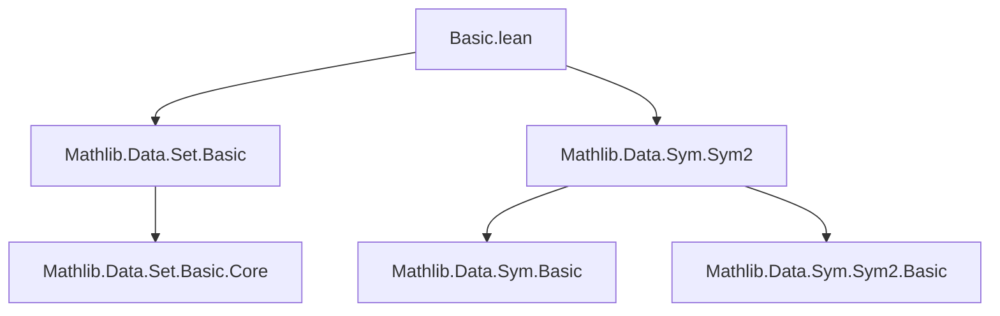
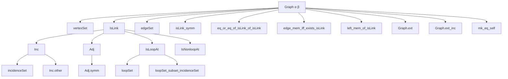

**Technical Brief: `Basic.lean` — Multigraph Formalization in Lean 4**

---

### 1. KEY DEFINITIONS & THEOREMS

| Name | Type / Signature | Purpose |
|------|------------------|---------|
| `Graph α β` | `Type u → Type v → Type (max u v)` | Core type: multigraph with vertices in `α`, edges in `β`. |
| `vertexSet G` | `Set α` | Vertex set of graph `G`. |
| `edgeSet G` | `Set β` | Edge set of graph `G`, definable via `IsLink`. |
| `IsLink G e x y` | `Prop` | Binary incidence predicate: edge `e` has ends `x`, `y`. |
| `Inc G e x` | `Prop` | Unary incidence: edge `e` is incident to vertex `x`. |
| `Adj G x y` | `Prop` | Adjacency: there exists an edge with ends `x`, `y`. |
| `IsLoopAt G e x` | `Prop` | Loop predicate: edge `e` is a loop at `x`. |
| `IsNonloopAt G e x` | `Prop` | Non-loop incidence: `e` incident to `x`, but not a loop at `x`. |
| `incidenceSet G x` | `Set β` | Set of edges incident to vertex `x`. |
| `loopSet G x` | `Set β` | Set of loops at vertex `x`. |
| `Inc.other h` | `α` | Noncomputable “other end” of edge `e` given `Inc e x`. |
| `Graph.ext` | `{G₁ G₂ : Graph α β} → V(G₁) = V(G₂) → (∀ e x y, G₁.IsLink e x y ↔ G₂.IsLink e x y) → G₁ = G₂` | Extensionality: graphs equal if same vertices and binary incidence. |
| `Graph.ext_inc` | Similar to `ext`, but using unary incidence `Inc`. | Extensionality via unary incidence. |
| `mk_eq_self` | `Graph.mk ... = G` | Shows that any `Graph.mk` with correct `IsLink` and edge set is definitionally equal to `G`. |

---

### 2. NAMING CONVENTIONS

- **Predicates**:  
  - `isLink_`, `Inc`, `Adj`, `isLoopAt`, `isNonloopAt`, `incidenceSet`, `loopSet`  
  - Prefixes: `is`, `inc`, `adj`, `loop`, `nonloop`, `incidence`, `loop`
- **Properties & lemmas**:  
  - `symm`, `comm`, `left_mem`, `right_mem`, `edge_mem`, `vertex_mem`, `eq_or_eq`, `unique`, `eq_and_eq_or_eq_and_eq`, `other`, `subset`
- **Notation**:  
  - `V(G)` and `E(G)` for `vertexSet G` and `edgeSet G`.  
  - `s(x, y)` for symmetric pair in `Sym2 α`.

---

### 3. TACTIC STACK

Frequently used tactics in proofs:

- `simp` / `simp_rw` — for rewriting definitions, especially with `@[simp]` lemmas.
- `obtain rfl | rfl := ...` — case analysis on equality from `eq_or_eq_of_isLink_of_isLink`.
- `by_contra!` — for contradiction proofs (e.g., in `Inc.eq_or_eq_or_eq`).
- `exact`, `assumption`, ` rfl` — basic proof automation.
- `convert rfl using 2` — in `mk_eq_self` and `ext`.
- `rw [Set.ext_iff]` — for extensionality of sets.
- `symm`, `left_mem`, `right_mem`, etc. — applied directly as lemmas.

No heavy automation (e.g., `aesop`, `linarith`) is used — proofs are mostly structural and case-based.

---

### 4. PROOF LOGIC

- **Inductive structure**: Proofs rely on case analysis on equality of ends (via `eq_or_eq_of_isLink_of_isLink`), symmetry (`isLink_symm`), and uniqueness of unordered pair (`left_eq_or_eq`, `right_unique`, `left_unique`).
- **Logical flow**:
  1. Unfold definitions (`Inc`, `Adj`, `IsLoopAt`, etc.).
  2. Use `choose` or `obtain ⟨_, h⟩` to extract witnesses from existential hypotheses.
  3. Apply symmetry and uniqueness lemmas to reduce to equalities.
  4. Use `rfl` or contradiction (`False.elim`) when needed.
- **Key pattern**:  
  `IsLink e x y` ↔ `Inc e x ∧ Inc e y ∧ ∀ z, Inc e z → z = x ∨ z = y`  
  This equivalence is repeatedly used to switch between unary and binary incidence.

---

### 5. IMPORTS & DEPENDENCIES

- `Mathlib.Data.Set.Basic` — foundational set theory.
- `Mathlib.Data.Sym.Sym2` — symmetric square, used to model unordered pairs (`s(x, y)`), crucial for modeling unordered edge ends.

> **Design motivation**: The graph is embedded in ambient types (`α`, `β`) rather than being a dependent type. This mirrors the `Matroid` design and simplifies subgraph/minor constructions.

---

### 6. MERMAID DIAGRAMS

#### Dependency Graph (Module-Level)

#### Overview of `Graph` Structure & API

#### Theory Context

- `Graph` serves as a **multigraph** generalization.
- `SimpleGraph` (in `Mathlib.GraphTheory.SimpleGraph.Basic`) is a *subcase*: no loops, at most one edge per pair.
- This module is foundational for:
  - Subgraphs, minors, graph operations.
  - Matroid-like constructions (via embedded sets).
  - Combinatorial arguments requiring edge/vertex incidence tracking.

---

### 7. DESIGN NOTES

- **No `@[ext]` on structure**: Extensionality is provided via `Graph.ext`, avoiding edge-set equality as a prerequisite.
- **Noncomputable `Inc.other`**: Allows reasoning about “the other end” of an edge, even for loops (returns `x` itself).
- **No `@[simp]` on many lemmas**: Prevents `simp` from getting stuck due to non-inferable variables (`x`, `e`, etc.).
- **Symmetry via `Sym2`**: `IsLink e x y ↔ s(x, y) = s(x', y')` formalizes unordered ends.

--- 

Let me know if you'd like a formalization of subgraphs, minors, or simple graphs built on top of this.
