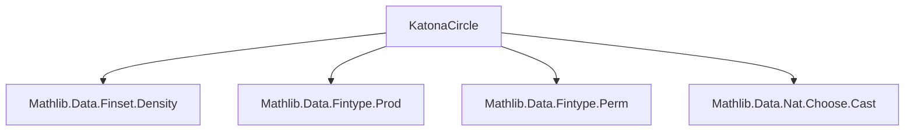

**Technical Brief: Katona Circle Method Formalization (`KatonaCircle.lean`)**  
*Domain: Combinatorics / Extremal Set Theory / Formalized Double Counting*

---

### 1. **Key Definitions & Theorems**

| Name | Type / Signature | Purpose |
|------|------------------|---------|
| `Numbering X` | `X ≃ Fin (card X)` | Bijection between a finite type `X` and `Fin (card X)` — models circular orderings up to rotation (used in Katona’s method). |
| `IsPrefix f s` | `∀ x, x ∈ s ↔ f x < #s` | Predicate stating that all elements of `s` appear before those of `sᶜ` in numbering `f`. |
| `prefixed s` | `Finset (Numbering X)` | Set of numberings where `s` is a prefix (i.e., `IsPrefix f s`). |
| `prefixedEquiv s` | `prefixed s ≃ Numbering s × Numbering ↑(sᶜ)` | Structural decomposition: numberings where `s` is a prefix ↔ pair of numberings on `s` and its complement. |
| `card_prefixed s` | `#(prefixed s) = (#s)! * (card X - #s)!` | Counts numberings where `s` is a prefix — key combinatorial identity for double counting. |
| `dens_prefixed s` | `(prefixed s).dens = ((card X).choose #s)⁻¹` | Density of `prefixed s` among all numberings equals inverse of binomial coefficient — central to probabilistic/averaging arguments. |
| `disjoint_prefixed_prefixed` | `¬ s ⊆ t ∧ ¬ t ⊆ s ⇒ Disjoint (prefixed s) (prefixed t)` | Ensures disjointness of prefix sets when neither set contains the other — critical for inclusion–exclusion or averaging over antichains. |

---

### 2. **Naming Conventions**

- **Prefixes**:
  - `is_`: Predicate definitions (`IsPrefix`)
  - `prefixed_`: Related to prefix sets (`prefixed`, `prefixedEquiv`)
- **Suffixes**:
  - `_equiv`: Equivalence constructions (`prefixedEquiv`)
  - `_le`, `_lt`, `_ge`, `_gt`: Order comparisons in proofs (`card_le_univ`, `card_lt_univ`)
- **Functional style**:
  - `toFun`, `invFun`, `left_inv`, `right_inv`: Standard for `equiv`/`equivFun` components.
  - `cast`, `castLE`, `cast`: Used for type coercion via inequalities (`Fin.cast`, `Fin.castLE`).

---

### 3. **Tactic Stack**

Frequently used tactics in this file:

| Tactic | Role |
|--------|------|
| `simp` / `simp_rw` | Simplification using lemmas like `mem_prefixed`, `Finset.mem_compl`, `Fin.is_lt`. |
| `rw` / `apply` | Rewriting using equivalences, e.g., `prefixedEquiv`, `equivFin`. |
| `intro` / `intro h` | Introducing hypotheses in implications. |
| `by_cases` | Splitting on membership (`x ∈ s`) or order (`n < #s`). |
| `omega` | Solving linear arithmetic goals involving `Nat` inequalities. |
| `exact` / `assumption` | Closing trivial goals. |
| `ext` | Extensionality for functions/relations (e.g., proving `equiv` equality). |
| `congr` / `congr'` | Congruence for function/structure equality. |
| `simpa` | Simplify and discharge using target goal. |
| `infer_instance` | Deriving decidability instances. |

---

### 4. **Proof Logic**

- **Core proof strategy**:
  1. **Decomposition via equivalence**: Use `prefixedEquiv` to reduce counting problems over `prefixed s` to products.
  2. **Cardinality computation**: Apply `Fintype.card_congr` to transfer counts via equivalences.
  3. **Disjointness via antichain condition**: Use `Nat.le_total` + `subset_of_card_le_card` to derive contradiction if both `IsPrefix f s` and `IsPrefix f t` hold and neither set contains the other.
  4. **Density simplification**: Reduce to binomial coefficients using factorial identities and `Nat.cast_choose`.

- **Typical proof flow**:
  - *Induction-free*: Relies on structural equivalences and combinatorial identities.
  - *Case analysis* on `x ∈ s` or `n < #s` to define piecewise functions.
  - *Order reasoning* via `omega` and `lt_or_ge` to handle boundary cases.

---

### 5. **Imports & Dependencies**

| Module | Purpose |
|--------|---------|
| `Mathlib.Data.Finset.Density` | Defines density of subsets of finite types (`dens`), used in `dens_prefixed`. |
| `Mathlib.Data.Fintype.Prod` | Provides `Fintype` instances for products, used implicitly in `Numbering s × Numbering ↑(sᶜ)`. |
| `Mathlib.Data.Fintype.Perm` | Underlies `Numbering` as `equiv` to `Fin n`. |
| `Mathlib.Data.Nat.Choose.Cast` | Enables casting binomial coefficients to `ℚ≥0`, needed for density expressions. |

---

### 6. **Mermaid Diagrams**

#### **Dependency Graph (Module-Level)**



#### **Conceptual Overview of the Katona Circle Method Formalization**

```mermaid
flowchart LR
  A[Numbering X: X ≃ Fin(card X)] --> B[IsPrefix f s: s precedes sᶜ in f]
  B --> C[prefixed s: {f | IsPrefix f s}]
  C --> D[prefixedEquiv: prefixed s ≃ Numbering s × Numbering sᶜ]
  D --> E[card_prefixed: #prefixed s = #s! * (card X - #s)!]
  E --> F[dens_prefixed: density = (card X choose #s)⁻¹]
  C --> G[disjoint_prefixed_prefixed: disjoint if neither ⊆]
  F & G --> H[Application: Double-counting over antichains]
```

---

### 7. **Intended Use Case**

This module provides foundational infrastructure for applying **Katona’s circle method**, a double-counting technique used in extremal set theory (e.g., proofs of Sperner’s theorem, Kruskal–Katona-type bounds). The key idea is to average over all circular orderings (modeled by `Numbering X`) and count how often a family of sets appears as an initial segment — leveraging symmetry and disjointness to derive combinatorial inequalities.

---

*End of Technical Brief*
